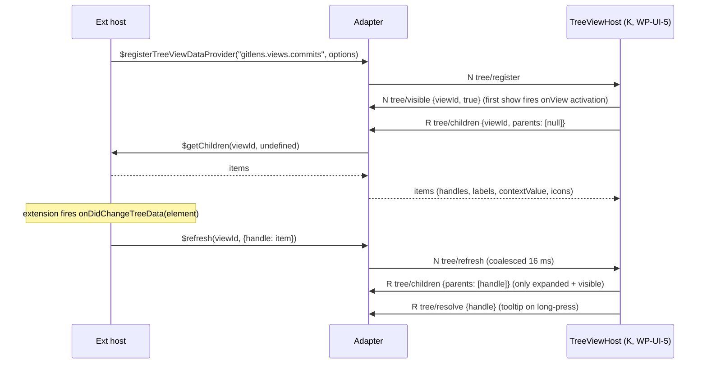
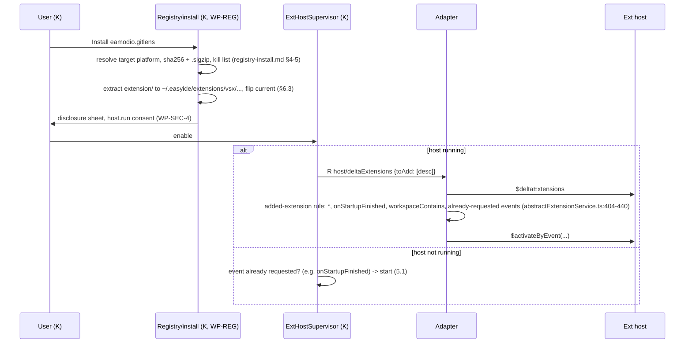

# VS Code extension support: UI protocol and initData (design detail)

Companion to [design.md](design.md) §4. Status: design proposal (audit phase, 2026-09-25). This file specifies the
**UI protocol** between the guest main-thread adapter (JS) and the Kotlin `:exthost` module, and how the adapter builds
`IExtensionHostInitData` (P5), plus the proposed-API allow-list (P7), two sequences moved out of design.md §5 (P8) and the work
packages design.md proposes (P9). The VS Code RPC between the adapter and the vendored extension host is not specified here: it is
VS Code's own ([research/route-spike.md](research/route-spike.md) §3-4, [research/vscode-src.md](research/vscode-src.md) §3).

Conventions. `$VS/...:n` = microsoft/vscode `0b16cb97` (the audit clone; the shipped pin is a stable tag, D1). Our code paths
are relative to the repository root. K = Kotlin `:exthost`, A = adapter, H = extension host. "N" = JSON-RPC notification,
"R" = request. Decisions D1-D13 are the lead decisions (ADR 0031-0034, D12).

## P1. Transport and framing

| Item | Rule | Evidence / reason |
|---|---|---|
| Wire | JSON-RPC 2.0, `Content-Length` framing, UTF-8, over the adapter's stdin/stdout. stderr is free text for the extension-host log | ADR 0030 decision 3 kept by D1; Kotlin side reuses `JsonRpcConnection` (`services/mobile/lsp/src/main/kotlin/dev/easyide/lsp/jsonrpc/JsonRpcConnection.kt:50-150`) and `Framing` (8 KB header, 64 MB body, JSON depth 256: `.../lsp/LspPolicy.kt:14-17`, `.../jsonrpc/Framing.kt:27-29`) |
| Process | K spawns `node /opt/easyide/exthost/<tag>/adapter.js` through `ServerProcessFactory.spawn` (`services/mobile/sandbox-runtime/src/main/java/dev/easyide/sandbox/shell/ServerProcessFactory.kt:76`) | D3; same path as language servers |
| Positions | 0-based `{line, character}` in UTF-16 code units; ranges `{start, end}` | same as LSP and our `LineIndex`; the adapter converts to VS Code's 1-based `IPosition`/`IRange` DTOs |
| URIs | strings (`file:///workspace/a.go`, `untitled:Untitled-1`, `git:/...?{...}`); the adapter revives/serialises `UriComponents` (`$mid: 1`) | guest paths only; K maps `file:///workspace/...` to the project dir with `PathMapper` (ADR 0017) |
| Handles | numbers and ids produced by H (provider handles, tree item handles, webview handles, command ids) pass through unchanged. Every handle is valid only for one **host generation** `gen` (increments on each H start) | H restarts invalidate every handle; `host/reset` (P4 #13) tells K to drop the old generation |
| Errors | JSON-RPC error objects. Codes: `-32601` unknown method; `-32800` cancelled; `-32000` extension-visible failure; `-32010` **not supported on easyIDE** with `data: {track, api}` (the typed stub-reject of D1, `track` in `OOS-DAP|OOS-NB|OOS-CHAT|OOS-PROP|OOS-MS|OOS-WEB`); `-32011` host not running; `-32012` stale generation | the adapter turns `-32010` into an `Error` whose `name` is `EasyIdeNotSupported` and whose message names the API and the track |

## P2. Method families

Direction: K->A (Kotlin calls the adapter) or A->K. "Shapes" = the MainThread*/ExtHost* shapes the family serves
(full list in [design.md](design.md) §6). M = first milestone (D11).

| Family | Direction and methods | Shapes | M |
|---|---|---|---|
| `host/` | K->A R `initialize`, `shutdown`, `restart`, `activateByEvent`, `deltaExtensions`, `setLogLevel`; A->K N `status`, `reset`, `exited`, `responsive`, `perf` | ExtHostExtensionService, handshake | M1 |
| `ext/` | A->K N `willActivate`, `didActivate`, `activationFailed`, `runtimeError` | MainThreadExtensionService, Errors, Console | M1 |
| `cmd/` | A->K N `register`, `unregister`; A->K R `execute` (app or built-in command); K->A R `execute` (extension command, activates `onCommand:` first), `list` | MainThreadCommands, ExtHostCommands | M1 |
| `ctx/` | A->K N `set {key, value}` (from the `setContext` command, which the adapter intercepts) | (command) | M3 |
| `config/` | K->A N `changed {models, change}`; A->K R `update`, `remove` | MainThreadConfiguration, ExtHostConfiguration | M1 |
| `window/` | A->K R `showMessage`, `showOpenDialog`, `showSaveDialog`, `openExternal`, `clipboardRead`; A->K N `clipboardWrite`; quick input: A->K R `quickInput/open`, N `quickInput/update`, `quickInput/dispose`; K->A N `quickInput/event {session, kind: accept|changeValue|changeActive|changeSelection|triggerButton|hide}` | MainThreadMessageService, Diaglogs, Clipboard, Window, QuickOpen, ExtHostQuickOpen | M1 (dialogs M3) |
| `progress/` | A->K N `start`, `report`, `end`; K->A N `cancel {handle}` | MainThreadProgress, ExtHostProgress | M1 |
| `status/` | A->K N `set`, `dispose` (last write wins, coalesced) | MainThreadStatusBar | M1 |
| `output/` | A->K N `register {id, label, file, languageId, extensionId}`, `update {id, mode, till}`, `reveal`, `close`, `dispose` | MainThreadOutputService | M1 |
| `storage/` | none on the wire: memento is adapter-local (design.md §3) | MainThreadStorage | M1 |
| `secrets/` | A->K R `get`, `store`, `delete`, `keys`; K->A N `changed` | MainThreadSecretState | M2 |
| `doc/` | K->A N `opened`, `changed`, `saved`, `closed`, `dirty`, `languageChanged`; A->K R `open` (`workspace.openTextDocument` of a file not in the editor), `create` (untitled), `save` | MainThreadDocuments, ExtHostDocuments(+AndEditors) | M2 |
| `editor/` | K->A N `state {editors, active, visibleRanges, selections, options, positions}`, `tabs`; A->K R `show`, `applyEdits`, `insertSnippet`, `setSelections`, `reveal`, `setOptions`, `decorationType/create`, N `decorationType/dispose`, `decorations/set` (coalesced) | MainThreadTextEditors, EditorTabs, ExtHostEditors | M2 (tabs M3) |
| `workspace/` | K->A N `folders`, `trust`, `fileEvents`; A->K R `applyEdit`, `saveAll`, `requestTrust` | MainThreadBulkEdits, Workspace | M2 |
| `lang/` | A->K N `register {handle, kind, selector, meta}`, `unregister`, `changed {handle}`, `languageStatus/set|dispose`, `languageConfiguration/set`; A->K R `changeLanguage`; K->A R `provide/<kind>`, `resolve/<kind>`, N `release` | MainThreadLanguageFeatures, Languages, ExtHostLanguageFeatures | M2 |
| `diag/` | A->K N `change {owner, entries}`, `clear {owner}` (merged per URI inside a flush window) | MainThreadDiagnostics | M2 |
| `content/` | A->K N `register {scheme}`, `unregister`, `changed {uri}`; K->A R `provide {uri}` | MainThreadDocumentContentProviders | M2 |
| `fs/` | A->K N `providerRegistered {scheme, capabilities}`; K->A R `stat`, `readDirectory`, `readFile`, `writeFile`, `delete`, `rename` for non-`file` schemes only | MainThreadFileSystem, ExtHostFileSystem | M2 |
| `fileDeco/` | A->K N `register`, `changed {uris}`; K->A R `provide {uris}` | MainThreadDecorations | M3 |
| `tree/` | A->K N `register`, `refresh {viewId, items?}`, `reveal`, `message`, `title`, `badge`, `dispose`; K->A R `children {viewId, parents}`, `resolve {viewId, handle}`, `getParent` (reveal), N `visible`, `selection`, `expanded`, `checkbox`, R `drop` (M5) | MainThreadTreeViews, ExtHostTreeViews | M3 |
| `webview/` | A->K R `create`, N `setHtml`, `setOptions`, `setTitle`, `setIconPath`, `reveal`, `dispose`, R `postMessage`, N `registerView`, `registerSerializer`, `registerCustomEditor`; K->A N `message`, `viewState`, `disposed`, R `resolveView`, `deserialize`, `resolveCustomEditor` | MainThreadWebviews, WebviewPanels, WebviewViews, CustomEditors | M4 |
| `terminal/` | A->K R `create`, N `show`, `hide`, `sendText`, `dispose`, `envCollection`; K->A N `opened`, `closed`, `data` (only when subscribed), `input` (Pseudoterminal, M5) | MainThreadTerminalService | M4 |
| `scm/` | A->K N `register`, `update`, `groups`, `splice`, `inputBox`, `dispose`, `quickDiff/*`; K->A R `provideOriginalResource`, N `inputChanged`, `acceptInput`, `selected` | MainThreadSCM, QuickDiff | M4 |
| `task/` | A->K N `providerRegistered`; K->A R `fetch`, `resolve`; A->K R `execute`, `terminate` | MainThreadTask | M5 |
| `auth/` | A->K R `getSession`, `getAccounts`, `removeSession`; K->A N `sessionsChanged` | MainThreadAuthentication | M5 |
| `test/` | A->K N controller/items/run events; K->A R `runProfile`, `resolve` | MainThreadTesting | M5 |
| `uri/` | A->K N `handlerRegistered {extensionId}`; K->A R `handle {uri}` (deep link `easyide://<ext-id>/...`) | MainThreadUrls, ExtHostUrls | M4 |
| `comments/` | A->K N controller/thread events (recorded from M4, drawn in M5) | MainThreadComments | M5 |
| `$/` | both: `$/cancelRequest {id}`; A->K N `$/logTrace` | - | M1 |

Things that are **not** on the wire because the guest already has them (ADR 0030 decision 5): `file:` I/O and
`workspace.fs` for `file:` (H has `DiskFileSystemProvider`, `$VS/src/vs/workbench/api/node/extHostDiskFileSystemProvider.ts`),
child processes, git, network, memento files, logs (H and A write them under `logsLocation`; K reads the files from the rootfs).

## P3. Cross-cutting rules

**Cancellation.** Both sides use the existing `$/cancelRequest {id}` (`JsonRpcConnection.kt:292`); `params.cancelId` and
`$/cancel` from `docs/extension-host/arch.md:35` are dropped. A maps a cancelled K->A request to its `CancellationTokenSource`,
which makes `RPCProtocol` send a `Cancel` message to H (`$VS/src/vs/workbench/services/extensions/common/rpcProtocol.ts:461-496`).
A->K requests that H cancels (for example a quick pick whose token fires) are cancelled with `$/cancelRequest` too; K closes the UI.
K cancels a provider request whenever a newer request for the same (feature, document) starts, and on a document version change.

**Ordering.** One stream per direction, processed in order. Invariant: when K applies an edit requested by A (`editor/applyEdits`,
`workspace/applyEdit`), it sends the resulting `doc/changed` **before** the response, so H sees the new version before the
promise resolves, as VS Code's main thread does. Before a `provide/*` or `resolve/*` call A checks that H has the document at the
`version` in the request; if not it waits (max 500 ms) for the pending `doc/changed`, then fails with `-32800`.

**Batching and coalescing.** A flushes coalescable A->K notifications on a 16 ms timer (one frame) or at 64 KB:
`status/set` and `decorations/set` last write wins per key; `tree/refresh` unions item handles (root refresh absorbs all);
`diag/change` merges per (owner, URI) keeping the last; `progress/report` keeps the last message and sums increments;
`fileDeco/changed` unions URIs. K->A: `doc/changed` batches follow the existing `DocumentSync` debounced flush
(`services/mobile/lsp/src/main/kotlin/dev/easyide/lsp/session/DocumentSync.kt:31-60`) and are always flushed before any K->A request
that names a document. Requests are never coalesced or dropped.

**Document deltas.** `doc/changed {uri, version, changes, eol, isDirty, coalesced}`: `changes` are ranges against the previous version,
ordered from the end of the document to the start (the order `ISerializedModelContentChangedEvent` requires,
`$VS/src/vs/editor/common/textModelEvents.ts:87-91`). `coalesced: true` means K produced one range per flush with `TextDiff`
(`services/mobile/lsp/src/main/kotlin/dev/easyide/lsp/text/TextDiff.kt:30`), not per keystroke. A converts to `$acceptModelChanged`.
Whether extensions care about per-keystroke events is UNVERIFIED (verify in the corpus harness with Error Lens and Vim-style extensions).

**Binary payloads.** Inline base64 as `{"$b64": "..."}` up to 1 MiB decoded. Above that, a **side channel file**:
the sender writes `/tmp/easyide-xfer/<gen>/<uuid>` in the guest (K writes into the rootfs path, A reads with Node) and sends
`{"$file": "<guest path>", "size": n, "sha256": "..."}`; the receiver deletes it after reading. Used by `fs/readFile|writeFile` on
provider schemes, webview `postMessage` buffers, `webview` resources from non-`file` schemes and `workspace/applyEdit` with file
contents. `file:` resources for webviews never cross: K reads them straight from the rootfs (D5, [ui-webviews.md](ui-webviews.md) §3).

**Backpressure.** Kotlin's `JsonRpcConnection` queues are `Channel.UNLIMITED` (`JsonRpcConnection.kt:81-82`), so the flow control is
in A: A keeps at most 256 in-flight A->K requests (further calls wait in A, H only sees latency), and when stdout `write()` returns
`false` A stops flushing coalescable notifications until `drain` (coalescing keeps memory bounded). K handles A->K notifications on
the reader and hands UI updates to conflated `StateFlow`s so a slow frame never blocks the reader. K->A: at most one in-flight
provider request per (feature, document); A answers `-32011` when H is down instead of queueing.

**Timeouts.** Every K->A request has a timeout (the `request()` API requires one, `JsonRpcConnection.kt:122`): providers 5 s
(completion 3 s), tree 10 s, `initialize` 30 s, `shutdown` 5 s. A->K requests that open UI (messages, pickers, dialogs) have none.
A marks H unresponsive after 3 s without an RPC acknowledgement (`rpcProtocol.ts:119`) and reports `host/responsive`.

**Versioning handshake.** `host/initialize` carries `protocol: {major: 1, minor: n}` and the tag K expects. The result carries
A's `protocol`, the vendored `vscode: {version, commit, date}` and `implemented`/`stubbed` shape lists. Major mismatch: K kills A,
re-copies the bundle from the APK assets into `/opt/easyide/exthost/<tag>/` and retries once. Minor: the lower minor wins; K does not
send families the other side lacks. A and H always come from the same build: A passes `commit` in initData and H exits with code 55
(`VersionMismatch`) if it differs (`$VS/src/vs/workbench/api/node/extensionHostProcess.ts:343-349`), which A reports as a packaging error.

## P4. Representative messages

1. K->A R `host/initialize` (see P5 for how A turns it into initData)
```json
{"jsonrpc":"2.0","id":1,"method":"host/initialize","params":{"protocol":{"major":1,"minor":0},"vscodeTag":"1.139.1",
 "session":{"environmentId":"env-7f3","projectId":"p-19","workspaceName":"hello-go","folder":"file:///workspace"},
 "locale":"en","logLevel":"info","trusted":true,
 "extensions":[{"location":"file:///root/.easyide/extensions/vsx/golang.go-0.56.1","packageJSON":{"name":"Go","publisher":"golang","...":"raw"},
   "targetPlatform":"universal","isBuiltin":false,"enabledApiProposals":[]}],
 "configuration":{"defaults":{},"user":{},"environment":{},"project":{},"scopes":[["go.gopath",5]]},
 "storage":{"quotaKb":10240},"telemetry":{"level":"off"}}}
```
2. A->K result
```json
{"jsonrpc":"2.0","id":1,"result":{"protocol":{"major":1,"minor":0},"vscode":{"version":"1.139.1","commit":"04c0d99f4fb0d8afe6ce4f0c58e31e183ac3e4b1"},
 "adapter":{"build":"2026.10.0"},"implemented":["MainThreadCommands","..."],"stubbed":{"MainThreadDebugService":"OOS-DAP","...":"..."}}}
```
3. K->A R `host/activateByEvent` `{"event":"onLanguage:go","kind":"normal"}` -> `{"activated":["golang.go"]}` (kind `immediate` maps to `ActivationKind.Immediate`).
4. K->A N `doc/opened`
```json
{"jsonrpc":"2.0","method":"doc/opened","params":{"uri":"file:///workspace/main.go","languageId":"go","version":1,"eol":"\n","isDirty":false,"encoding":"utf8","text":"package main\n..."}}
```
5. K->A N `doc/changed`
```json
{"jsonrpc":"2.0","method":"doc/changed","params":{"uri":"file:///workspace/main.go","version":4,"coalesced":true,"isDirty":true,"eol":"\n",
 "changes":[{"range":{"start":{"line":2,"character":0},"end":{"line":2,"character":0}},"rangeOffset":14,"rangeLength":0,"text":"import \"fmt\"\n"}]}}
```
6. A->K N `lang/register`
```json
{"jsonrpc":"2.0","method":"lang/register","params":{"gen":1,"handle":7,"kind":"completion","extensionId":"golang.go",
 "selector":[{"language":"go","scheme":"file"}],"meta":{"triggerCharacters":["."],"supportsResolve":true}}}
```
7. K->A R `lang/provide/completion` and result (A expands VS Code's compact `ISuggestDataDto` fields, `$VS/src/vs/workbench/api/common/extHost.protocol.ts:2666`)
```json
{"jsonrpc":"2.0","id":41,"method":"lang/provide/completion","params":{"gen":1,"handle":7,"uri":"file:///workspace/main.go","version":4,
 "position":{"line":5,"character":5},"context":{"triggerKind":1,"triggerCharacter":"."}}}
{"jsonrpc":"2.0","id":41,"result":{"cacheId":12,"isIncomplete":false,"items":[{"id":[12,0],"label":"Println","kind":2,
 "insertText":"Println","detail":"func(a ...any)","sortText":"0001","range":{"start":{"line":5,"character":5},"end":{"line":5,"character":5}}}]}}
```
8. K->A N `$/cancelRequest` `{"id":41}` -> A cancels the token of `$provideCompletionItems`; K later sends N `lang/release {"handle":7,"cacheId":12}` (`$releaseCompletionItems`).
9. A->K R `window/showMessage` `{"severity":"info","message":"Tools missing: gopls","modal":false,"source":"golang.go","items":[{"title":"Install","handle":0},{"title":"Later","handle":1,"isCloseAffordance":true}]}` -> `1` or `null`.
10. A->K N `status/set` `{"gen":1,"id":"golang.go.status","extensionId":"golang.go","name":"Go","text":"$(beaker) Go 1.23","tooltip":{"value":"**Go**"},"command":{"id":"go.environment.status","title":""},"alignLeft":false,"priority":100,"color":null,"backgroundColor":null}`
11. A->K N `tree/refresh` `{"gen":1,"viewId":"gitlens.views.commits","items":{"0/0:abc":{"handle":"0/0:abc","label":{"label":"Fix build"},"collapsibleState":1,"contextValue":"gitlens:commit","iconPath":{"id":"git-commit"}}}}` (omit `items` = refresh from root).
12. A->K R `webview/create` `{"gen":1,"handle":"c1e...","viewType":"gitlens.graph","extensionId":"eamodio.gitlens","title":"Commit Graph","viewColumn":1,"options":{"enableScripts":true,"enableCommandUris":true,"retainContextWhenHidden":true,"localResourceRoots":["file:///root/.easyide/extensions/vsx/eamodio.gitlens-2026.9.250515"]},"iconPath":{"id":"gitlens-graph"}}` -> `{}`; then N `webview/setHtml {handle, html}`; K->A N `webview/message {"handle":"c1e...","message":"{\"type\":\"ready\"}","buffers":[]}` (message is the JSON string the page posted, passed through unparsed to `$onMessage`).
13. A->K N `host/exited` `{"gen":1,"code":null,"signal":"SIGKILL","reason":"oom?","active":["eamodio.gitlens","golang.go"],"activating":"anthropic.claude-code","uptimeMs":812345}` then, after K's `host/restart`, N `host/reset {"gen":2}`.
14. A->K R `cmd/execute` `{"id":"workbench.action.files.save","args":[]}` -> `{"result":null}`; refused ids answer `-32000` with `data.reason:"not-allowed"` (WP-SEC-12).
15. A->K N `ctx/set` `{"key":"gitlens:enabled","value":true}` (from `executeCommand('setContext', ...)`, stored by `ContextKeyService.setRaw`, `services/shared/extension-schema/src/main/kotlin/dev/easyide/extensions/whenclause/ContextKeyService.kt:70`).

## P5. initData construction

A builds `IExtensionHostInitData` (`$VS/src/vs/workbench/services/extensions/common/extensionHostProtocol.ts:28-60`) and sends it as
the first message after H's `Ready` (`extensionHostProcess.ts:332-393`). Fields and where each value comes from:

| Field | Value on easyIDE | Source |
|---|---|---|
| `version` | vendored stable tag, e.g. `1.139.1`; becomes `vscode.version` (`extHost.api.impl.ts:1991`) so `engines.vscode` checks pass up to it | D9; build constant in A |
| `quality` | `"stable"` (`env.appQuality`, `:509`) | build constant |
| `commit`, `date` | commit and date of the tag; must equal the `product.commit` injected into H's bundle | build (product injection, route-spike §2) |
| `parentPid` | A's pid: H polls it every 1 s and exits when A is gone; `@vscode/native-watchdog` is not shipped and its `require` fails inside a `try` (`extensionHostProcess.ts:351-384`); socket close also terminates H (`:286-288`) | A |
| `environment.appName` | `"easyIDE"` | D9 |
| `environment.appHost` | `"desktop"` | D9 |
| `environment.appRoot` | `file:///opt/easyide/exthost/<tag>` (`env.appRoot`, `:431`) | A |
| `environment.appLanguage` | app locale (`vscode.env.language`, `:429`); NLS bundles for extensions via `l10n` | `host/initialize.locale` |
| `environment.appUriScheme` | `"easyide"`; `env.uriScheme`, used for `asExternalUri`/`onUri` round trips (`:433,477`) | WP-SEC-11 |
| `environment.globalStorageHome` | `file:///root/.easyide/exthost/globalStorage` (H appends the lower-cased ext id, `$VS/src/vs/workbench/api/common/extHostStoragePaths.ts:90`) | A; guest home per D4 |
| `environment.workspaceStorageHome` | `file:///root/.easyide/exthost/workspaceStorage` (H appends the workspace id, `:45`) | A |
| `environment.skipWorkspaceStorageLock` | `true` (one H per workspace session, D3) | A |
| `environment.isExtensionDevelopmentDebug`, `isExtensionTelemetryLoggingOnly`, `useHostProxy` | `false` | A |
| `environment.extensionLogLevel` | per-extension overrides from settings | K |
| `workspace` | `{id, name, transient:false, configuration:null, isUntitled:false}`; `id` = hex SHA-256 of `envId + "/" + projectId` (stable across restarts, no path leak); folders come in `$initializeWorkspace` with `[{uri:"file:///workspace", name, index:0}]` | K session |
| `extensions` | `{versionId, allExtensions, activationEvents, myExtensions}`: `allExtensions` = K's list (raw `packageJSON` + `identifier`, `extensionLocation`, `isBuiltin`, `isUserBuiltin:false`, `isUnderDevelopment:false`, `targetPlatform`, `preRelease`, `publisherDisplayName`) plus A's built-ins (design.md §7); `activationEvents` = declared + implicit events from the generator table; `myExtensions` = all enabled ids | K + A |
| `extensions[].enabledApiProposals` | built-ins: their own list; others: `package.json` list **intersected** with the allow-list (D8: product.json `extensionEnabledApiProposals` for that id AND implemented by A), same filtering as `$VS/src/vs/workbench/services/extensions/common/extensionsProposedApi.ts:69-113` | K (allow-list is a data file) |
| `nlsBaseUrl` | undefined | - |
| `telemetryInfo` | `sessionId` = random per H start; `machineId`, `devDeviceId` = random UUIDs persisted per environment (never an Android id); `sqmId` = `""`; `firstSessionDate` = environment creation time | A (stored in `~/.easyide/exthost/identity.json`) |
| `logLevel`, `loggers`, `logsLocation` | from settings; `[]`; `file:///root/.easyide/exthost/logs/<yyyymmddThhmmss>` (H puts `logUri` per extension under it, `extHostExtensionService.ts:538-539`) | K, A |
| `autoStart` | `true`: H starts itself and handles `*` and `onStartupFinished`; A then sends `$activateByEvent` for pending events | spike §3 |
| `remote` | `{isRemote:false, authority:undefined, connectionData:null}` so `remoteName` is undefined (D9) and `extensionKind` is UI (`extHostExtensionService.ts:510`) | D9 |
| `consoleForward` | `{includeStack:false, logNative:true}` | A |
| `uiKind` | `1` (Desktop) | D9 |
| `messagePorts`, `handle` | absent | - |

Right after the handshake A calls, in order: `ExtHostConfiguration.$initializeConfiguration` (models from design.md §8),
`ExtHostWorkspace.$initializeWorkspace(workspace, trusted)`, `ExtHostTelemetry.$initializeTelemetryLevel(NONE, false)`
(`isTelemetryEnabled` false, D9/WP-SEC-17), `ExtHostDocumentsAndEditors.$acceptDocumentsAndEditorsDelta` (open documents),
`ExtHostExtensionService.$startExtensionHost` and then `$activateByEvent` for every event requested so far (route-spike §3 step 4;
the barriers are `extHostConfiguration.ts:118-131` and `extHostExtensionService.ts:212-227`).

Environment of H (set by A, after K's clean env, D3): `VSCODE_EXTHOST_IPC_HOOK=/tmp/easyide-exthost-<gen>.sock`,
`VSCODE_HANDLES_UNCAUGHT_ERRORS=true` and `VSCODE_NLS_CONFIG=<json>` (the same variables VS Code's server sets for its host,
`$VS/src/vs/server/node/extensionHostConnection.ts:44-46`; desktop: `localProcessExtensionHost.ts:229-232`),
`NODE_COMPILE_CACHE=/root/.cache/easyide/node-compile-cache` (D2), `ELECTRON_RUN_AS_NODE=1` (H sets it anyway, route-spike §7);
never `EASYIDE_GIT_TOKEN` (ADR 0012, WP-SEC-5). `VSCODE_ESM_ENTRYPOINT` is not needed: our bundle is the entry point.

## P6. Amendments to `docs/extension-host/arch.md` (re-scoped as this UI protocol)

| arch.md item | Status | Change |
|---|---|---|
| Diagram and "Layout" (`exthost.js` = our shim, `services/mobile/exthost/js`) | superseded | two guest processes: A (ours, JS) + H (vendored); see design.md §2 |
| `params.cancelId` + `$/cancel` (arch.md:35) | replaced | `$/cancelRequest {id}` (P3) |
| `host/initialize` result `{apiVersion, implemented}` | amended | `protocol`, `vscode`, `implemented`, `stubbed` (P3) |
| `host/initialize.configuration {<section>: json}` | replaced | layered models (defaults, user, environment, project, scopes) (design.md §8) |
| `ExtDesc.packageJSON` | kept, clarified | must be the **raw** bytes-equivalent manifest (D4), not our typed descriptor |
| `doc/changed {uri, version, changes, dirty}` | amended | adds `coalesced`, `eol`, `rangeOffset/rangeLength`, reverse order (P3) |
| `workspace/getConfiguration` request | dropped | H answers from its own model; only `config/update|remove` go to K |
| `provide/<kind>` params | amended | add `gen`, `version`; selectors carry `language`, `scheme`, `pattern` (RelativePattern `{base, pattern}`), `notebookType` (ignored) |
| `tree/children`, `tree/item` | amended | `tree/children {parents: [...]}` batched as `$getChildren` takes several handles (`extHost.protocol.ts:2496`); add `tree/resolve` (`:2504`) and `tree/getParent` for reveal |
| `output/append|replace|clear {text}` | replaced | `output/register {file}` + `output/update {mode, till}`: H already writes channel text to a file (`$register(label, file, ...)`, `extHost.protocol.ts:625`); K tails it from the rootfs |
| `storage/get|update` | dropped | memento is adapter-local (design.md §3) |
| `fs/*` "base64 for file content" | amended | only for provider schemes, with the side channel above 1 MiB (P3) |
| `webview/*` `https://easyide-webview.local/<handle>/...` resource form | replaced | H computes `asWebviewUri` as `https://<scheme>+<authority>.vscode-resource.vscode-cdn.net/<path>` and `cspSource` as `'self' https://*.vscode-cdn.net` (`$VS/src/vs/workbench/contrib/webview/common/webview.ts:21-58`, `extHostWebview.ts:76-96`); K must intercept that host (design.md §5.4) |
| "Built-in extension stubs" (vscode.git in the host, typescript/markdown absent) | amended | design.md §7 |
| `telemetry/*` dropped | kept | `MainThreadTelemetry` is a no-op in A |
| Phases 1-6 | superseded | milestones M1-M5 (D11) and the table in design.md §6 |

## P7. Proposed-API allow-list (D8), initial content

Intersection of product.json `extensionEnabledApiProposals` for the id and what A
implements. Must-work extensions that declare proposals ([research/vscode-src.md](research/vscode-src.md) §1 and the corpus
manifests): `ms-python.python` (11 in product.json; candidates `quickPickSortByLabel`, `quickPickItemTooltip`, `contribEditorContentMenu`,
`terminalDataWriteEvent`, `terminalExecuteCommandEvent`, `terminalShellEnv`, `testObserver`, `portsAttributes`, `codeActionAI`; the two
`notebook*` are OOS-NB), `GitHub.vscode-pull-request-github` (34; candidates `treeItemMarkdownLabel`, `treeViewMarkdownMessage`,
`codiconDecoration`, `diffCommand`, `quickDiffProvider`, `tabInputMultiDiff`, `contribCommentThreadAdditionalMenu` and the other
`comment*` ones with WP-API-24; chat/agent ones are OOS-CHAT), `dbaeumer.vscode-eslint` (`[]`). `meta.pyrefly` declares
`editorHoverVerbosityLevel` but has no product.json entry, so it is disabled, exactly as in VS Code stable. The list is a data file
reviewed per milestone; each entry needs a corpus scenario (D7 g4).

## P8. Additional sequences

### P8.1 Tree view refresh (design.md §5.5)



### P8.2 `.vsix` install to activation (design.md §5.6)



## P9. Work packages (canonical ids)

Ids follow [backend-2.md](backend-2.md) (WP-HOST-1..11, WP-API-1..16) and [roadmap.md](roadmap.md); this design adds WP-HOST-12..13
and WP-API-17..25.

| Id | Scope from this design |
|---|---|
| WP-HOST-1 | bundle build of host and adapter from the pinned tag, built-ins, product/NLS injection, JS logger replacing `@vscode/spdlog` |
| WP-HOST-2 | guest provisioning of Node (ADR 0032) and of the bundles |
| WP-HOST-4 / WP-HOST-5 | Kotlin `:exthost` supervisor / UI protocol client and transport |
| WP-HOST-12 | adapter core: initData, extension registry, activation event forwarding, lifecycle, errors, console, telemetry stub, local services, logs |
| WP-HOST-13 | built-in extensions other than git (design.md section 7: github-authentication stub, npm, json-language-features candidates) |
| WP-HOST-8 / WP-API-6 | storage (Memento) / secrets |
| WP-API-2 / WP-API-3 | configuration / documents and editors sync |
| WP-API-4 / WP-API-5 | file systems and search / watchers |
| WP-API-7 / WP-API-8 | tasks / terminals |
| WP-API-10 | git API: vendored `extensions/git` + `git-base` |
| WP-API-11 | authentication |
| WP-API-13 | language features, diagnostics, content providers (provider bridge) |
| WP-API-17 | commands and context keys (`setContext`) |
| WP-API-18 | window: messages, quick input, progress, status bar, output, dialogs, clipboard, URLs |
| WP-API-19 | text editor, decorations, file decorations, tabs |
| WP-API-20 | tree views |
| WP-API-21 | webviews and custom editors (main side; UI is WP-UI-8/9) |
| WP-API-22 | SCM and quick diff |
| WP-API-23 | testing (stub first) |
| WP-API-24 | comments (stub until WP-UI-15) |
| WP-API-25 | labels, theming, misc |
| WP-OOS-* | per-track stubs: DAP, NB, CHAT, PROP, MS, WEB |
