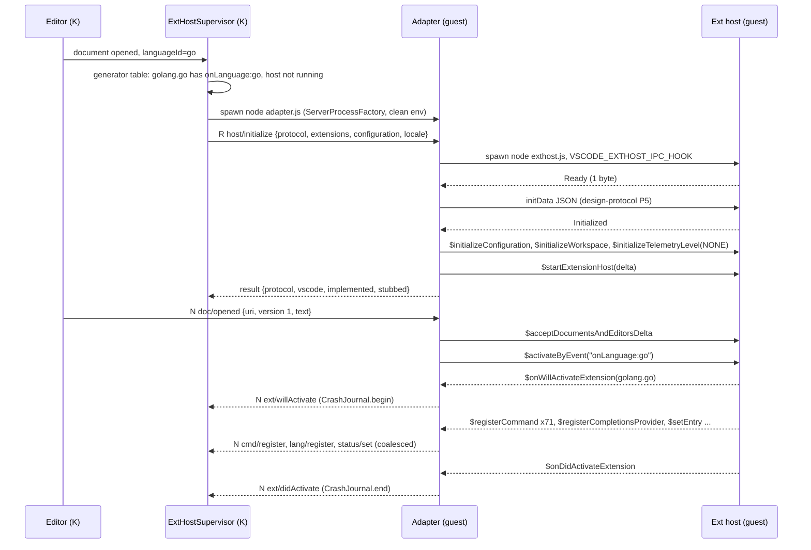
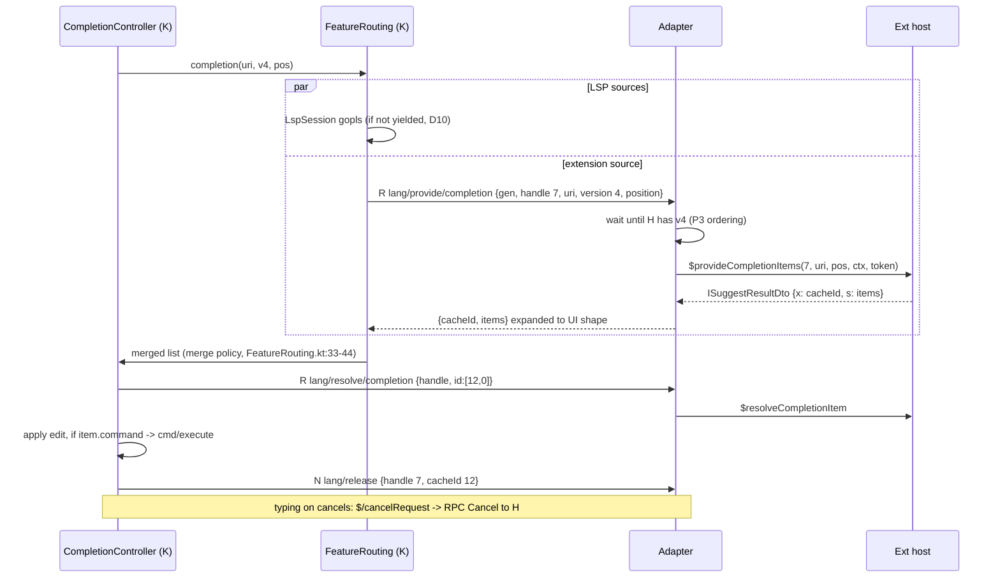
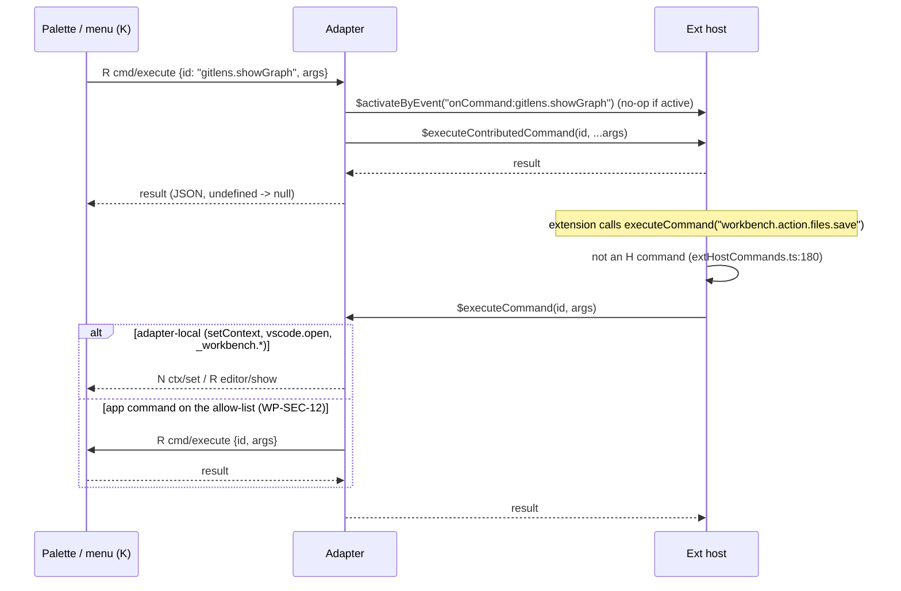
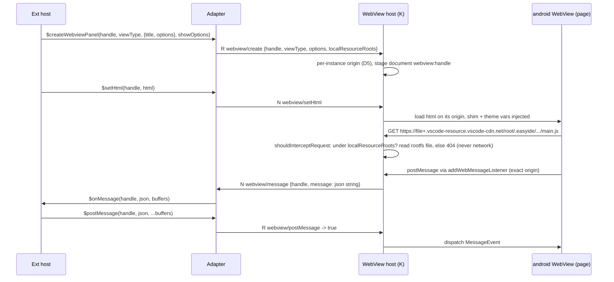
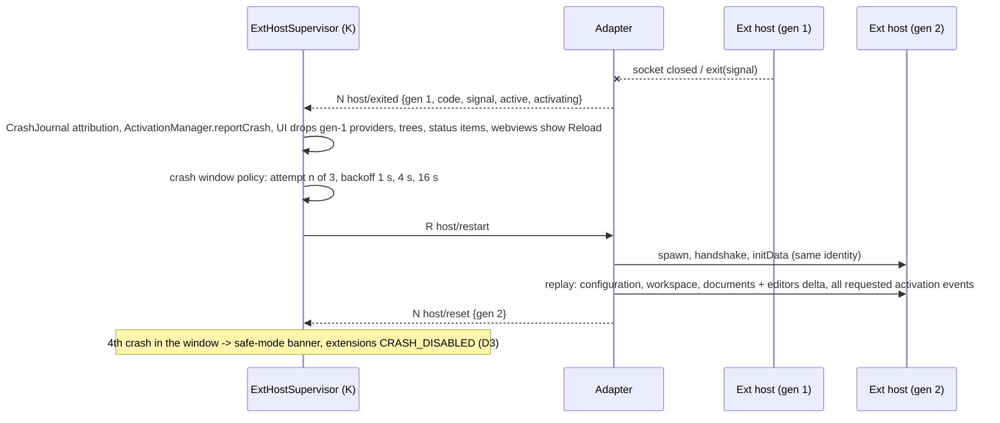

# VS Code extensions on easyIDE: target architecture (route 2b)

Status: design proposal (audit phase, 2026-09-25). Binding inputs: lead decisions D1-D13 ([ADR 0031](../decision/0031-vendor-vscode-extension-host.md)
route, [0032](../decision/0032-node-runtime-provisioning.md) Node runtime, [0033](../decision/0033-extension-webview-security-model.md)
webview security, [0034](../decision/0034-play-policy-stance-code-extensions.md) Play policy). Protocol detail and initData: [design-protocol.md](design-protocol.md).
Evidence: [research/route-spike.md](research/route-spike.md) (spike), [research/vscode-src.md](research/vscode-src.md) (VS Code
internals), [research/ourcode-backend.md](research/ourcode-backend.md) and [research/ourcode-ui.md](research/ourcode-ui.md) (our code),
[registry-install.md](registry-install.md), [security-licensing.md](security-licensing.md), [ui.md](ui.md), [ui-webviews.md](ui-webviews.md).
Prior draft: [../extension-host/arch.md](../extension-host/arch.md) (re-scoped here, §10) and
[ADR 0030](../decision/0030-vscode-extension-host-in-sandbox.md).
Conventions: `$VS/...:n` = microsoft/vscode `0b16cb97` (audit clone, route-spike header); our paths are relative to the repo root;
A = main-thread adapter (JS, guest), H = vendored extension host (JS, guest), K = Kotlin `:exthost` + app ports.
Work-package ids `WP-HOST-*`/`WP-API-*` are proposed here (§10.3); `WP-UI-*`, `WP-REG-*`, `WP-SEC-*` are the ones already defined.

## 1. Goals, non-goals, mental model

| Goals | Non-goals |
|---|---|
| Run unmodified Open VSX code extensions (Node `main`) in the guest with VS Code semantics inside the host, by construction (D1) | Re-implementing the `vscode` API (ADR 0030 decision 2, superseded by D1) |
| Keep the native Compose shell as the only UI; every extension surface renders through existing or planned app surfaces (ui.md) | A VS Code workbench in a WebView (route 3, rejected: route-spike §8-10) |
| S_in >= 99% on the corpus (D7), milestones M1-M5 (D11) | Out-of-scope tracks OOS-DAP/NB/CHAT/PROP/MS/WEB (D8): stubbed, typed, counted per track |
| One upgrade unit: bump the pinned VS Code tag, rebuild H + A, re-run the corpus (route-spike §5) | Tracking VS Code weekly; Microsoft-service features; remote/SSH |
| Cost only when used: no Node process until a code extension is enabled and one of its activation events fires (D3) | Per-extension isolation (proot gives none; ADR 0030 Context) |

**Mental model.** An extension talks to the `vscode` API exactly as on desktop, because the API *is* VS Code's own extension host (H),
bundled unchanged. H believes it is connected to a VS Code window: it speaks VS Code's private binary RPC over a Unix socket to our
**main-thread adapter** (A), a small JS program built from the same VS Code tag so it shares H's protocol definitions. A plays the
part of VS Code's `mainThread*.ts` classes: it keeps the VS Code-side protocol state (handles, caches, activation bookkeeping,
memento files) and translates each in-scope `MainThread*` call into a **semantic JSON-RPC message** to Kotlin (the UI protocol), or
answers it locally when the guest already has what is needed (files, processes, logs). Kotlin owns everything the user sees and all
Android-side state (documents in the editor, settings layers, context keys, commands, secrets, WebViews), and pushes changes back
through A into H. Out-of-scope calls stop in A with a typed "not supported on easyIDE" error or a no-op.

## 2. Components, processes, files

### 2.1 Component diagram

```
 Android app process (Kotlin)                                   proot guest (Ubuntu arm64, one per workspace session, D3)
 +-------------------------------------------------+            +-------------------------------------------------------------+
 | :exthost (new, pure JVM like :lsp)              |            |  node adapter.js  (A, ours, ~0.2 MB min)                    |
 |  ExtHostSupervisor   spawn/backoff/safe mode    |  stdio     |   UiProtocolServer  <- JSON-RPC (Content-Length) ------------+--- to K
 |  UiProtocolClient    JsonRpcConnection (reuse)  |<==========>|   MainThread* handlers (in-scope shapes, §6)               |
 |  Handlers per family (cmd, doc, lang, tree, ...)|  JSON-RPC  |   stubs: OOS shapes -> typed reject / no-op                 |
 |  ExtensionCatalog    raw package.json, enable   |            |   local services: memento files, logs, fs routing,          |
 +----------------------+--------------------------+            |     search/glob, workspaceContains, storage dirs            |
 | app ports (:app, existing modules)              |            |   HostSupervisor: spawn H, ack watchdog, restart replay     |
 |  UI surfaces: dialogs, quick input, status,     |            |   RPCProtocol (VS Code, same tag)                           |
 |    output, trees, menus, notifications (WP-UI)  |            +--------------------------+----------------------------------+
 |  Editor + DocumentStore + decorations (0018)    |            |  Unix socket, PersistentProtocol 13-byte frames,          |
 |  FeatureRouting -> FeatureSource (D10)          |            |  VS Code RPCProtocol (route-spike §3-4)                   |
 |  ContextKeyService, CommandRegistry, keymap     |            +--------------------------v----------------------------------+
 |  Settings resolver (5 layers)                   |            |  node exthost.js  (H, vendored, 3.0 MB min, unmodified)     |
 |  WebView host (ADR 0033, D5)                    |            |   extHost* services, require('vscode') interception         |
 |  Keystore secrets (WP-SEC-7), auth (WP-SEC-8)   |            |   built-ins: vscode.git, vscode.git-base, stubs (§7)       |
 |  Registry/install (WP-REG), crash journal       |            |   extensions (CJS + ESM) --> child_process, fs, git, net   |
 +-------------------------------------------------+            +-------------------------------------------------------------+
```

K spawns A through the existing `ServerProcessFactory` (`services/mobile/sandbox-runtime/src/main/java/dev/easyide/sandbox/shell/ServerProcessFactory.kt:76`,
`/bin/sh -c 'exec "$0" "$@"'`, stdio pipes, clean env `SandboxShell.kt:159-171`), keyed like a language server by (environment, project)
(`services/mobile/app/src/main/java/dev/easyide/app/lsp/SandboxServerLauncher.kt:57-62`). A spawns H with `child_process.spawn(node, [exthost.js])`
and `VSCODE_EXTHOST_IPC_HOOK=<socket>`, the transport the spike used (`$VS/src/vs/workbench/api/node/extensionHostProcess.ts:272-290`).

### 2.2 Decision: A and H are two processes

| Criterion | (a) two processes, UDS (chosen) | (b) one process, H in a `worker_thread` | (c) one process, one isolate, in-memory protocol |
|---|---|---|---|
| Uses H's bootstrap unmodified | yes, stock IPC-hook transport (spike-proven) | IPC hook from a worker: UNVERIFIED (`process.exit`/`Module._load`/`uncaughtException` patches, `extensionHostProcess.ts:56-157`, behave per thread) | no: needs our own entry around `ExtensionHostMain` |
| Hang detection (extension spins the event loop) | A keeps running; RPC acks stop after 3 s (`rpcProtocol.ts:119`) -> A reports, K offers kill | A keeps running; can `worker.terminate()` | impossible: A is blocked too, K sees silence only |
| Crash containment (native addon SIGSEGV, V8 OOM, `process.abort`) | H dies alone; A keeps the UI session and its mirror (documents, config, requested events) and replays them | V8 OOM contained by `resourceLimits`; native crash kills both | everything dies |
| H's global patches leak into A | no | partly (shared process) | yes |
| Memory | + one Node isolate for A: bare Node is 42 MB RSS on x86 (route-spike §3 table) + A's heap; estimate 45-60 MB, UNVERIFIED on arm64 | + ~10-20 MB isolate (UNVERIFIED) | 0 |
| Restart latency after an H crash | H only (0.25-0.41 s hello on x86, spike §3) + replay; no K re-handshake | same | full stack |

Reasons for (a): VS Code itself separates main and host for exactly these failure modes; the spike measured this topology; the
failure model in §9 relies on A surviving H. Cost: one extra small Node process. **Fallback**: if device gate G3/G4 (route-spike §10)
fails on memory, try (b) behind a setting and re-measure. A runs with `--max-old-space-size=64` and the compile cache (D2); H gets a
heap cap from `extensions.host.maxHeapMb` (WP-SEC-13).

### 2.3 Where files live (guest paths)

| Path | Content | Owner / lifetime |
|---|---|---|
| `/opt/easyide/node/<version>/` | Node 24 LTS linux-arm64 from nodejs.org, SHA-256 checked (D2, ADR 0032) | K provisioning, per environment, on first enable |
| `/opt/easyide/exthost/<tag>/exthost.js` | H bundle (esbuild of `extensionHostProcess.ts`, product config injected) | copied from APK assets; replaced on app update |
| `/opt/easyide/exthost/<tag>/adapter.js` | A bundle (same tag, reuses `RPCProtocol`, `extHost.protocol.ts`) | same |
| `/opt/easyide/exthost/<tag>/extensions/<id>/` | built-in extensions built from the same tag (§7) | same; read-only |
| `~/.easyide/extensions/vsx/<id>-<version>[-<tp>]/` + `current` | installed Open VSX extensions, raw `package.json` (D4, registry-install.md §6.3) | WP-REG-4, per environment |
| `~/.easyide/exthost/globalStorage/<ext-id>/` | `context.globalStorageUri` (H creates it) | wiped by kill switch (WP-SEC-6) |
| `~/.easyide/exthost/workspaceStorage/<workspaceId>/<ext-id>/` | `context.storageUri` | per project |
| `~/.easyide/exthost/state/global.json`, `state/<workspaceId>.json` | memento (`globalState`/`workspaceState`), written by A (temp + fsync + rename) | A |
| `~/.easyide/exthost/logs/<session>/` | H and A logs, `logUri` per extension, output-channel files K tails | rotated, 5 sessions |
| `~/.cache/easyide/node-compile-cache/` | `NODE_COMPILE_CACHE` (D2) | disposable |
| `/tmp/easyide-exthost-<gen>.sock`, `/tmp/easyide-xfer/<gen>/` | A<->H socket; binary side channel (design-protocol.md P3) | per H generation |

`~` is the guest home (`HOME=/root`, `services/mobile/sandbox-runtime/src/main/java/dev/easyide/sandbox/backend/SandboxLauncher.kt:86-119`).
The whole `~/.easyide/extensions/vsx/` tree must be visible in the guest; `EnvironmentExtensionBinds.kt:20-28` binds only
`/opt/easyide/extensions/<id>` today (registry-install.md §6.3 step 9).

## 3. Module boundaries and ownership

"Truth" = the side whose copy wins; the other side holds a mirror. Rule (D1): K owns UI and Android-side state; A owns VS Code-side
protocol state; H owns extension objects.

| State | Truth | Mirror / cache | Sync | Notes |
|---|---|---|---|---|
| Installed extensions, enablement, consent (`host.run`) | K (`ExtensionCatalog`, `Enablement.kt:45-100`) | A (initData `extensions`), H registry | `host/initialize`, `host/deltaExtensions` -> `$deltaExtensions` | raw `package.json` read by K from the rootfs (D4) |
| Activation state per extension | H | A (`ext/*` events), K `ActivationManager` view | A->K `ext/didActivate` etc. | K records `CrashJournal` begin/end around activation (`CrashJournal.kt:36-60`) |
| Requested activation events | A (set, replayed on restart as VS Code does, `abstractExtensionService.ts:924,993-994`) | K | K->A `host/activateByEvent`; A derives `onLanguage`, `onCommand`, `onFileSystem`, `onView`, `onUri`, `onWebviewPanel` itself | implicit events: one generator table (data file) used by K (to decide when to start A) and A |
| Text documents (text, version, dirty, EOL, language) | K `DocumentStore` (`services/mobile/lsp/src/main/kotlin/dev/easyide/lsp/docs/DocumentStore.kt:18-84`) | A (versions only), H `ExtHostDocumentData` | K->A `doc/*` -> `$acceptDocumentsAndEditorsDelta`, `$acceptModelChanged` | edits from extensions are applied by K first (design-protocol.md P3 ordering) |
| Editors: visible, active, selections, visible ranges, options, tabs | K (stage/editor groups) | H `ExtHostTextEditor`, `ExtHostEditorTabs` | K->A `editor/state`, `editor/tabs` | editor ids minted by K, stable per tab |
| Configuration (5 layers) | K settings resolver (`services/mobile/app/src/main/java/dev/easyide/app/data/settings/SettingsResolver.kt:38-100`) | H `ExtHostConfiguration` model | K->A `config/changed`; A->K `config/update` | mapping §8 |
| Context keys | K `ContextKeyService` (`ContextKeyService.kt:59-100`) | none | A->K `ctx/set` | `setContext` intercepted by A |
| Commands | split: extension commands in H; app/built-in commands in K `CommandRegistry` (`services/mobile/app/src/main/java/dev/easyide/app/ui/commands/Command.kt:45-61`); `vscode.*` API commands mostly in H (`extHostApiCommands.ts`) | A keeps the id set of H commands; K keeps a dynamic id table | `cmd/register|unregister|execute` | H executes its own ids locally and only sends unknown ids to `$executeCommand` (`$VS/src/vs/workbench/api/common/extHostCommands.ts:155,178-223`) |
| Language providers | H (objects) | A (handle -> kind/selector); K `FeatureSource` per handle | `lang/register` / `provide/*` | D10 dedup in K |
| Diagnostics | H collections | K `DiagnosticStore` (synthetic `ServerKey` per owner, `services/mobile/lsp/src/main/kotlin/dev/easyide/lsp/diagnostics/DiagnosticStore.kt:23-43`) | `diag/*` | |
| Decorations (text, file) | H | K render layers (WP-UI-7) | `editor/decorations/*`, `fileDeco/*` | coalesced |
| Tree nodes | H (element map, `extHostTreeViews.ts`) | K caches rendered rows per handle | `tree/*` | K never invents handles |
| Webviews: HTML, options, state | H (panel objects) + K (WebView instance, `setState` blob, per-instance origin, D5) | A handle table | `webview/*` | state survives H restart only via serializers |
| Terminals | K (PTY, `SandboxShell.kt:63-113`) | H `ExtHostTerminal` | `terminal/*` | |
| SCM providers | H (git built-in, others) | K renders (WP-UI-11) | `scm/*` | |
| Memento (`globalState`, `workspaceState`) | **A** (guest JSON files) | H cache | local; `$initializeExtensionStorage`/`$setValue` answered by A | no K round trip; wiped by kill switch; quota from K |
| `globalStorageUri`, `storageUri`, `logUri` dirs | H/extension (guest files) | - | - | paths from initData |
| Secrets | **K** (Keystore AES-GCM per `(envId, extId)`, WP-SEC-7, pattern `GitCredentials.kt:14-24`) | none in the guest | `secrets/*` | never written to guest disk |
| Auth sessions | K (WP-SEC-8) | H cache | `auth/*` | |
| Output channels | H writes files | K tails them (read-only) | `output/*` | |
| File watching (`createFileSystemWatcher`) | A (guest `fs.watch` recursive on `/workspace`) + K events for app-originated saves | H | local | inotify through proot UNVERIFIED (ourcode-backend §9) |
| File search (`findFiles`) | A (guest glob over `/workspace`) | - | local | text search M5: ripgrep in the guest |
| Telemetry | nowhere (dropped in A) | - | - | D9, WP-SEC-17 |

## 4. Protocols

**(a) VS Code RPC, A <-> H.** Unchanged VS Code: `PersistentProtocol` frames (13-byte header, acks, keep-alive) and `RPCProtocol`
messages (u8 type + u32 id; request = proxy id + method + JSON or mixed args with `VSBuffer`s; replies; `Cancel`); handshake `Ready` ->
initData JSON -> `Initialized` ([research/route-spike.md](research/route-spike.md) §3-4, [research/vscode-src.md](research/vscode-src.md) §3).
Proxy ids are creation-order indexes that shift between releases (70-144 ids moved per monthly step 1.100->1.130, route-spike §4), which
is why A is JS built from the same tag and Kotlin never speaks this protocol. Measured x86: p50 2.6 ms, p99 6.9 ms (spike §3).

**(b) UI protocol, A <-> K.** JSON-RPC 2.0 over A's stdio with LSP framing and Kotlin's existing `JsonRpcConnection`. Semantic messages
in families (`host/`, `ext/`, `cmd/`, `ctx/`, `config/`, `window/`, `progress/`, `status/`, `output/`, `secrets/`, `doc/`, `editor/`,
`workspace/`, `lang/`, `diag/`, `content/`, `fs/`, `fileDeco/`, `tree/`, `webview/`, `terminal/`, `scm/`, `task/`, `auth/`, `test/`,
`uri/`, `comments/`). Cancellation by `$/cancelRequest`; coalescing of status/decorations/tree/diagnostics on a 16 ms flush; binary
inline base64 up to 1 MiB, else a guest side-channel file; versioning handshake (protocol major/minor + vendored tag + commit);
backpressure in A (bounded in-flight, pause coalescable streams). Families, 15 sample messages and all rules:
[design-protocol.md](design-protocol.md) P1-P4.

**(c) initData.** Built by A from `host/initialize`: `version` = vendored stable tag, `appName` "easyIDE", `appHost` "desktop",
`uiKind` Desktop, `remote.isRemote` false (so `remoteName` undefined), telemetry NONE, storage homes under `~/.easyide/exthost`,
extension list = K's raw manifests + A's built-ins, `enabledApiProposals` filtered by the D8 allow-list. Field-by-field table:
[design-protocol.md](design-protocol.md) P5.

**Proposed-API allow-list (D8).** Initial content and rationale: [design-protocol.md](design-protocol.md) P7.

## 5. Sequences

### 5.1 Host start and activation (`onLanguage`)



### 5.2 Provider call: completion



### 5.3 Command execution, both directions



### 5.4 Webview panel: create and message round trip



Note: H computes resource URLs and `cspSource` itself (`https://<scheme>+<authority>.vscode-resource.vscode-cdn.net/<path>` and
`'self' https://*.vscode-cdn.net`, `$VS/src/vs/workbench/contrib/webview/common/webview.ts:21-58`, `extHostWebview.ts:76-96`). K must
answer **every** request to `*.vscode-cdn.net` locally (404 by default): `vscode-cdn.net` is a real public domain, so a missed
interception would fail open to the network. ADR 0033 decides exactly this (per-instance page origin, VS Code's resource host,
vendored `pre/index.html`); the resource URL form in [ui-webviews.md](ui-webviews.md) §3 S4/S5 is superseded by it.

### 5.5 Tree view refresh and 5.6 `.vsix` install to activation

Both diagrams: [design-protocol.md](design-protocol.md) P8.

### 5.7 Host crash and restart



## 6. MainThread shape disposition (all 87)

Derived mechanically from `docs/vsx-compat/data/vscode-exthost-shapes.json` (87 `MainThread*` shapes, 522 methods, `meta.summary`)
with one disposition per shape. `Spike` = distinct methods of that shape called by the 8 real extensions during activation in the
spike (`tools/vsx-audit/spike/calls/*.json`, 50 methods in total, route-spike §3). Codes: **I** Implement, **I\*** Implement with
listed stubs, **N** Stub-noop (accept, record, answer the neutral value), **R** Stub-reject (typed `-32010` error naming the OOS track;
where the API defines a failure value, that value plus a one-time banner), **N+R** registration accepted, use rejected, **N→I** stub
first, implemented later. WP owner per row; WP-OOS-<track> owns the stubs of its track.

Totals: I 36 shapes, I\* 7, N→I 1 (44 shapes with implementation work); N 16; R 22; N+R 5. The spike classified 53 ids as
"in scope" by name bucket (route-spike §4); the 9 not implemented here are deliberate no-ops (Telemetry, Theming, LabelService,
GitExtension, TerminalShellIntegration until M5) or proposal-only shapes (Timeline, UriOpeners as N; DocumentDiff, EditorInsets as R).

**Group justifications.** Workbench core (Commands, Configuration, Console, Errors, ExtensionService, Logger, MessageService,
OutputService, Progress, QuickOpen, StatusBar, Storage, Window, Clipboard): every spike extension touches them (M1). Editor model
(Documents, TextEditors, BulkEdits, Diagnostics, LanguageFeatures, Languages, DocumentContentProviders, FileSystem,
FileSystemEventService, Search, Workspace, Localization, SecretState): language extensions (M2, 22-must-work list). Views (TreeViews,
Decorations, EditorTabs, Diaglogs): M3. Webviews, SCM/QuickDiff, Terminal, Urls, CustomEditors: M4 (GitLens, Claude Code, Git Graph).
Tasks, Testing, Authentication, Comments UI, DownloadService: M5 (corpus weight: `tasks.executeTask` 0.407, `tests.createTestController`
0.208, `comments.createCommentController` 0.064, `authentication.getSession` 0.045 weight share, `data/corpus-usage.json`).
Debug, notebook, chat/lm/mcp/ai, remote/tunnels: D8 tracks; their *registration* methods are no-ops because H calls some at start
for every extension (`$registerDebugTypes`, `$getTools`, `$registerTaskSystem`, 8/8 runs) and many extensions register providers
unconditionally at activation.

| # | Shape (MainThread…) | m | Spike | Disp. | Milestone | Owning WP | Notes |
|---|---|---|---|---|---|---|---|
| 1 | AgentEditorComments | 4 |  | R | - | WP-OOS-CHAT | proposal `agentEditorComments` |
| 2 | AiEmbeddingVector | 2 |  | R | - | WP-OOS-CHAT | proposal |
| 3 | AiRelatedInformation | 3 |  | R | - | WP-OOS-CHAT | proposal |
| 4 | AiSettingsSearch | 3 |  | R | - | WP-OOS-CHAT | proposal |
| 5 | Authentication | 15 |  | I* | M5 | WP-API-11, WP-SEC-8 | `github` provider main-side (§7); `$registerDynamicAuthenticationProvider`/`$setSessionsForDynamicAuthProvider`/`$sendDidChangeDynamicProviderInfo`/`$promptFor*` = R (MCP auth, OOS-CHAT); M1: register accepted |
| 6 | Browsers | 5 |  | R | - | WP-OOS-PROP | proposal `browser` (CDP) |
| 7 | BrowserTunnelProxy | 1 |  | N | - | WP-OOS-MS | remote-only |
| 8 | BulkEdits | 1 |  | I | M2 | WP-API-2/3 | `workspace.applyEdit`; Kotlin `WorkspaceEditApplier` |
| 9 | ChatAgents2 | 20 |  | R | - | WP-OOS-CHAT | `chat.createChatParticipant` rejects with typed error |
| 10 | ChatContext | 6 |  | R | - | WP-OOS-CHAT |  |
| 11 | ChatDebug | 5 |  | R | - | WP-OOS-CHAT |  |
| 12 | ChatInputNotification | 2 |  | R | - | WP-OOS-CHAT |  |
| 13 | ChatOutputRenderer | 2 |  | R | - | WP-OOS-CHAT |  |
| 14 | ChatQuota | 1 |  | N | - | WP-OOS-CHAT |  |
| 15 | ChatSessions | 14 |  | R | - | WP-OOS-CHAT |  |
| 16 | ChatStatus | 2 |  | N | - | WP-OOS-CHAT |  |
| 17 | Clipboard | 2 |  | I | M1 | WP-API-18 | Kotlin `AndroidClipboard` |
| 18 | CodeMapper | 3 |  | R | - | WP-OOS-CHAT |  |
| 19 | Commands | 5 | 3 | I | M1 | WP-API-17 | all 5 |
| 20 | Comments | 9 |  | N→I | M4 stub, M5 | WP-API-24, WP-UI-15 | accept + record from M1 (ui.md §8.5), draw in M5 |
| 21 | Configuration | 2 |  | I | M1 | WP-API-2/3 | §8 |
| 22 | Console | 1 | 1 | I | M1 | WP-HOST-12 | to extension log |
| 23 | CustomEditors | 5 | 1 | I | M4 | WP-API-21, WP-UI-9 | text editors first (GitLens rebase); register accepted from M1 |
| 24 | DataChannels | 5 |  | R | - | WP-OOS-PROP | `linkPresentation` etc. |
| 25 | DebugService | 21 | 3 | N+R | - | WP-OOS-DAP | `$register*`/`$unregister*`/`$sessionCached` = N (called at activation, 8/8 spike runs call `$registerDebugTypes`); `$startDebugging` resolves `false` + banner; rest R |
| 26 | Decorations | 3 | 1 | I | M3 | WP-API-19, WP-UI-7 | file decorations |
| 27 | Diaglogs | 2 |  | I | M3 | WP-API-18 | open/save dialogs over guest FS |
| 28 | Diagnostics | 2 |  | I | M2 | WP-API-13 | `DiagnosticStore` synthetic `ServerKey` |
| 29 | DocumentContentProviders | 3 | 1 | I | M2 | WP-API-13 | virtual docs (`git:`, GitLens `gitlens:`) |
| 30 | DocumentDiff | 1 |  | R | - | WP-OOS-PROP | proposal `documentDiff` |
| 31 | Documents | 3 |  | I | M2 | WP-API-2/3 | open/create/save |
| 32 | DownloadService | 1 |  | I | M5 | WP-HOST-12 | adapter-local (Node `fetch` in guest) |
| 33 | EditorInsets | 5 |  | R | - | WP-OOS-PROP | proposal `editorInsets` |
| 34 | EditorTabs | 3 |  | I | M3 | WP-API-19, WP-UI-6 | `tabGroups` close/move |
| 35 | Embeddings | 3 |  | R | - | WP-OOS-CHAT |  |
| 36 | Errors | 1 | 1 | I | M1 | WP-HOST-12 | to extension log + crash attribution |
| 37 | ExtensionService | 8 | 5 | I | M1 | WP-HOST-12 | `$asBrowserUri` M4 (webview resources) |
| 38 | FileSystemEventService | 2 | 1 | I | M2 | WP-API-4/5 | adapter-local guest watcher + Kotlin save events (§3) |
| 39 | FileSystem | 12 | 2 | I | M2 | WP-API-4/5 | adapter-local routing between provider schemes; `file` stays in the host (node `DiskFileSystemProvider`) |
| 40 | GitExtension | 1 |  | N | - | WP-HOST-13 | only fires for main-side git consumers (agent sessions); record |
| 41 | Interactive | 0 |  | N | - | WP-OOS-NB | 0 methods |
| 42 | LabelService | 2 |  | N | - | WP-API-25 | formatters recorded; Kotlin labels unchanged |
| 43 | LanguageFeatures | 47 | 5 | I* | M2 / M5 | WP-API-13, WP-UI-10 | M2: the 23 kinds `FeatureRouting` already routes (§4.2); M5: color, call/type hierarchy, linked editing, inline completions, semantic tokens, paste/drop; `$registerEvaluatableExpressionProvider`/`$registerInlineValuesProvider`/`$emitInlineValuesEvent` = N (OOS-DAP); `$registerNewSymbolNamesProvider`, `$registerMultiDocumentHighlightProvider` = N |
| 44 | LanguageModels | 12 |  | N+R | - | WP-OOS-CHAT | `$selectChatModels` -> `[]`; register = N; `$tryStartChatRequest` = R |
| 45 | LanguageModelTools | 7 | 1 | N+R | - | WP-OOS-CHAT | `$getTools` -> `[]` (host calls it at start, 8/8), `$registerTool*`/`$unregisterTool` = N (`lm.registerTool` 0.161 at activation), `$invokeTool`/`$countTokensForInvocation` = R |
| 46 | Languages | 5 | 1 | I* | M2 | WP-API-13 | `$changeLanguage`, `$setLanguageStatus`, `$removeLanguageStatus`; `$tokensAtPosition`, `$computeFullSyntaxHighlighting` = R (proposals) |
| 47 | Localization | 2 |  | I | M2 | WP-HOST-12 | adapter reads bundle files in guest |
| 48 | Logger | 6 | 1 | I | M1 | WP-HOST-12 | adapter-local files under logsLocation; `LogOutputChannel` visible via output |
| 49 | ManagedSockets | 5 |  | R | - | WP-OOS-MS | remote resolvers |
| 50 | Mcp | 11 |  | R | - | WP-OOS-CHAT |  |
| 51 | MessageService | 1 | 1 | I | M1 | WP-API-18 |  |
| 52 | MeteredConnection | 0 |  | N | - | WP-OOS-MS | 0 methods |
| 53 | NotebookDocuments | 3 |  | R | - | WP-OOS-NB |  |
| 54 | NotebookEditors | 3 |  | R | - | WP-OOS-NB |  |
| 55 | NotebookKernels | 18 |  | N+R | - | WP-OOS-NB | `$addKernel`/`$updateKernel`/`$removeKernel`/detection = N (controllers created at activation); execution = R |
| 56 | NotebookRenderers | 1 |  | N | - | WP-OOS-NB |  |
| 57 | Notebook | 5 |  | N | - | WP-OOS-NB | serializer/status-bar registration accepted |
| 58 | OutputService | 5 | 1 | I | M1 | WP-API-18, WP-UI-4 |  |
| 59 | Power | 7 |  | R | - | WP-OOS-PROP | proposal `environmentPower` |
| 60 | ProfileContentHandlers | 2 |  | N | - | WP-OOS-MS | Settings Sync profiles |
| 61 | Progress | 3 |  | I | M1 | WP-API-18, WP-UI-4 |  |
| 62 | QuickDiff | 4 |  | I | M4 | WP-API-22, WP-UI-11 | git extension quick-diff bars |
| 63 | QuickOpen | 6 |  | I | M1 | WP-API-18, WP-UI-4 | QuickPick/InputBox sessions |
| 64 | SCM | 17 |  | I | M4 | WP-API-22, WP-UI-11 | git extension is the main producer (§7); history/artifact events = N until M5 |
| 65 | Search | 8 | 1 | I* | M2 / M5 | WP-API-4/5 | `$register*Provider`/`$unregisterProvider` = accept (host registers file providers at start, 8/8); `$handleFileMatch`/`$handleTextMatch` M2/M5; `$registerAITextSearchProvider`, `$handleKeywordResult` = N |
| 66 | SecretState | 4 | 1 | I | M2 | WP-HOST-8/WP-API-6, WP-SEC-7 | Kotlin Keystore; M1 answers `undefined` |
| 67 | Share | 2 |  | N | - | WP-OOS-PROP | proposal `shareProvider` |
| 68 | Speech | 5 |  | R | - | WP-OOS-CHAT |  |
| 69 | StatusBar | 2 |  | I | M1 | WP-API-18, WP-UI-4 |  |
| 70 | Storage | 3 | 3 | I | M1 | WP-HOST-8/WP-API-6 | adapter-local guest files (§3) |
| 71 | Task | 10 | 3 | I | M5 | WP-API-7/8 | register/`$registerSupportedExecutions`/`$registerTaskSystem` accepted from M1 (8/8 at start); run via terminal |
| 72 | Telemetry | 2 | 1 | N | M1 | WP-SEC-17 | dropped (D9) |
| 73 | TerminalService | 23 | 2 | I* | M4 / M5 | WP-API-7/8, WP-UI-13 | M1 accept `$registerProcessSupport`, `$setEnvironmentVariableCollection`; M4 create/show/hide/sendText/dispose; M5 Pseudoterminal (`$sendProcess*`), data events, link provider; profile/completion/quick-fix providers = N |
| 74 | TerminalShellIntegration | 1 |  | N | M5 | WP-API-7/8 | no shell integration until M5 (`terminal.shellIntegration` stays undefined) |
| 75 | Testing | 21 |  | I | M5 | WP-API-23, WP-UI-13 |  |
| 76 | TextEditors | 13 | 1 | I* | M2 | WP-API-19, WP-UI-7 | `$getDiffInformation` = N (proposal) |
| 77 | Theming | 0 |  | N | - | WP-API-25 | 0 methods; theme changes go ext-host-wards |
| 78 | Timeline | 3 |  | N | - | WP-OOS-PROP | proposal `timeline` (ui.md: Not-planned); git built-in registers it |
| 79 | TreeViews | 9 | 2 | I | M3 | WP-API-20, WP-UI-5 | drop data = M5 |
| 80 | TunnelService | 11 |  | N+R | - | WP-OOS-MS | `$setCandidateFilter`/`$registerPortsAttributesProvider`/`$setTunnelProvider` = N; `$openTunnel` = R |
| 81 | UriOpeners | 2 |  | N | - | WP-OOS-PROP | proposal `externalUriOpener` |
| 82 | Urls | 3 | 1 | I | M4 | WP-API-18, WP-SEC-11 | register accepted from M1; `$createAppUri` -> `easyide://` |
| 83 | WebviewPanels | 7 | 3 | I | M4 | WP-API-21, WP-UI-9 |  |
| 84 | Webviews | 3 | 1 | I | M4 | WP-API-21, WP-UI-8 |  |
| 85 | WebviewViews | 6 | 1 | I | M4 | WP-API-21, WP-UI-9 |  |
| 86 | Window | 3 | 1 | I | M1 | WP-API-18 |  |
| 87 | Workspace | 20 |  | I* | M2 / M5 | WP-API-2/3, WP-API-4/5 | M2: `$startFileSearch`, `$checkExists`, `$save(All)`, encoding trio (UTF-8), `$resolveProxy` (DIRECT), `$loadCertificates` (`[]`); M3: trust; M5: `$startTextSearch`; `$updateWorkspaceFolders` -> `false` (single root); edit-session/canonical-URI providers = N; `$lookup*Authorization` = R |

**M1/M2 minimum: the 50 methods real extensions called during activation** (GitLens, Claude Code, Go, ESLint, Prettier, EditorConfig,
Code Runner, Better Comments; `tools/vsx-audit/spike/calls/*.json`). A must answer all of them without error from M1 (implemented,
or accepted and recorded) so these extensions activate; the feature behind each lands at the milestone in the table.
Commands `$registerCommand`, `$executeCommand`, `$fireCommandActivationEvent` · Console `$logExtensionHostMessage` · CustomEditors
`$registerTextEditorProvider` · DebugService `$registerDebugTypes`, `$registerDebugConfigurationProvider`, `$registerDebugAdapterDescriptorFactory` (N) ·
Decorations `$registerDecorationProvider` · DocumentContentProviders `$registerTextContentProvider` · Errors `$onUnexpectedError` ·
ExtensionService `$onWillActivateExtension`, `$onDidActivateExtension`, `$onExtensionActivationError`, `$onExtensionRuntimeError`, `$setPerformanceMarks` ·
FileSystem `$ensureActivation`, `$registerFileSystemProvider` · FileSystemEventService `$watch` · LanguageFeatures `$registerCompletionsProvider`,
`$registerCodeLensSupport`, `$registerDocumentFormattingSupport`, `$registerDocumentLinkProvider`, `$setLanguageConfiguration` ·
LanguageModelTools `$getTools` (N, `[]`) · Languages `$setLanguageStatus` · Logger `$registerLogger` · MessageService `$showMessage` ·
OutputService `$register` · Search `$registerTextSearchProvider` · SecretState `$getPassword` · Storage `$initializeExtensionStorage`, `$setValue`,
`$registerExtensionStorageKeysToSync` · Task `$registerSupportedExecutions`, `$registerTaskSystem`, `$registerTaskProvider` · Telemetry `$publicLog2` (N) ·
TerminalService `$registerProcessSupport`, `$setEnvironmentVariableCollection` · TextEditors `$registerTextEditorDecorationType` ·
TreeViews `$registerTreeViewDataProvider`, `$setTitle` · Urls `$registerUriHandler` · WebviewPanels `$createWebviewPanel`, `$registerSerializer`,
`$setIconPath` · WebviewViews `$registerWebviewViewProvider` · Webviews `$setHtml` · Window `$getInitialState`.

## 7. Built-in extensions the host expects

H itself contains no built-in extensions; VS Code ships them from `$VS/extensions/` (106 entries, MIT per each `package.json` `license`
and `$VS/LICENSE.txt`). Corpus demand (bundles under the corpus cache, `/root/.cache/easyide-corpus/x`): **20 extensions call `getExtension('vscode.git')`**
(GitLens, GitHub PR, GitLab Workflow, Git Blame, Git History, Ruby LSP, Continue, Cline, Kilo Code, CodeRabbit, Atlassian, ...), 6 declare
`extensionDependencies: ["vscode.git"]` (GitLab Workflow, Ruby LSP, Atlassian, CodeRabbit, Nx Console, Kombai), 1 declares
`vscode.github-authentication` (GitHub PR), 4 reference `vscode.typescript-language-features` (Volar, Svelte, Gemini Code Assist, .NET runtime).
Open VSX hosts `vscode.*` copies built by `eclipse-theia/vscode-builtin-extensions` at **1.95.3** (`vscode.git`, `git-base`,
`github-authentication`, `npm`, `json-language-features`, `yaml`, `docker` are in the corpus cache; `vscode.npm` and
`vscode.json-language-features` are in the top 150 of `data/corpus.json`).

### 7.1 Decision: vendor `extensions/git` (+ `git-base`) from the pinned tag, unmodified

| Option | For | Against |
|---|---|---|
| **Vendor `$VS/extensions/git` + `git-base`, built with its own esbuild config at the pinned tag, shipped as `isBuiltin`** (chosen) | exact `getAPI(1)` semantics (`extensions/git/src/api/extension.ts:81`), the API GitLens and 19 others were written against; SCM provider, quick diff, blame, `git:` content provider, askpass come with it; MIT; same upgrade unit as H; its proposals (34) are honoured because built-ins keep theirs (`extensionsProposedApi.ts:110`) | large (25,495 TS lines in `src/`; Theia's build of 1.95.3 is 5.1 MB `dist/`); activates on `*` (every host start: memory and a `git status` per repo, UNVERIFIED cost on device); spawns `git` (guest git exists); one native dependency `@vscode/fs-copyfile` (node-gyp, used for worktree copy at `repository.ts:2105`) must be aliased at bundle time to a JS `fs.promises.cp` shim; `@vscode/extension-telemetry` goes quiet because telemetry is off |
| Write a `vscode.git` subset over the guest `git` binary (arch.md "Built-in extension stubs") | small | every consumer probes a different part (`repositories[].state`, `onDidOpenRepository`, `log`, `diff`, `getBranch`, `inputBox`); drift is the same route-1 problem at smaller scale |
| Install Open VSX `vscode.git` 1.95.3 | zero build work | 44 minor releases older than the pinned host; its `enabledApiProposals` include names that no longer exist (e.g. `quickInputButtonLocation`, absent from `$VS/src/vs/platform/extensions/common/extensionsApiProposals.ts`), and it is a third-party build of Microsoft code |

Consequences. (1) Built-ins live in `/opt/easyide/exthost/<tag>/extensions/`, win over any installed copy with the same id, and the
installer refuses Open VSX `vscode.git`/`vscode.git-base` with "built in" (WP-REG-2 amendment). (2) The SCM view gets two
backends: native JGit while no host runs (today's view, `services/mobile/sandbox-runtime/src/main/java/dev/easyide/sandbox/git/GitService.kt:21-150`),
the git extension's `git` provider (`MainThreadSCM`) while a host runs, rendered with the same rows, so that `scm/*` menu commands
from GitLens and GitHub PR receive the H-side resource-state arguments they expect (WP-UI-11; ui.md §8.4). (3) Credentials: H has
no git token (D3, ADR 0012); push/fetch from the git extension prompt through its askpass (`askpass.ts`, an IPC server in the guest)
into our input box; offering the app's PAT there needs consent and is a WP-SEC-8 follow-up. (4) The `MainThreadGitExtension` /
`ExtHostGitExtensionService` pair (`$VS/src/vs/workbench/api/common/extHostGitExtensionService.ts:196-215`) lets the main side query
the git extension; A records `$onDidChangeRepository` and does not use it in v1.

### 7.2 Other built-ins

| `$VS/extensions/<dir>` | Decision | Reason |
|---|---|---|
| `git`, `git-base` | vendor (M4) | §7.1 |
| `github-authentication` | **replace**: a declarative stub `vscode.github-authentication` (package.json with `contributes.authentication: [{id: "github"}]`, no `main`) + the `github` provider implemented main-side in A, backed by K (WP-SEC-8, M5) | satisfies GitHub PR's `extensionDependencies`; the real one depends on Microsoft's OAuth app/redirects, `vscode-tas-client` experimentation and 4 auth proposals |
| `npm` | vendor (M5) | in corpus top 150 as Open VSX `vscode.npm`; task provider + scripts view; needs Task (M5) |
| `json-language-features` | vendor candidate (M5, open question 11.3) | in corpus top 150; its client applies `contributes.jsonValidation` of all extensions; conflicts with a built-in JSON LSP only if we add one (D10) |
| `merge-conflict`, `references-view`, `emmet`, `media-preview` | vendor candidates (M5) | small, MIT, stable API only (`emmet` 8.4k lines, `merge-conflict` 1.4k, `references-view` 1.9k) |
| `typescript-language-features` | **absent** | our TypeScript LSP pack serves TS/JS; the extension needs `tsserver`, 20+ proposals and is heavy. Consumers get `MissingExtensionDependency` or `getExtension` = undefined: Volar/Svelte hybrid mode (they then run their own servers; impact UNVERIFIED), open question 11.4 |
| `markdown-language-features`, `markdown-math`, `mermaid-markdown-features` | not now | 16 npm deps (markdown-it, mermaid, katex...), 7 proposals, webview preview; our markdown pack + `MermaidView` exist |
| `github` | not now | Octokit, `chatSessionsProvider` and `shareProvider` proposals; value is "Publish to GitHub" and git credential provider, both behind WP-SEC-8 |
| `configuration-editing`, `extension-editing`, `search-result`, `terminal-suggest` | no | tied to VS Code's own settings files, extension authoring, search editor, or proposals |
| `microsoft-authentication`, `copilot`, `tunnel-forwarding` | must not | OOS-MS/OOS-CHAT; Microsoft services; `keytar` native |
| `debug-auto-launch`, `debug-server-ready`, `ipynb`, `notebook-renderers`, `prompt-basics` | must not | OOS-DAP / OOS-NB / OOS-CHAT |
| `*-basics`, language grammar dirs, `theme-*` | not through H | declarative; the existing TextMate/theme import path handles them (ADR 0010, ADR 0029) |
| `vscode-api-tests` | test only (WP-TEST) | VS Code's API conformance suite, run against A with the corpus harness |

Configuration defaults: `configurationDefaults` of every extension (built-in or installed) go into the defaults model (§8); A adds
none of its own except the D9 identity values (`telemetry.telemetryLevel: "off"`, read-only, WP-SEC-12/17).

## 8. Settings and configuration model

K's five layers (`LayerId { BUILT_IN, EXTENSION, USER, ENVIRONMENT, PROJECT }`,
`services/mobile/app/src/main/java/dev/easyide/app/data/settings/LayerDoc.kt:10`) map onto VS Code's `IConfigurationData`
(`defaults, policy, application, userLocal, userRemote, workspace, folders`, `$VS/src/vs/platform/configuration/common/configuration.ts:222-230`):

| VS Code model | From K | Reason |
|---|---|---|
| `defaults` | BUILT_IN + EXTENSION: schema defaults of `contributes.configuration` of all installed extensions (K already parses them, `ContributedSettings.kt:21-60`) + `configurationDefaults` incl. `[lang]` blocks + D9 identity values | better-comments failed activation in the spike only because defaults were missing (route-spike §3) |
| `policy` | empty | no enterprise policy |
| `application` | USER keys whose scope is `application` | VS Code reads application-scoped keys from the user profile only |
| `userLocal` | USER | app-wide user settings |
| `userRemote` | ENVIRONMENT | the guest is our "remote machine": VS Code writes `machine`/`machine-overridable` keys there and `inspect()` exposes it as `globalRemoteValue`, a real slot instead of none (ourcode-backend §2.2 `config.inspect`) |
| `workspace` | PROJECT | single root: workspace = folder |
| `folders` | `[]` | `workspaceFolderValue` stays undefined (single root, ADR 0017) |
| `configurationScopes` | `[key, scope]` from contributed schemas (`ConfigurationScope`: `application`=1, `machine`=2, `application-machine`=3, `window`=4, `resource`=5, `language-overridable`=6, `machine-overridable`=7, `$VS/src/vs/platform/configuration/common/configurationRegistry.ts:184-213`) | H needs them for `getConfiguration(section, scope)` and language overrides |

`inspect()` then works in H unchanged: `defaultValue` (defaults), `globalValue` (userLocal merged with userRemote), `workspaceValue`
(PROJECT), `*LanguageValue` from `[lang]` blocks in each layer (`SettingScope.L`, `Setting.kt:18-28`). Writes: `$updateConfigurationOption(target, key, value, overrides, scopeToLanguage)`
-> A -> `config/update`: `Global` -> USER, except keys whose scope is `machine`/`machine-overridable` -> ENVIRONMENT (VS Code sends
machine-scoped writes to the remote user settings in a remote window); `Workspace`/`WorkspaceFolder` -> PROJECT; `overrides.overrideIdentifiers`
-> the `[lang]` block of that layer. K validates with `SchemaValidator`, applies `ProjectTrust` for exec-bearing keys
(`ProjectTrust.kt:1-31`), refuses protected keys (`telemetry.*`, `http.proxy*`, WP-SEC-12). Change events: K sends
`config/changed {models (changed layers only), change: {keys, overrides}}`; A calls `$acceptConfigurationChanged`. Our current
`scopeOf` maps `window`/`resource` to PROJECT (`ContributedSettings.kt:49-53`); that stays for the settings UI, and the VS Code scope
number travels separately in `configurationScopes`.

## 9. Failure model and supervision

| Failure | Detection | Containment | Recovery | User sees |
|---|---|---|---|---|
| Extension throws in `activate()` | H `$onExtensionActivationError` | that extension only (H catches) | none; VS Code parity | extension marked failed in Extensions UI, log link |
| Extension runtime error | `$onExtensionRuntimeError`, `$onUnexpectedError` | H patches `uncaughtException` (`extensionHostProcess.ts:97-157`) | none | log entry; banner after N errors/min |
| H busy loop | A: no RPC ack for 3 s (`rpcProtocol.ts:119`) -> `host/responsive false` | A and K stay responsive; K cancels pending provider requests (P3 timeouts) | user "Restart extensions"; auto-kill after `extensions.host.unresponsiveKillSec` (proposal 30 s) | status item "Extensions not responding" |
| H crash (signal, native addon, V8 OOM, `process.abort`) | A: child exit + socket close | UI drops gen-N registrations; A keeps its mirror | §5.7: restart with backoff 1/4/16 s, replay; 4th in the crash window (reuse `LspPolicy` 300 s window) -> safe mode (D3) | toast "Extensions restarted"; then safe-mode banner |
| Crash attributed to one extension | K `CrashJournal` begin/end around activation (`CrashJournal.kt:36-60`) + A's `activating` field in `host/exited` | 2 consecutive crashes during the same extension's activation -> that extension `CRASH_DISABLED` (`ActivationManager.kt:111-127`), host restarts without it | re-enable by user | "GitLens was disabled after crashing the extension host" |
| A crash | K: `ServerProcess.awaitExit` | H exits (socket close, `extensionHostProcess.ts:286-288`) | K restarts A + H under the same backoff counter | same as H crash |
| Low memory (`onTrimMemory`) | `MemoryPolicy` (`services/mobile/lsp/src/main/kotlin/dev/easyide/lsp/manager/MemoryPolicy.kt:5-70`) | order: idle LSPs -> hidden webviews -> H (ui-webviews.md §5, backend C9) | H stopped (not crashed): `deactivate()` with 5 s grace, restart on the next activation event | status "Extensions paused to save memory" |
| Workspace session parked/closed | session lifecycle (ADR 0023) | `host/shutdown` -> `$deactivate` per extension -> exit; kill after 5 s | on resume, lazy start again | none |
| Version skew A/H | H exit code 55 (`VersionMismatch`) | host never starts | K re-copies assets once, then reports | "Extension host package is damaged, reinstall" |
| Kill switch (per environment) | user | K kills A (proot `--kill-on-exit` takes the tree) | wipes `~/.easyide/exthost/{state,globalStorage,workspaceStorage}` and Keystore entries (WP-SEC-6) | confirm dialog |
| Node missing/corrupt | spawn fails / `node --version` check | no host | re-provision (ADR 0032) | "Install extension runtime" |

Supervision split: A executes (spawn, handshake, replay, ack watchdog); K decides (restart or not, backoff, safe mode, crash
journal, memory pressure), so policy lives in one place and persists across app restarts.

## 10. What changes in existing modules

### 10.1 Code changes required (all later phases; this audit changes no code)

| # | Module / file | Change | Ref |
|---|---|---|---|
| 1 | new Gradle `:exthost` (pure JVM) | supervisor, UI protocol client, family handlers, `ExtensionCatalog` for `.vsix` | ADR 0030 dec. 4 kept |
| 2 | `services/mobile/lsp/.../jsonrpc/JsonRpcConnection.kt:81-82` | reused as-is; add a conflated handler dispatch for high-rate notifications on the K side | P3 backpressure |
| 3 | `services/mobile/lsp/.../client/FeatureRouting.kt:30-90`, `LspClient.kt`, `CompletionController.kt:200-212` | `FeatureSource` with `DocumentSelector`; extension providers are sources; D10 dedup; merge moved out of presenters | D10, backend C5 |
| 4 | `services/mobile/lsp/.../docs/DocumentStore.kt`, `session/DocumentSync.kt` | add `eol`, dirty, untitled, encoding, per-flush change list; A is one more consumer | backend C11 |
| 5 | `services/mobile/app/.../ui/commands/Command.kt:45-61`, `extensions/.../ExtensionsRuntime.kt:186-196` | dynamic command ids (`CommandHandler.Host`), return values, allow-list for H->K calls | backend C6, WP-SEC-12 |
| 6 | `services/shared/extension-schema/.../whenclause/*` | `===`/`!==`, VS Code key table, `setRaw` from `ctx/set` | backend C7, WP-UI-2 |
| 7 | `services/mobile/extensions/.../host/ActivationManager.kt:142`, `SCH/manifest/ExtensionDescriptor.kt:22-47` | raw event strings, implicit events, host-specific timeout and crash keys; a Node `Activator` | backend C8 |
| 8 | `services/mobile/app/.../data/settings/*` | model export for §8; write path by target; protected keys | §8 |
| 9 | `services/mobile/lsp/.../manager/MemoryPolicy.kt:58-68` | host slot in the kill order + budget key | backend C9, WP-SEC-13 |
| 10 | `services/mobile/sandbox-runtime/.../extensions/EnvironmentExtensionBinds.kt:20-28` | make `~/.easyide/extensions/vsx/` and `/opt/easyide/exthost/` visible | registry-install.md §6.3 |
| 11 | secrets: new `ExtensionSecrets` on the `GitCredentials.kt:14-24` pattern | `secrets/*` | WP-SEC-7 |
| 12 | `services/mobile/lsp/.../diagnostics/DiagnosticStore.kt:23-43` | owners as synthetic `ServerKey`s | backend C15 |
| 13 | SCM view (`git/ScmHeader.kt`, `git/ChangeRow.kt`) | second backend = git extension provider | §7.1, WP-UI-11 |
| 14 | manifest path | tolerant `.vsix` reader; never through `manifest.schema.json` | D4, backend C1 |
| 15 | build: `tools/build-exthost` (new) | esbuild H + A + built-ins from the pinned tag, product injection, `fs-copyfile` alias, NOTICE rows | WP-HOST-1 |

### 10.2 What is superseded in `docs/extension-host/arch.md`

Superseded: the architecture diagram and "Layout" (our own `vscode` module in `exthost.js`), "Transport" cancellation (`$/cancel`),
"Host lifecycle" steps 1-2 (now handshake + initData, design-protocol.md P5), `host/initialize` payload, `workspace/getConfiguration`,
`storage/*`, output text messages, the webview URL form, "Built-in extension stubs" and "Phases". Kept (re-scoped as UI protocol with
the amendments in [design-protocol.md](design-protocol.md) P6): JSON-RPC/LSP framing, position/URI conventions, most method names in
the Main->host and Host->main tables, provider kinds, tree/webview/terminal/SCM families. ADR 0030: decisions 1 (amended by D3),
3, 5, 6 kept; 2 superseded by ADR 0031; the Node source in decision 1 superseded by ADR 0032.

### 10.3 Work packages proposed here

List with scopes: [design-protocol.md](design-protocol.md) P9.

## 11. Open questions and UNVERIFIED

| # | Question / claim | How to settle |
|---|---|---|
| 11.1 | Memory of the two-process split on arm64 (A's RSS; H with GitLens + Claude Code + ESLint + git built-in) against G3/G4 (route-spike §10) | device spike: `/proc/<pid>/status` VmRSS/VmHWM for A and H, `dumpsys meminfo`; if over, try option (b) |
| 11.2 | Unix-domain socket at `/tmp/...` works under proot for the IPC hook; path length < 108 bytes | device: run the spike renderer + host in the guest |
| 11.3 | Vendor `json-language-features` (jsonValidation parity) vs our own JSON support | corpus count of `contributes.jsonValidation`; conflict check with D10 |
| 11.4 | Impact of absent `typescript-language-features` on Volar/Svelte (hybrid mode, `typescriptServerPlugins`) | corpus scenario g4 for both |
| 11.5 | Git extension cost at host start (`*` activation, `git status`, `.git` watchers) on a big repo | device: time to `$onDidActivateExtension` for `vscode.git`, CPU during first minute |
| 11.6 | `@vscode/fs-copyfile` alias is the only native import in the git bundle | esbuild metafile of the built-in; `grep -r '\.node'` in its output |
| 11.7 | Coalesced (one range per flush) document changes are acceptable to extensions | corpus harness with Error Lens, Prettier format-on-type, Vim-style extensions |
| 11.8 | inotify through proot for A's watcher on `/workspace` (ourcode-backend §9) | device: `node -e "require('fs').watch('/workspace',{recursive:true},console.log)"` + edits from the app and the terminal |
| 11.9 | `extensionHostProcess.ts` runs inside a `worker_thread` (fallback (b)) | spike: start H in a worker with the IPC hook, run the 8 extensions |
| 11.10 | ui-webviews.md §3-4 still describe a no-iframe shim and our own resource URL form; ADR 0033 vendors `pre/index.html` and keeps VS Code's resource host | update ui-webviews.md to ADR 0033; device tests T3/T4 (ui-webviews.md §8) |
| 11.11 | Which H-internal commands (`_workbench.*`, `vscode.*` not in `extHostApiCommands.ts`) reach `$executeCommand` during the corpus run | log `$executeCommand` ids in the harness; add each to A's table or K's allow-list |
| 11.12 | The initial proposal allow-list (design-protocol.md P7) is enough for ms-python and GitHub PR scenarios | corpus g1-g4 with and without each proposal |
| 11.13 | Default timeouts, flush window (16 ms), inline binary limit (1 MiB), in-flight cap (256) | tune with device traces; all become settings keys (R-ENG-07/08 no-hardcoding) |
| 11.14 | All route-spike numbers are x86 proxies | device gates G1-G7 (route-spike §10) |
