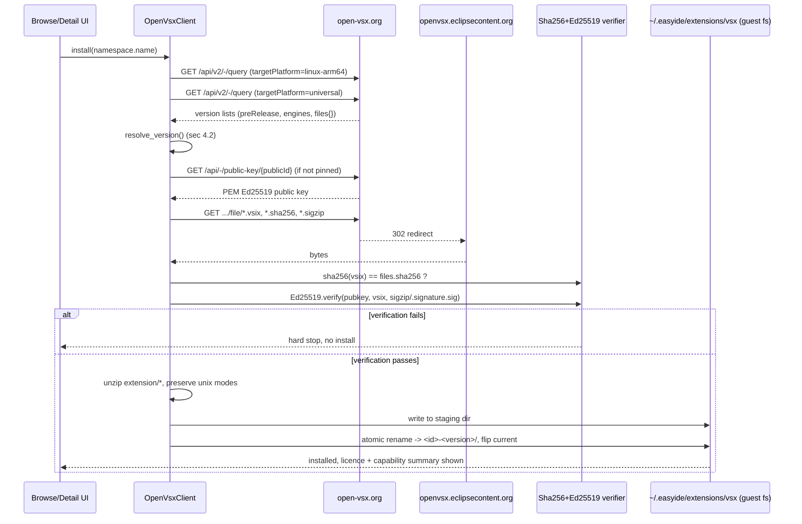

# Open VSX registry and install pipeline — design notes

Audit-phase design doc (documentation only, no application code changed). Sources: [research/openvsx-registry.md](research/openvsx-registry.md)
(primary; git revisions pinned there: `ovsx@edab3e4`, `ovsx-wiki@54c40c0`, `fdn-site@10340c3`,
`fdn-wiki@b9f9568`, `vsce@c1eebf3`, `vscode@0b16cb9`), [research/policy-licence.md](research/policy-licence.md) (licences, Node, rate limits),
[research/ourcode-backend.md](research/ourcode-backend.md) (installer/manifest facts). Every claim below cites one of those three files (as
`reg:<section>`, `lic:<section>`, `be:<section>`) or a repo `file:line`. Claims not traceable to a primary
source are marked **UNVERIFIED** (section 12).

## 1. Scope and links

This document designs the client-side pieces needed to browse, resolve, verify and install extensions
from Open VSX (`open-vsx.org`) into easyIDE, alongside — not replacing — the existing `.easyext` /
static-index registry pipeline (ADR 0016). It does not design the manifest-compatibility layer (accepting
real `package.json`, contribution points, the Node extension host); that is `ourcode-backend.md` §1 items
C1–C19, tracked in [backend.md](backend.md) (sibling audit doc, same phase). Licence and Play-policy
conclusions are in [security-licensing.md](security-licensing.md) (sibling doc, built from
`policy-licence.md`). Corpus measurements referenced here (package sizes, engines, signature coverage)
live in [corpus.md](corpus.md) and `docs/vsx-compat/data/corpus.json`. Read together with:

- [README.md](README.md) — audit overview and how these docs fit together.
- [ADR 0005](../decision/0005-sandbox-environment-sharing-model.md) — environments vs. projects; project
  sources are bind-mounted, never inside a rootfs; environment deletion is refused while projects
  reference it.
- [ADR 0016](../decision/0016-extension-registry-static-index-ed25519.md) — the primary registry (signed
  git index, ed25519, TOFU). It already names Open VSX as "opt-in secondary source
  (`extensions.openVsx.enabled`)" and states (now outdated, corrected here) that Open VSX "carries only
  its own sha256" (0016 Context; corrected in §5).
- [LLD §9](../extension-sdk/lld/registry-and-install.md#9-open-vsx-adapter) — the current proposed Open
  VSX adapter (sha256-only, subset importer, scope forced GLOBAL). This document supersedes that section's
  design (not its file); §11 explains why.

**Fixed decisions** (given, not re-derived here): code extensions install per environment into the guest
(ADR 0005); a separate "vsx" install path exists beside the `.easyext` installer, and it keeps the real
`package.json` raw — never forced through `manifest.schema.json`; the client uses the Open VSX native
Registry API, not the `/vscode/gallery` marketplace adapter; target selection prefers `linux-arm64` over
`universal` for the same version and never picks `alpine-*`/`x64`/`web` for code extensions (web/browser
extensions are Not-planned for the Node host); integrity is sha256 + Ed25519 `.sigzip` verified with our
existing Ed25519 code, not `@vscode/vsce-sign`; publisher pinning plus a verified-namespace badge; no
auto-update by default, update checks ask consent, rollback keeps the previous version; Open VSX rate
limits are honoured (client throttling, backoff, caching); pre-releases are filtered unless opted in;
NLS resolution is applied; `engines.vscode` is checked with a port of VS Code's own grammar, not npm
semver; Unix file modes are preserved; package limits are raised with a stated rationale; the Open VSX
`extension-control` list is honoured as a kill list; licence is captured and shown before install.

---

## 2. Open VSX client

### 2.1 Endpoint table (subset used by the client; full table `reg:(a)`)

Base `https://open-vsx.org`. All GET unless noted (`reg:(a)`).

| Purpose | Path | Params we use | Notes |
|---|---|---|---|
| Search | `/api/-/search` | `query, category, size, offset, sortBy, sortOrder, includeAllVersions=false` | **Never** pass `targetPlatform` here — it hides universal extensions (`reg:(a)` live: 15 hits for "yaml" with `targetPlatform=linux-arm64` vs 374 without; `reg:(b)` fact 4). |
| Version query v2 | `/api/v2/-/query` | `extensionId=<ns.name>, targetPlatform, includeAllVersions=true, size, offset` | The right primitive for version selection — one Extension object per version, paginated, carries `preRelease`/`engines`/`targetPlatform` (`reg:(a)` row "Metadata query (v2)"). |
| Specific version | `/api/{ns}/{name}[/{tp}]/{version}` | `version` may be `latest`/`pre-release` alias | `latest` can resolve to a pre-release (`reg:(b)` fact: redhat.java 1.57.2026092508 `preRelease:true` yet `versionAlias:['latest','pre-release']`) — client must not trust the alias for "stable". |
| File download | `/api/{ns}/{name}[/{tp}]/{version}/file/**` | file name from `files{}` | 302 to CDN `openvsx.eclipsecontent.org`, `cache-control: max-age=604800` on the redirect (`reg:(a)`). |
| Public key | `/api/-/public-key/{publicId}` | — | PEM SPKI, Ed25519 (OID `1.3.101.112`) (`reg:(a)`, `reg:(c)`). |
| Namespace / details | `/api/{namespace}`, `/api/{namespace}/details` | — | `verified` flag ("has an owner") (`reg:(a)`, `reg:(e)`). |
| Version-changes feed | `/api/-/version-changes` (Preview) | `after, since, until, size` | `state=ACTIVE\|INACTIVE\|REMOVED`; used for revocation and update polling (`reg:(a)`, `reg:(i)`). |

Not used: `/vscode/gallery/**` (marketplace adapter — bigger, untyped payloads; `reg:(a)` recommendation).
Field reference for the `Extension` object (namespace, version, `preRelease`, `verified`, `deprecated`,
`replacement`, `dependencies[]`, `bundledExtensions[]`, `files{}`, `downloads{}`, `license`, …) is
`reg:(a)` "Extension object fields".

### 2.2 Paging

`/api/v2/-/query?includeAllVersions=true` is paginated (`offset`, `totalSize`); the client walks pages
of `size` (server default 18, observed max acceptable up to 1000 per `reg:(a)`) until `offset + size >=
totalSize`, then merges. `search` paging is the same shape. `allVersions` on the plain `Extension` object
is explicitly "Deprecated: only returns the last 100 versions" (`reg:(a)`) — never used for version
selection.

### 2.3 Caching

- **Metadata** (search results, version lists, Extension objects): cached on device keyed by
  `(namespace,name,targetPlatform)` with a fetch timestamp; treated as stale after a client-chosen TTL
  (proposal: 1 hour for search, 15 min for a specific extension's version list — no server guidance
  exists; **UNVERIFIED**, tune from telemetry-free usage counters if ever added).
- **ETag / conditional GET**: the API sends an ETag but a live `If-None-Match` probe on `/api/redhat/java`
  returned 200, not 304 (`reg:(d)` "cache by time ... UNVERIFIED for file endpoints"). **UNVERIFIED**:
  whether any endpoint honours `If-None-Match`. Client must not assume 304 works; always re-fetch on TTL
  expiry rather than relying on conditional requests, until measured.
- **Downloaded packages**: cached content-addressed by sha256 (reusing `ExtensionPaths`'s existing
  `<files>/extensions/cache/<sha256>.easyext` pattern, LLD §11.1) — a `.vsix` cache entry is the same
  mechanism keyed by its own sha256, so a re-download after a failed install or a rollback never re-fetches
  bytes already on disk.
- **CDN downloads** (the 302 target) are not confirmed to share the same rate limit as `/api` and
  `/vscode` (`reg:(d)` scope: filter is `url: '/(api|vscode)/.*'`) — **UNVERIFIED** whether the CDN hop is
  separately limited; treat it as unlimited but still cache to avoid repeat downloads.

### 2.4 Rate limits

- Free tier: **< 3 requests/second, < 10,800 requests/hour**, keyed by client IP, scope `/(api|vscode)/.*`
  (`reg:(d)`, quoting `fdn-wiki@b9f9568 Rate-limiting.md:9,11`). 429 responses carry `Retry-After`,
  `X-RateLimit-Remaining: 0`, `X-RateLimit-Reset` (RFC 9457 body) (`reg:(d)`, `RateLimitServletFilter.java:37-39,112,119`).
- **Client rules** (`reg:(d)` "Client rules we should adopt"): one request at a time per device, ≤ 1 RPS
  steady state (well under the 3 RPS ceiling — the device may share a NAT/carrier IP with other easyIDE
  installs, `reg:(d)` quoting the wiki "multiple users may share a single egress IP"); honour `Retry-After`
  exactly, no retry storms on 429; prefer one `v2/-/query` call over N per-version calls; never poll a
  given extension for updates more than once per day (matches VS Code's own 12 h cadence,
  `extensionsWorkbenchService.ts:977`, `reg:(i)`).
- Elevated tiers exist (Enterprise/XL/Platform, token-authenticated, `reg:(d)`) but the header/token
  mechanism is **UNVERIFIED** (`reg:(d)`: "read `ratelimit/IdentityService.java` before relying on it") —
  not designed here; easyIDE ships as a free-tier anonymous client.

---

## 3. Browse/search/details UX data

Data available per `reg:(a)` field list and `reg:(e)`:

| UX element | Source field(s) | Rule |
|---|---|---|
| Category filter | `/api/-/search?category=` | server-side filter; categories enumerated by the OpenAPI schema (not reproduced here — read from `api-docs-registry.json` at implementation time). |
| Verified badge | version `verified` (bool) | Shield icon **only** when `verified == true`. `verified` means "namespace is verified **and** publishing user is a member of the namespace" (`reg:(e)` quoting `Namespace-Access.md:25`) — this is stronger than the separate namespace-level `verified` ("has an owner", `Namespace-Access.md:23`), and the two must never be merged in the UI (`reg:(e)` display proposal). |
| Unverified warning | `verified == false` | Warning chip "Unverified publisher" + `publishedBy.loginName`. If `publishedBy.loginName == "open-vsx"`, show "Republished by Open VSX" (the privileged account that republishes unmaintained extensions even without namespace membership, `reg:(e)`). |
| Downloads | `downloadCount` | shown as-is. |
| Ratings | `averageRating`, `reviewCount`; reviews via `/api/{ns}/{name}/reviews` | list view + detail. |
| README / CHANGELOG | `files.readme`, `files.changelog` (Markdown) | rendered client-side; same Markdown renderer as elsewhere in the app (not designed here). |
| Licence | `license` (raw `package.json` string, not normalised) + `files.license` | see §5 rule below; always shown before install. |
| Deprecated / replacement | `deprecated` (bool), `replacement{url, displayName}` | banner "Deprecated — replaced by X" linking to the replacement's page when present. |
| Review status | `reviewStatus` (`published`/`under_review`/`rejected`) | **not installable** unless `published` (`reg:(e)`). |
| Pre-release | `preRelease` | hidden from the default version list unless the user opts in per-extension (§9). |
| Platform availability | per-version `targetPlatform` across `allTargetPlatformVersions` | shown as a compatibility line, e.g. "Available for: linux-arm64" vs "universal (no ARM64-specific build)" — see §4 for what to show when nothing suitable exists. |

---

## 4. Target platform selection algorithm

### 4.1 Facts (`reg:(b)`)

- Open VSX defines 12 target platform names; the server applies **no fallback logic** at all — a request
  for `/api/{ns}/{name}/linux-arm64` 404s with "Extension not found" when only `universal` exists
  (`reg:(b)` fact row 1 and row "Latest for platform"; `TargetPlatform.java:16-55`).
  `/api/v2/-/query` ordering, absent an explicit `targetPlatform`, prefers `universal` on ties
  (`ExtensionVersionJooqRepository.java:1484-1510`).
- VS Code itself never falls back from `linux-arm64` to `linux-x64`/`alpine-*` — compatibility is exact
  match, or the extension's platform is `undefined`/`universal` (`reg:(b)` `extensionManagement.ts:133-165`,
  "No linux-x64 or alpine fallback for linux-arm64").
- A VSIX sideloaded locally in VS Code carries **no** target platform key at all — the vsixmanifest
  `TargetPlatform` attribute is never read on sideload (`reg:(b)` "VS Code VSIX sideload"; §6 below).

### 4.2 Algorithm (pseudo-code)

```
product_tp = "linux-arm64"   # from guest /etc/os-release ID=ubuntu; never the Android host arch
                              # (an alpine guest would compute "alpine-arm64" instead — not used for
                              # code extensions per the fixed decisions above)

function resolve_version(extension_id, want_prerelease):
    # Two explicit queries — the server does not merge/fallback for us (reg:(b) point 3)
    arm64_versions     = query_v2(extension_id, targetPlatform="linux-arm64", includeAllVersions=true)
    universal_versions = query_v2(extension_id, targetPlatform="universal",   includeAllVersions=true)

    merged = {}  # keyed by semver
    for v in universal_versions: merged[v.version] = v
    for v in arm64_versions:     merged[v.version] = v   # linux-arm64 wins per-version ties (VS Code
                                                            # filterLatestExtensionVersionsForTargetPlatform)

    candidates = sort(merged.values(), by=semver, desc=true)
    candidates = [v for v in candidates if v.preRelease == false or want_prerelease]

    for v in candidates:
        if is_engine_compatible(v.engines.vscode):     # ported VS Code grammar, see (i)
            if v.namespace.id in malicious_list:        # kill list, §5
                return Refused("blocked by Open VSX extension-control")
            return Resolved(v)

    if candidates == [] and universal_versions == [] and arm64_versions != []:
        # only pre-releases exist and want_prerelease == false
        return Refused("has no release version", offer_prerelease_opt_in=true)

    if merged == {}:
        # neither linux-arm64 nor universal published — e.g. linux-x64-only extension
        return NotAvailable("not built for ARM64", show_available_platforms=list_other_tp(extension_id))

    return Refused("no version satisfies engines.vscode")
```

Rules folded in (`reg:(b)` §"Proposal: easyIDE selection"):

1. Acceptable build target platforms, in preference order: `linux-arm64` > `universal`. **Never**:
   `alpine-*` (musl, incompatible with our glibc guest), `linux-armhf` (32-bit), `linux-x64`/`darwin-*`/
   `win32-*` (wrong OS/arch), `web` (no web-worker host).
2. `web`: a package whose manifest has `browser` but no `main` is a web-worker extension
   (`extensionKind` deduces `['web']`, `reg:(b)` `extensionManifestPropertiesService.ts:262-293`); it is
   classified **Not-planned for Node host** and never offered for install, regardless of what
   `targetPlatform` build exists. **UNVERIFIED**: how many of these would actually run if loaded into
   Node anyway — measured by the corpus run, not assumed here (`reg:(b)` point 6; see `corpus.md`).
3. A declarative package (no `main`, no `browser` — themes, grammars, snippets-only) is platform-neutral;
   install the `universal` build directly, no arm64 lookup needed.
4. An extension that only ever published `linux-x64` (no `universal`) is **incompatible** — same rule as
   VS Code, no x86 emulation (`reg:(b)` point 8). Shown as "not built for ARM64" per the pseudo-code above,
   not silently hidden, so the user understands *why* an extension they searched for cannot install.

### 4.3 What to show when no glibc arm64 build exists

Three distinct cases, each with different UX (do not collapse them):

| Case | Detection | Message |
|---|---|---|
| Only `universal` exists | `arm64_versions` empty, `universal_versions` non-empty | No badge needed — universal always installs; optionally show "runs on all platforms" info line. |
| Only non-arm64 native builds exist (e.g. `linux-x64` only) | both queries empty, but `allTargetPlatformVersions`/search shows other platforms | "Not built for ARM64 — cannot install" with a link to the extension's platform list (no install button). |
| Only pre-release versions exist | `candidates` empty after the `preRelease` filter, raw version list non-empty | "Only a pre-release version is available" with an explicit opt-in toggle before offering install — mirrors VS Code's own refusal semantics (`reg:(b)` point 5, `abstractExtensionManagementService.ts:728-731`). |

---

## 5. Integrity and trust

### 5.1 Facts (`reg:(c)`, all "verified" rows)

- `.sha256` = lowercase hex SHA-256 of the whole `.vsix`, no filename inside
  (`ExtensionProcessor.java:452-466`; confirmed live against `sha256sum`).
- `.sigzip` = a zip containing `.signature.sig` (raw 64-byte Ed25519 signature over the **entire `.vsix`
  bytes**, RFC 8032 pure Ed25519, no prehash/context) and `.signature.manifest` (JSON per-file digest list,
  **itself unsigned** — confirmed by a failing `openssl` verify against the manifest bytes vs. a
  succeeding verify against the vsix bytes) and a dummy 0-byte `.signature.p7s` ("Add dummy file to the
  archive because VS Code checks if it exists", `ExtensionVersionIntegrityService.java:161`).
- The signing key is server-generated Ed25519, served as PEM SPKI at `/api/-/public-key/{publicId}`; the
  same key id (`14ccb407-4e79-41ed-be5a-6d608325c45a`) signs every sampled version across many extensions
  and publish dates back to 2020, meaning old versions were re-signed by a migration job — a single active
  key today (`reg:(c)`).
- Verification works with plain `openssl pkeyutl -verify` (or any Ed25519 verifier) — **no
  `@vscode/vsce-sign` is required**, and that package is licensed for Microsoft products only ("You may
  install and use any number of copies of the software only with Microsoft Visual Studio, ...
  Visual Studio Code, ... and successor Microsoft products and services"; "You may not ... reverse
  engineer, decompile or disassemble") — using it in easyIDE would breach its licence, so it is rejected
  outright, not merely deprioritised (`reg:(c)` "Design options" O4).
- easyIDE already has a pure-Java Ed25519 verifier: `TinkEd25519` (Tink, Apache-2.0, ADR 0016 Amendment,
  `services/mobile/app/src/main/java/dev/easyide/app/extensions/registry/TinkEd25519.kt:12-23`) and a
  generic `SignatureVerifier.verifyPackage(archive, sig, key)` in the shared SDK
  (`services/shared/extension-schema/.../registry/{Signatures.kt:16-109, RegistryVerifier.kt:30-122}`).

### 5.2 Verification steps

1. Download `.vsix`; compute SHA-256 over the raw bytes; compare to the `sha256` field from the API
   (fetched over TLS from `open-vsx.org`, not from the CDN — `reg:(c)` O1 caveat: "sha256 comes from the
   same origin over TLS", so this step alone only proves CDN integrity, not registry-compromise safety).
2. Download `.sigzip`; unzip in memory; extract `.signature.sig` (64 raw bytes).
3. Resolve the signing key: use the pinned Open VSX public key (raw 32-byte Ed25519 key extracted from the
   PEM SPKI by stripping the fixed 12-byte DER prefix `302a300506032b6570032100`, per `reg:(c)` O2) baked
   into the APK, keyed by `publicId`. If the version's `files.publicKey` names a **different** `publicId`
   than the pinned one (key renewal — Open VSX supports `KEYPAIR_MODE_RENEW`), fetch the new key over TLS
   and show "Open VSX signing key changed" — TOFU on the registry key, **never silent** (`reg:(c)` "Key
   trust for O2").
4. `TinkEd25519.verify(rawKey, vsixBytes, sigBytes)`. Any failure is a **hard stop**, matching ADR 0016's
   rule for the primary registry ("Any verification failure is a hard stop — no 'install anyway'").
5. Missing `files.signature` on an active version is treated as "unsigned, confirm" (not a hard failure)
   until the corpus sweep in §12 establishes how common this is — **UNVERIFIED** share of unsigned active
   versions (`reg:(c)`).

This corrects two stale statements: ADR 0016's Context section ("Open VSX ... carries only its own
sha256") and LLD §9 ("Integrity: sha256 from Open VSX only ... no easyIDE signature") — Open VSX signs
every sampled version with Ed25519 today (`reg:(c)`).

### 5.3 Publisher pinning and verified-namespace badge

Reuse the same TOFU shape as ADR 0016's publisher pins, but scoped to Open VSX namespaces: on first
install of an id, record `(namespace, publishedBy.loginName)`; on a later version whose `publishedBy`
differs, surface a "publisher changed" notice rather than installing silently (mirrors the registry-key
TOFU in §5.2 step 3, applied one level down). This is a client-side convenience — it does not change what
Open VSX itself reports as `verified` (§3), which is authoritative and always shown regardless of the
local pin state.

### 5.4 Extension-control kill list

Open VSX publishes a malicious/deprecated list at
`https://github.com/open-vsx/publish-extensions/raw/master/extension-control/extensions.json`
(reachable via `raw.githubusercontent.com` per the audit's network allowlist), consumed server-side by
`ExtensionControlService.java:133-178` (a nightly batch job, `reg:(i)` quoting `fdn-wiki Managing-Extensions.md:25-29`).
Live snapshot: 944 `malicious` entries, 128 `deprecated`, 3 `migrateToPreRelease`, 5 `search` (`reg:(i)`).
Client rule: fetch this file on the same cadence as the update check (§9), and before any install: refuse
(never merely warn) an id on the `malicious` list, and disable an already-installed match on the next
refresh — never auto-uninstall, matching the ADR 0016 revocation rule ("never auto-uninstalls; sandbox
changes need the user") (`reg:(k)`). Combined with `reviewStatus != published` refusal (§3) and the
`version-changes` feed's `INACTIVE`/`REMOVED` states (§9), this is the full kill-switch surface; Open VSX's
own scanning (ClamAV, YARA, Argus, secret detection) is best-effort at publish time and proves nothing
about runtime behaviour in the (unsandboxed, ADR 0009) proot guest (`reg:(k)`).

---

## 6. VSIX anatomy and install steps

### 6.1 Anatomy (as vsce writes it, `reg:(f)`)

1. `extension.vsixmanifest` (XML root) carries `Identity@Id/Version/Publisher/TargetPlatform`, display
   metadata, and `Properties` (`Microsoft.VisualStudio.Code.Engine`, `.ExtensionDependencies`,
   `.ExtensionPack`, `.ExtensionKind`, `.PreRelease`, …) — `vsce@c1eebf3 src/package.ts:1525-1621`; live
   sample `ra.vsixmanifest:4` has `TargetPlatform="linux-arm64"`.
2. `[Content_Types].xml` (OPC) lists one `<Default Extension=.../>` per file extension in the package —
   `src/package.ts:1629-1656`.
3. Extension files live under an `extension/` prefix — `src/util.ts:256-258`.
4. NLS for the *listing* (vsixmanifest DisplayName/Description) is resolved at package time; the shipped
   `extension/package.json` still carries `%key%` placeholders for the runtime — `src/package.ts:1468-1509`.
5. Unix file modes are preserved in the zip's external attributes (live: `unzip -Z` shows
   `-rwxr-xr-x` on `extension/server/rust-analyzer`, 40.7 MB) (`reg:(f)`).

### 6.2 Install, numbered as VS Code does it (`reg:(f)`, file:line from the notes)

| # | Step | Evidence |
|---|---|---|
| 1 | Resolve compatible gallery version (malicious list, deprecation auto-migrate, target platform, engine, pre-release) | `extensionManagement/common/abstractExtensionManagementService.ts:704-760`; `extensionGalleryService.ts:997-1044` |
| 2 | Download `.vsix`; if signing enabled and `isSigned`, download `.sigzip`, check it is a zip containing `.signature.p7s`, run vsce-sign | `extensionManagement/node/extensionDownloader.ts:64-106,141-167` |
| 3 | Enforce signature policy (hard fail unless `NotSigned` and not required) | `node/extensionManagementService.ts:340-380` |
| 4 | Read `extension/package.json` from the zip — **the only manifest read** | `node/extensionManagementUtil.ts:24-36` |
| 5 | Check manifest id/version against the gallery id/version | `node/extensionManagementService.ts:307-311` |
| 5b | Sideload path: check `engines.vscode`, allowed-extensions policy; **no** target platform is read on sideload | same file :145-175, :281 |
| 6 | Extract **only entries under `extension/`** (prefix stripped) into a temp dir, reject paths escaping the target dir, apply Unix mode bits from the zip's external attributes | `node/extensionManagementService.ts:620-650`; `base/node/zip.ts:53-59,75-80,143-148,320` |
| 7 | Write install metadata (`installedTimestamp`, `targetPlatform`, `size`) into the extracted manifest | `node/extensionManagementService.ts:655-669` |
| 8 | Atomically rename the temp dir to `<publisher>.<name>-<version>[-<targetPlatform>]` | :675-688 |
| 9 | Scan the installed folder (NLS, validation) and add it to the profile's `extensions.json` | :696 |
| — | `extension.vsixmanifest` and `[Content_Types].xml` are **never read** during install (grep of the install paths finds no reader) — dropped because extraction keeps only `extension/` | `reg:(f)` |

### 6.3 easyIDE mapping — environment-scoped install path

**Install location: `~/.easyide/extensions/<id>-<version>/` inside the guest, per environment.** Chosen
over `/opt/easyide/vsx/<id>-<version>/` because:

- It follows VS Code's own convention (extensions under the user's home, `~/.vscode/extensions`), which
  minimises surprise for extensions that hard-code path assumptions relative to their own install
  directory or probe `os.homedir()`.
- `/opt/...` in the guest is conventionally root-owned/system-wide; `~/.easyide/...` sits next to where a
  Node host process (spawned as the guest's fake-root user, `SBX/backend/ProotLauncher.kt:20-57`,
  `be:2.1`) already expects per-user state, and keeps code-extension installs visually distinct from the
  declarative `.easyext` packages under `/opt/easyide/extensions/<id>` used for GLOBAL non-code imports
  (`be:2.1` "storage.paths" row — that path exists today and is reused for the *existing* icon-theme
  subset importer, not for full `.vsix` code extensions).
- ADR 0005 fixes environments as the unit that owns a rootfs and bind-mounted project dirs; nothing in
  ADR 0005 mandates a particular in-guest path, only that the layout be per-environment and outside the
  project source tree — `~/.easyide/extensions/` satisfies that (it is guest-local state, not bind-mounted
  project content, matching ADR 0005's "sources live outside every rootfs" rule applied in reverse: extension
  installs are rootfs-local, deleted with the environment, same as any other guest package).

Layout, following the `<version>` + `current` symlink pattern the LLD already uses for the primary
registry (LLD §11.1, reused here rather than invented fresh):

```
~/.easyide/extensions/vsx/<publisher>.<name>-<version>[-linux-arm64]/    unpacked extension/ contents
~/.easyide/extensions/vsx/<publisher>.<name>/current -> ../<publisher>.<name>-<version>[-linux-arm64]
```

The `[-linux-arm64]` suffix mirrors VS Code's own folder-naming rule (`ExtensionKey.toString()`,
`reg:(f)` step 8) so a `universal` and a `linux-arm64` build of the same version can never collide.

Mapped steps (numbers match §6.2):

1. Same resolution algorithm as §4, plus the kill-list/`reviewStatus` checks of §5.4/§3.
2–3. Same as §5.2 (sha256 + Ed25519 `.sigzip`, hard stop on failure) — replaces VS Code's vsce-sign step
   entirely (§5.1).
4. Read `extension/package.json` **and keep it raw** — this is the fixed decision that the real manifest
   is never forced through `manifest.schema.json`. `ourcode-backend.md` §1 finding 1 documents why the
   current schema (`SCHJ:5` top-level `additionalProperties:false`, requires `engines.easyide`) would
   reject essentially every real `.vsix` manifest — that gap (C1 in `be:8`) is the backend team's to close;
   this design only states that the vsx install path must not attempt to coerce the manifest and must keep
   the original bytes as the extension's `package.json`, exactly as VS Code does.
5. Id/version cross-check against the resolved API metadata, same rule as VS Code.
6. Extract **only `extension/`**, stripped, with the same path-escape guard the current `PackageUnpacker`
   already applies (`be:1` finding 2 cites `PackageFiles.kt:57,77,87-124`) — but **preserve Unix mode
   bits**, which `PackageUnpacker.kt:35-95` currently drops (`reg:(f)` "easyIDE equivalent must ...
   preserve the executable bit ... `PackageUnpacker.kt:38-61` currently drops modes"). Java's
   `java.util.zip` does not expose external attributes; reading them needs Apache Commons Compress's
   `ZipArchiveEntry.getUnixMode()` or an equivalent reader (`reg:(f)`).
7. Write our own install metadata (installedAt, resolved targetPlatform, sha256) into a sidecar next to the
   extracted dir (not into `package.json`, to keep that file byte-identical to what was signed).
8. Atomic rename staging-dir → `<publisher>.<name>-<version>[-<tp>]`, then flip `current` — same
   temp-then-rename discipline `LocalInstaller.kt:319-323` already uses for `.easyext`.
9. Bind the environment's `~/.easyide/extensions/vsx/` tree into the guest at launch (extends
   `EnvironmentExtensionBinds.kt:20-28`, which today only binds `/opt/easyide/extensions/<id>` —
   `be:2.1` finding "Global-scope extensions are invisible in the guest"); scan for the extension host to
   pick up.

**File modes**: preserved end to end (step 6). **Size limits**: see §7 corpus rationale (Have/Partial
table). **Atomicity**: temp dir + rename, matching VS Code step 8 and the existing `LocalInstaller`
pattern — no half-installed extension is ever visible under `current`.

### 6.4 Install sequence diagram



---

## 7. Dependencies and packs

Facts (`reg:(g)`):

- `extensionDependencies` and `extensionPack` members not already installed are resolved recursively with
  a cycle-safe `knownIdentifiers` set, one batched `getExtensions(ids, {preRelease})` call —
  `abstractExtensionManagementService.ts:648-700,654-695`.
- **Failure rule differs by kind**: a dependency with no compatible version fails the **whole** install;
  an incompatible **pack member** is merely skipped ("Skipping the packed extension as it cannot be
  installed") — :683-691.
- Deps/pack members inherit the pre-release preference of the root install (explicit choice wins) — :399-405.
- **Install order is unordered** — all tasks run in parallel (`joinAllSettled`), :440-460. **Ordering is
  enforced only at activation**: "Cannot activate the '{0}' extension because it depends on unknown
  extension '{1}'" / "... because its dependency '{1}' failed to activate" —
  `workbench/api/common/extHostExtensionActivator.ts:313,404`.
- If the root task fails, dependencies/pack members it installed are rolled back (`versionOnly`) — :486-520.
- Open VSX refuses to *publish* an extension with unresolved dependencies, so a published extension's
  `dependencies[]` always point at real, listable ids — `PublishExtensionVersionHandler.java:477-481`.

**easyIDE design**: resolve the full closure before showing the install sheet — one flat list with
per-item resolved platform/version/licence/verified/size (reusing §4's algorithm per dependency) — apply
the same fail-whole-install-for-deps / skip-for-pack-members rule, commit every accepted item into the
**same** environment scope as the root (an environment-scoped install's dependency must land in the same
environment; VS Code has no direct equivalent to check this against — it is a straightforward consequence
of ADR 0005's "one environment, one guest filesystem" model, not a separate invention), and run activation
in topological order (the backend's job — `ourcode-backend.md` §8 C-items own the host-side activation
manager; this document only fixes that install-time resolution must produce the dependency graph for it to
consume).

---

## 8. NLS

Facts (`reg:(h)`):

- Whole-string `%key%` substitution only, recursive over the manifest's objects/arrays —
  `extensionManagement/common/extensionNls.ts:30-80`. Missing key falls back to the original bundle, else
  warns and keeps the literal — same file :38-55.
- Bundle lookup order: `package.nls.<locale>.json`, then progressively strip locale suffixes, then
  `package.nls.json` — `extensionsScannerService.ts:909-930`.
- Runtime strings use the separate `l10n` manifest field, resolved through `bundle.l10n.<lang>.json` and
  the `vscode.l10n` API — `workbench/services/extensions/common/extensionsRegistry.ts:642-645`;
  `extHostLocalizationService.ts:103`.
- vsce resolves `package.nls.json` into the *listing* metadata (vsixmanifest DisplayName/Description) at
  package time; `extension/package.json` itself keeps the `%key%` placeholders — `src/package.ts:1468-1509`.
- Open VSX does **no** server-side `%key%` handling (`grep -i "package.nls"` in `server/src/main` = 0
  hits) — `displayName`/`description` in the API response are already the English-resolved listing text
  from the vsixmanifest.

easyIDE already implements whole-string `%key%` substitution with most-specific-locale-first bundle
resolution in `Nls.kt` (`SCH/manifest/Nls.kt`, `be:(h)`); that is reused unchanged for `.vsix` installs.
Not yet covered (backend work, not this design): the `{value, original}` pairing for translated command
titles, language-pack translations (Not-planned), and the `l10n`/`bundle.l10n.*.json` runtime API.

---

## 9. Updates, rollback, pre-release, offline cache/mirror

- **Update cadence**: check daily, never more often, matching VS Code's own 12 h floor
  (`extensionsWorkbenchService.ts:977`, `reg:(d)`/`reg:(i)`). One `v2/-/query` per installed id, or —
  preferably — one `version-changes` request since the last cursor covering every installed id in a
  single call (`reg:(i)`). Never auto-installs; a badge/notification only, matching ADR 0016's "Updates
  are never automatic: notify, show the capability delta, user taps."
- **Open VSX itself has no push/auto-update facility** ("Open VSX Registry itself does not provide any
  auto-update facility", FAQ, `reg:(d)`) — all update detection is client-polled.
- **Pre-release**: set by `vsce --pre-release`, stored as `preRelease` on the version; the `latest` alias
  can resolve to a pre-release (§2.1) — the client must apply its own release/pre-release split (§4.2) and
  never treat the `latest` alias as implicitly stable. Filtered out of default results; a per-extension
  toggle opts in, mirroring VS Code's own separate tracking of "latest release" and "latest pre-release"
  (`filterLatestExtensionVersionsForTargetPlatform`, `reg:(b)`/`reg:(i)`).
- **Rollback**: keep the previous version's directory on disk (never delete it on update — the `current`
  symlink is the only thing that moves); rollback flips `current` back, re-validates the retained package
  (sha256 + Ed25519, same as a fresh install) and refuses if that version has since been revoked or
  malicious-listed (§5.4) — same rule LLD §10 already states for the primary registry, applied unchanged
  to `vsx` installs.
- **Deprecation**: `deprecated` + `replacement{url, displayName}` fields, sourced from the same
  `extension-control/extensions.json` nightly batch as the malicious list (§5.4) — shown as a banner, not
  a block (unlike `malicious`, which refuses install outright).
- **Offline cache**: the content-addressed `<sha256>.easyext`-style cache (§2.3) doubles as the offline
  reinstall path — install/rollback from cache needs no network once a version's bytes are on disk, which
  is the arch.md "offline first" goal already stated for the primary registry (ADR 0016 Context).
- **Mirroring**: device-local caching of downloaded `.vsix` files is not restricted by the Open VSX Terms
  of Use (no redistribution/mirroring clause found in the ToU text, `reg:(d)`) — governed only by each
  extension's own licence. **Re-hosting/mirroring on an easyIDE-operated server is a different act**
  (redistribution under each extension's licence, since "neither the Eclipse Foundation nor the Members
  grant any licenses ... in the Content", ToU :13, `reg:(d)`) and is out of scope here; not designed, not
  planned. Bulk corpus crawling (as this audit itself does) must stay under the 3 RPS / 10,800/h ceiling
  per IP (§2.4).

---

## 10. easyIDE delta table

Gap classes: **Have** (works today) / **Partial** (exists but insufficient) / **Missing-backend** /
**Missing-UI** / **Missing-both** / **Not-planned**. Effort: S/M/L/XL. All rows sourced from
`ourcode-backend.md` §1/§2/§8 (`be:`) cross-referenced with the Open VSX facts above (`reg:`).

| # | Need | State (file:line) | Class | Effort | Risk |
|---|---|---|---|---|---|
| 1 | HTTP client: `/api/-/search`, `/api/v2/-/query`, `/api/{ns}/{name}/{tp}/{v}`, file/public-key endpoints; 429/`Retry-After` handling, ≤1 RPS, time-based metadata cache | none — grep of `services/**/*.kt` for `OpenVsx`/`open-vsx` finds only UI strings (`ExtensionText.kt:21,31`) and the design-only LLD §9 comment (`reg:(l)`) | Missing-backend | M | Low |
| 2 | Browse/detail UI: search, categories, sort, verified badge, publisher, licence, deprecated/replacement, pre-release toggle, platform availability | none — "Open VSX browse is still not built" (ADR 0029:56) | Missing-UI | M | Low |
| 3 | Target-platform resolver (§4: linux-arm64 > universal, two queries, never alpine/web/armhf/x64) + `engines.vscode` grammar port | none; existing `SemVerRange.kt` is npm semantics, wrong grammar entirely | Missing-backend | S | Med — a wrong pick installs a native binary that will not run |
| 4 | sha256 check | generic `checkBytes` exists for the primary index's package cache (`RegistryVerifier.kt:84`) | Partial | S | Low |
| 5 | `.sigzip` Ed25519 verification with pinned Open VSX key (§5.2) | primitive exists (`TinkEd25519`, `SignatureVerifier.verifyPackage`); no sigzip unzip / PEM-to-raw-key handling | Partial | S | Low |
| 6 | Full `.vsix` install per §6.3: keep `extension/` only, preserve exec bits, keep `package.json` raw, ignore `extension.vsixmanifest` | `PackageUnpacker.kt:35-95` drops Unix modes; only the icon-theme adapter converts any `.vsix` today; LLD §9 designs a lossy subset rewrite instead of a full install | Partial | M | High — rust-analyzer ships `extension/server/rust-analyzer` as `-rwxr-xr-x`; losing the bit breaks it silently |
| 7 | Package size limits for real extensions | defaults 50 MB package / 200 MB unpacked / 20 MB per file (`SCH/settings/ExtensionSettings.kt:22-24`); live corpus: redhat.java linux-arm64 vsix = 132,370,233 bytes, rust-analyzer's bundled binary alone is 40.7 MB (> the 20 MB per-file cap) | Partial | S | Med |
| 8 | Install scope for code extensions: environment-scoped (ADR 0005 + arch.md "Extensions are per-environment"; contradicts LLD §9's "Scope is always GLOBAL", valid only for the old declarative-subset design) | design conflict between arch.md and LLD §9 | Missing-backend | S (decision, already made — this doc states it) | Med |
| 9 | Dependency/pack closure resolution, fail/skip rule, activation ordering (§7) | no `extensionDependencies`/`extensionPack` resolver for registry-sourced installs at all | Missing-both | M | Med |
| 10 | Malicious/deprecated kill list (§5.4) + `reviewStatus` gate + `version-changes` feed for takedown/update polling | revocation machinery exists, but only for the primary static-index registry | Partial | S | Low |
| 11 | Update check (daily, notify-only), pre-release channel per extension (§9), rollback via retained version | rollback + `current`-flip mechanics exist (`LocalInstaller.kt:172-237`); no Open VSX version source feeding them | Partial | S | Low |
| 12 | Licence display + keep licence file on disk; explicit acknowledgement in the install sheet (§5, `security-licensing.md`) | none for Open VSX today | Missing-UI | S | Low |
| 13 | NLS parity (§8): `{value, original}` command-title pairing, `l10n`/`bundle.l10n.*.json` runtime bundles | `%key%` substitution done (`Nls.kt`) | Partial | S | Low |
| 14 | `browser`-only (web-worker) extensions | cannot run in the Node host as designed | Not-planned | — | — |
| 15 | Docs corrections: ADR 0016 Context ("carries only its own sha256"), LLD §9 ("sha256 from Open VSX only", open issue 5 — now answered: `files.sha256`/`files.signature` present on every sampled version), `arch.md:91-93` (prefer native Registry API over `/vscode/gallery`) | stale | — | S | Low |

---

## 11. Work packages

| WP | Scope | Acceptance test |
|---|---|---|
| **WP-REG-1** | Open VSX HTTP client: search, `v2/-/query` paging, version/public-key/file fetch, 429/`Retry-After` handling, ≤1 RPS throttle, time-based metadata cache (§2) | Given a mocked 429 with `Retry-After: 5`, the client makes no further request for ≥5s and then retries; a burst of 20 concurrent calls from the UI results in ≤1 request/sec observed on the wire; search never sends `targetPlatform`. |
| **WP-REG-2** | Target-platform resolution algorithm (§4) + ported `engines.vscode` grammar (VS Code's, not npm semver) | For a fixture extension published as both `linux-arm64` and `universal` at different versions, `resolve_version` picks the newest version whose available build is `linux-arm64` where one exists at that version, else falls back to `universal` at the same version — never silently substitutes `alpine-arm64`/`linux-x64`. An extension with only pre-release versions returns `Refused(offer_prerelease_opt_in=true)`, not a silent empty result. |
| **WP-REG-3** | sha256 + Ed25519 `.sigzip` verification with pinned key, renewal TOFU prompt, malicious/deprecated kill-list fetch and enforcement (§5) | A corrupted-byte fixture `.vsix` fails sha256 and is never installed; a fixture signed with a *different* key than the pinned `publicId` triggers the "signing key changed" prompt, not a silent accept; an id present in a fixture `extension-control/extensions.json` `malicious` list is refused at install and any already-installed match is disabled (not uninstalled) on next refresh. |
| **WP-REG-4** | Full `.vsix` install pipeline: extract-`extension/`-only, Unix mode preservation via Commons Compress, raw `package.json` retained, atomic rename into `~/.easyide/extensions/vsx/<id>-<version>[-tp]/`, `current` flip, guest bind (§6.3) | Installing the rust-analyzer linux-arm64 fixture leaves `extension/server/rust-analyzer` executable (`stat` mode `0755`) inside the guest at `~/.easyide/extensions/vsx/rust-lang.rust-analyzer/current/server/rust-analyzer`, and a `chmod +x` check is never needed post-install; an interrupted install (killed mid-extract) leaves the previous `current` symlink untouched. |
| **WP-REG-5** | Dependency/pack closure resolver + fail/skip rule + environment-scoped commit (§7) | A fixture extension with one unresolvable dependency fails the entire install with no partial state left in the environment; a fixture pack with one incompatible member installs the compatible members and reports the skipped one, without failing. |
| **WP-REG-6** | Browse/search/detail UI: categories, verified badge (namespace-vs-version distinction), licence display + acknowledgement gate, deprecated/replacement banner, platform-availability messaging (§3, §4.3) | The three "no arm64 build" cases in §4.3 render three distinct, distinguishable UI states in a snapshot test; the verified shield never appears for a version whose `verified == false` even when its namespace is verified. |
| **WP-REG-7** | Update check (daily, `version-changes`-based), pre-release opt-in toggle, rollback re-validation against the kill list (§9) | After a fixture "new version" appears via the mocked feed, the extension shows an update badge and installs nothing until tapped; rollback to a version that has since appeared on the malicious list is refused with an explanit message. |
| **WP-REG-8** | Raise/justify package limits (package/unpacked/per-file MB) for Open VSX installs specifically, without changing the `.easyext` defaults (§10 row 7) | The redhat.java linux-arm64 fixture (132 MB package) and a synthetic 45 MB single-file fixture both install successfully under the new `vsx`-specific limits, while the existing `.easyext` limits (50/200/20 MB) are unchanged for non-`vsx` installs in the same test run. |
| **WP-REG-9** | Documentation corrections (§10 row 15): ADR 0016 Context, LLD §9, `arch.md:91-93` | Each cited stale sentence is either replaced or has a note pointing at this document; no other doc still asserts "Open VSX carries only its own sha256" or recommends the `/vscode/gallery` adapter. |

---

## 12. UNVERIFIED list

| # | Item | How to verify |
|---|---|---|
| 1 | Share of active Open VSX versions lacking `files.signature` or `files.sha256` | Sweep `/api/v2/-/query?...includeAllVersions=true` over the compatibility corpus, respecting the 10,800 req/h ceiling (§2.4); record in `corpus.md`. |
| 2 | Whether `If-None-Match`/304 works on any Open VSX endpoint (metadata or file) | Instrumented probe: repeat a GET with the returned `ETag` as `If-None-Match` against several endpoint kinds (search, `/api/{ns}/{name}`, file download) and record status codes. |
| 3 | Whether the CDN hop (`openvsx.eclipsecontent.org`) is rate-limited separately from `/api`/`/vscode` | Issue >3 RPS of CDN-only requests (reusing already-resolved download URLs) and watch for 429s / missing rate-limit headers there. |
| 4 | Header/token format for elevated Open VSX rate-limit tiers | Read `ovsx@edab3e4 server/.../ratelimit/IdentityService.java` (not read in this audit). Not needed for the free-tier client design here. |
| 5 | How many `universal`-only, `browser`-only (web-worker) extensions would actually function if loaded into our Node host despite being classified Not-planned | Corpus run: attempt to load a sample of such extensions' `browser` entry point under Node and record failures. |
| 6 | Kernel floor for official Node linux-arm64 binaries (built on RHEL 8, "may work" on older kernels; Android devices with `minSdk 26` may run kernels < 4.18) vs. what proot exposes via `uname` | Device test across the app's supported Android version range: `node -e 'console.log(process.versions)'` in the guest; compare against `policy-licence.md` §3.3 footnote. |
| 7 | Production value of Open VSX's `requireLicense` publish-time flag | Not present in the `fdn-site` deployment config sampled; would need to ask Eclipse or read the deployed `application.yml` directly (not accessible in this audit). |
| 8 | Whether `@vscode/vsce-sign` would even accept an Open VSX `.sigzip` (the dummy `.signature.p7s` suggests VS Code-based products only check its presence, not its content) | Irrelevant to this design (the package is licence-incompatible regardless, §5.1) — left open only for completeness. |
| 9 | Eclipse's general Terms of Use (`eclipse.org/legal/termsofuse.php`, linked from the API's `info.termsOfService`) for any automated-access clause beyond the Open VSX-specific ToU already analysed | Full read-through of the fetched but unanalysed text; not needed for the client behaviour designed here (§2.4's rate-limit rules are conservative regardless). |
