# VS Code extension compatibility: roadmap (M1-M5)

Status: plan, audit phase (no code changed). Binding inputs: lead decisions D1-D13 (ADRs
[0031](../decision/0031-vendor-vscode-extension-host.md), [0032](../decision/0032-node-runtime-provisioning.md),
[0033](../decision/0033-extension-webview-security-model.md), [0034](../decision/0034-play-policy-stance-code-extensions.md)).
Out-of-scope tracks (D8) have their own roadmap: [roadmap-oos.md](roadmap-oos.md).

Sources of the work packages (ids are canonical there; this file only orders, sizes and assigns them):

| Family | Source | Ids |
|---|---|---|
| WP-HOST, WP-API | [backend-2.md](backend-2.md) §28-29 (HOST-1..11, API-1..16), [design-protocol.md](design-protocol.md) P9 (HOST-12..13, API-17..25), shape owners in [design.md](design.md) §6 | 13 + 25 |
| WP-UI | [ui.md](ui.md) §9 | 16 (ui.md defines WP-UI-1..16 plus an unnumbered "PE1 track" row; there is no WP-UI-17) |
| WP-REG | [registry-install.md](registry-install.md) §11 | 9 |
| WP-SEC | [security-licensing.md](security-licensing.md) §7 | 18 |
| WP-PERF | [optimisation.md](optimisation.md) §4 | 11 |
| WP-TEST | [test-program.md](test-program.md) §6 | 12 |
| WP-OOS-* | [design.md](design.md) §6 (stub owners), D8, [corpus.md](corpus.md) | 6 stub slices here; full tracks in roadmap-oos.md |

**Added by roadmap** (gaps that had no WP; next free numbers):

| Id | Gap | Evidence |
|---|---|---|
| WP-HOST-14 | Doc drift: security-licensing.md §0 item 1 / A14 still say "one host per environment" (D3 changed it); ui-webviews.md §3-4 predate ADR 0033; arch.md sections superseded by design.md §10.2 carry no banner | backend-2.md §30 last paragraph; design.md §11 row 11.10, §10.2 |
| WP-TEST-13 | Guest language toolchains that the scenario scripts assume (Python venv, Go, Rust, JDK, clangd arm64, Ruby + ruby-lsp, Dart, eslint in fixture) have no owner; WP-TEST-8 lists them as a dependency "outside this program's control" | test-program.md §6 WP-TEST-8 row, §7 (clangd UNVERIFIED) |
| WP-OOS-FORK | Fork-only API namespaces (`vscode.cursor`, `vscode.antigravityAuth`) seen in corpus bundles; no D8 track covers them. Roadmap only (roadmap-oos.md §7), nothing scheduled here | research/corpus-notes.md:457 |

Re-milestoned by roadmap (dependency consistency; flagged in the table): WP-UI-6 M3 -> M2 (WP-API-3, M2, depends on it,
backend-2.md §29); WP-UI-11 M5 -> M4 (WP-API-10, M4, depends on it); WP-UI-13 split M4 terminal half / M5 testing half
(WP-API-8, M4, depends on it); WP-API-6 + WP-SEC-7 in M2 (design.md §6 row SecretState: "M1 answers `undefined`");
WP-API-16 in M3 (design.md §6 row Workspace "M3: trust"; backend-2.md put it in M5).

Overlaps kept as separate ids (one implements, one accepts): WP-REG-3 (mechanism) / WP-SEC-1, WP-SEC-2 (acceptance);
WP-HOST-6 (mechanism) / WP-PERF-3 (budgets) / WP-SEC-13 (ST-VSX-10); WP-PERF-1 (measurement run) / WP-HOST-3 (decision
record); WP-UI-8 (build) / WP-SEC-9 (hostile-fixture acceptance); WP-HOST-4 (kill mechanism) / WP-SEC-6 (kill switch UX + wipe).

## 1. Milestones

Expected `S_in`: no `gap-analysis.md` or `data/matrix-summary.json` exists in the tree at the time of writing, so every
projected score below is **"see gap-analysis.md"**. The "target weight" column is computed here from
`data/corpus.json` (`downloadCount` share of the whole corpus C, total 1,091,356,814; E_in = 90.36% of C, corpus.md §3)
and only says how much weight the milestone's named extensions carry, not what `S_in` will be.

| M | Goal (D11) | Included WPs (completion) | Exit tests (all must pass) | Target weight | Expected `S_in` |
|---|---|---|---|---|---|
| **M1** | hello-world + 1 real simple extension activated on the Xiaomi Pad 6 | HOST-1..5, 7, 8, 9, 10 (enable slice), 12, 14; PERF-1; API-1, 2, 15, 17, 18; REG-4, 8, 9; SEC-5, 12, 15, 17, 18 (started); TEST-1, 2; OOS-DAP/NB/CHAT/PROP/MS/WEB stub slices | (1) ADR 0031 G1-G7 all "Go" on the Pad 6, numbers in `results/perf-<date>.json` and ADR 0031 (WP-HOST-3); (2) spike `hello` fixture: g1 + g2 (command in palette) + g4 (command -> `showInformationMessage` renders) on device (test-program.md §2.2 gates); (3) `EditorConfig.EditorConfig` (`onStartupFinished`) reaches g1 on device, zero `-32010`/`-32601` in its trace (design-protocol.md P1 codes); (4) fake-main replays the 8 spike extensions 8/8 on x86 CI (WP-TEST-1); (5) ST-VSX-01 (WP-SEC-5); (6) Play-flavour build with `extensions.code.enabled` off refuses `main` extensions (WP-SEC-15, ADR 0034); (7) PR CI tier green (test-program.md §5) | EditorConfig 0.20% | see gap-analysis.md |
| **M2** | language extensions via the provider bridge | HOST-6, 11; API-3, 4, 5, 6, 12, 13; UI-1, 4, 6, 10; REG-1, 2, 3, 5, 6; SEC-1, 2, 3, 4, 6, 7, 10, 13, 14, 16; PERF-2..6, 10; TEST-3, 4, 5, 6, 9, 11, 13; TEST-8 (8 language scenarios) | Scenarios in [test-program.md §4](test-program.md#4-scenario-scripts) for Prettier, ESLint, YAML, Ruff, Pyrefly, Go, rust-analyzer, clangd pass g1-g4 on the nightly x86 tier and the weekly device tier (§5); rust-analyzer's inlay-hint and "Run" lens assertions are recorded `blocked: PE1` (not passed) and M2 requires its diagnostics/completion/format assertions only; clangd requires WP-TEST-13 to provision an arm64 `clangd` (else `blocked`, M2 not exited); D10 yield test (WP-API-13 acceptance); B20-B22 storm (WP-PERF-5); install of all 8 from Open VSX with sha256 + signature verified (ST-01, ST-VSX-11) and disclosure sheet (ST-VSX-12); regression rule live (WP-TEST-11) | 17.3% (Pyrefly 7.9, Go 3.7, clangd 2.8, Prettier 0.8, YAML 0.7, rust-analyzer 0.6, ESLint 0.5, Ruff 0.3) | see gap-analysis.md |
| **M3** | views, menus, trees, status bar, quick input, settings UI | API-16, 19, 20; UI-2, 3, 5, 12; TEST-7; PERF-7; TEST-8 (Docker, Material Icon Theme) | GitLens Commits/Branches views render with inline actions and `view/item/context` menus (WP-UI-5 corpus smoke); Docker scenario (§4: tree renders fixture services with no daemon) g1, g2, g4; Material Icon Theme golden; `ExtMenuGoldenTest`, `ExtTreeViewGoldenTest`, `SettingsObjectEditorGoldenTest`, `QuickPickStepsGoldenTest`; U-INT-03 long-press + `...` on every menu location (device); 10k-node tree at 60 fps (device); `:app:verifyRoborazziDebug` in CI | GitLens 1.5 + Docker 0.6 (+ its dependency vscode-containers 1.3) | see gap-analysis.md |
| **M4** | webviews + GitLens (graph, home) + Claude Code panel | API-8, 10, 14, 21, 22; UI-7, 8, 9, 11, 13 (terminal), 14; SEC-9, 11; PERF-8, 9; TEST-10; TEST-8 (GitLens, Claude Code, Git Graph, Error Lens, Code Spell Checker) | ui-webviews.md §8 T1-T10 on device (T10: GitLens Home, Claude Code panel, Git Graph goldens); ST-VSX-03..06 hostile webview fixture (WP-SEC-9); GitLens scenario (§4: blame decoration equals `git blame`, Commit Graph loads with no CSP violation, details SHA matches); Claude Code scenario (§4: panel ready, `claude-code.newSession` no stub-reject, terminal receives input); `getAPI(1).repositories[0].state.HEAD` correct (WP-API-10); G4-equivalent RSS (GitLens + Claude Code + ESLint <= 300 MB) re-measured with webviews live (B25-B27, WP-PERF-8); B7/B20/B21/B23 macrobenchmarks (WP-PERF-9) | GitLens 1.5, Claude Code 4.8, Git Graph 0.1, Error Lens 0.1, Code Spell Checker 0.2 | see gap-analysis.md |
| **M5** | corpus `S_in >= 99%` | API-7, 9, 11, 23, 24, 25; HOST-10 (rest), 13; UI-13 (testing), 15, 16; REG-7; SEC-8; PERF-11; TEST-8 (rest), 12 | nightly `results/score-<date>.json`: `S_in >= 99%` over E_in (test-program.md §2.1 formula, D7), excluded list published (§2.3), per-track scores published (§2.3.1); all 22 must-work scenarios g1-g4 on the weekly device tier (GitHub PR = defined stop at `getSession`, Java 120 s timeout); no regression > 0.1 pp and no must-work gate lost across 3 consecutive nightlies (§5 regression rule); PERF-11 corpus perf gate green; TalkBack walkthrough (WP-UI-16) | E_in 90.36% of C (150 ext) | see gap-analysis.md (target >= 99%) |

Milestone rule: a milestone exits when every listed test passes on the pinned corpus snapshot (test-program.md §2.5);
work for later milestones may already be merged behind its flag. ADR 0031 forbids adapter work beyond M1 before the
device gates: every M2+ WP owned by the exthost-js, kotlin-exthost, lsp-router (except WP-API-12, which backend-2.md §26
allows before the host exists), ui-kit and ui-webview roles is gated on WP-HOST-3 = GO.

## 2. Ordered work-package table

Order = milestone, then dependency order (every row's dependencies appear above it). Effort: class from the source doc
(S/M/L/XL; for WP-REG-*, WP-HOST-12..14, WP-API-17..25 and WP-TEST-13 the source gives none, class estimated here) mapped
to planning agent-days S=2, M=5, L=15, XL=30 (WP-PERF-* days from optimisation.md mapped to the nearest class). Risk from
the source doc (estimated here where absent). **Bold** = on the critical path (§3). "Deps" omit the `WP-` prefix. Brief =
`agent-briefs/<WP-ID>.md` (written by another agent with exactly this name). Owner roles are defined in §4.

| # | WP | Title | M | Deps | Effort / days | Risk | Owner role | Brief | Acceptance (one line) |
|---|---|---|---|---|---|---|---|---|---|
| 1 | WP-HOST-1 | Reproducible host + adapter bundle build from pinned tag | M1 | - | M / 5 | Low | exthost-js | [brief](agent-briefs/WP-HOST-1.md) | two builds byte-identical; spike harness activates 8/8 spike extensions on x86 CI; no native `require` at start |
| 2 | WP-HOST-2 | Node 24 provisioning (ADR 0032) | M1 | - | M / 5 | Med | kotlin-exthost | [brief](agent-briefs/WP-HOST-2.md) | fresh env: `node -v` equals pin; 1-byte-corrupted tarball refused; offline -> retryable error |
| 3 | WP-PERF-1 | Device go/no-go measurement run (G1-G7, B1/B2/B8/B12/B17) | M1 | HOST-1, HOST-2 | S / 2 | High | perf | [brief](agent-briefs/WP-PERF-1.md) | `results/perf-<date>.json` with G1-G7 verdicts from the Pad 6 (adb 8084d710) |
| 4 | WP-HOST-3 | GO/NO-GO decision: ADR 0031 gates G1-G7 recorded | M1 | PERF-1 | S / 2 | High | perf | [brief](agent-briefs/WP-HOST-3.md) | G1-G7 numbers committed; go/no-go (or fallback branch) recorded in ADR 0031 |
| 5 | WP-SEC-5 | Host launch hygiene (env allow-list, no token, kill-on-exit) | M1 | - | S / 2 | Low | security | [brief](agent-briefs/WP-SEC-5.md) | ST-VSX-01 on device; ST-12/13 extended to the host |
| 6 | WP-HOST-4 | `ExtHostSupervisor` (per workspace, lazy start, backoff, park, kill mechanism) | M1 | HOST-1, HOST-2, HOST-3, SEC-5 | L / 15 | Med | kotlin-exthost | [brief](agent-briefs/WP-HOST-4.md) | host absent until fixture `onCommand`; `kill -9` -> 3 restarts then banner; kill leaves no guest process (`ps`) |
| 7 | WP-HOST-5 | `:exthost` module + UI protocol v1 transport | M1 | HOST-1 | M / 5 | Low | kotlin-exthost | [brief](agent-briefs/WP-HOST-5.md) | device round trip p50 <= 15 ms / p99 <= 50 ms; cancel within one RTT |
| 8 | WP-HOST-12 | Adapter core (initData, registry, activation fwd, lifecycle, errors, logs) | M1 | HOST-1, HOST-5 | L / 15 | Med | exthost-js | [brief](agent-briefs/WP-HOST-12.md) | the 50 spike activation methods (design.md §6) answered without error in fake-main |
| 9 | WP-OOS-DAP | Stub slice: DebugService N+R | M1 | HOST-12 | S / 2 | Low | exthost-js | [brief](agent-briefs/WP-OOS-DAP.md) | `$registerDebugTypes` accepted; `$startDebugging` -> false + banner; `-32010 {track:"OOS-DAP"}` on use |
| 10 | WP-OOS-NB | Stub slice: Notebook* N/R | M1 | HOST-12 | S / 2 | Low | exthost-js | [brief](agent-briefs/WP-OOS-NB.md) | kernel/serializer registration accepted; execution rejects with `-32010 {track:"OOS-NB"}` |
| 11 | WP-OOS-CHAT | Stub slice: chat/lm/mcp/ai N+R (18 shapes) | M1 | HOST-12 | S / 2 | Low | exthost-js | [brief](agent-briefs/WP-OOS-CHAT.md) | `$getTools` -> `[]`; `lm.registerTool` accepted; `createChatParticipant` rejects typed |
| 12 | WP-OOS-PROP | Stub slice: proposal-only shapes N/R | M1 | HOST-12 | S / 2 | Low | exthost-js | [brief](agent-briefs/WP-OOS-PROP.md) | 8 proposal shapes answer per design.md §6; P7 allow-list file read (empty default) |
| 13 | WP-OOS-MS | Stub slice: remote/tunnel/profile shapes N/R | M1 | HOST-12 | S / 2 | Low | exthost-js | [brief](agent-briefs/WP-OOS-MS.md) | TunnelService register = N, `$openTunnel` rejects typed; `microsoft` auth request fails typed |
| 14 | WP-OOS-WEB | Stub slice: browser-only manifests labelled | M1 | HOST-12 | S / 2 | Low | exthost-js | [brief](agent-briefs/WP-OOS-WEB.md) | a `browser`-only fixture installs as "not supported (OOS-WEB)" and never starts a host |
| 15 | WP-HOST-7 | Crash journal, attribution, safe mode | M1 | HOST-4 | S / 2 | Low | kotlin-exthost | [brief](agent-briefs/WP-HOST-7.md) | throw in `activate` -> FAILED, host alive; 2x `process.abort()` -> CRASH_DISABLED |
| 16 | WP-HOST-8 | Guest storage homes, Memento, quota, wipe | M1 | HOST-4 | S / 2 | Low | exthost-js | [brief](agent-briefs/WP-HOST-8.md) | `globalState` survives host+app restart; uninstall removes storage dir |
| 17 | **WP-REG-4** | `.vsix` install pipeline (extract, modes, raw package.json, atomic `current`) | M1 | - | L / 15 | Med | registry | [brief](agent-briefs/WP-REG-4.md) | rust-analyzer arm64 fixture: server binary mode 0755 in guest; killed install leaves old `current` |
| 18 | WP-REG-8 | vsx-specific package limits | M1 | - | S / 2 | Low | registry | [brief](agent-briefs/WP-REG-8.md) | redhat.java 132 MB + 45 MB single-file fixtures install; `.easyext` limits unchanged |
| 19 | **WP-HOST-9** | `.vsix` descriptor builder + tolerant manifest reader | M1 | REG-4, REG-8 | L / 15 | Med | kotlin-exthost | [brief](agent-briefs/WP-HOST-9.md) | all 156 corpus manifests -> descriptor, 0 fatal; contribution counts equal `corpus.json` |
| 20 | WP-HOST-10 | Extension set: start/delta, restart-to-apply, deps, engines check | M1 (enable) / M5 (rest) | HOST-9 | M / 5 | Med | kotlin-exthost | [brief](agent-briefs/WP-HOST-10.md) | enable activates without restart; disable shows "Restart extensions"; missing dep shows VS Code message |
| 21 | WP-API-1 | Activation bridge (raw + implicit events, `$activateByEvent`) | M1 | HOST-4, HOST-9, HOST-12 | M / 5 | Med | kotlin-exthost | [brief](agent-briefs/WP-API-1.md) | each corpus event kind activates a fixture exactly once; OOS events never raised |
| 22 | WP-API-2 | Configuration models + update mapping | M1 | HOST-5 | M / 5 | Med | kotlin-exthost | [brief](agent-briefs/WP-API-2.md) | better-comments activates on defaults; `inspect()` fixture table equals VS Code |
| 23 | WP-API-15 | Identity/env (D9), telemetry no-op, l10n, URI handler fwd | M1 | HOST-4 | S / 2 | Low | exthost-js | [brief](agent-briefs/WP-API-15.md) | `env.appName==="easyIDE"`, `isTelemetryEnabled===false`, `l10n.t` returns German with locale `de` |
| 24 | WP-API-17 | Commands + context keys (`setContext`) | M1 | HOST-12 | M / 5 | Low | exthost-js | [brief](agent-briefs/WP-API-17.md) | hello-world command in palette runs; `setContext` reaches K `ContextKeyService` |
| 25 | WP-API-18 | Window: messages, quick input, progress, status, output, dialogs, clipboard | M1 | HOST-12 | L / 15 | Med | exthost-js | [brief](agent-briefs/WP-API-18.md) | `showInformationMessage` renders via existing prompts; status item + output channel visible |
| 26 | WP-SEC-12 | Built-in command allow-list + protected settings | M1 | API-17 | S / 2 | Low | security | [brief](agent-briefs/WP-SEC-12.md) | ST-VSX-09; ST-23 extended |
| 27 | WP-SEC-15 | Distribution flag `extensions.code.enabled` per flavour (ADR 0034) | M1 | - | M / 5 | High | security | [brief](agent-briefs/WP-SEC-15.md) | Play-flavour build with flag off refuses `main` extensions with a clear message; direct build on |
| 28 | WP-SEC-17 | Telemetry-off enforcement + disclosure | M1 | API-15 | S / 2 | Med | security | [brief](agent-briefs/WP-SEC-17.md) | instrumented `https` hook sees no telemetry hosts for GitLens, claude-code, ms-python, yaml |
| 29 | WP-SEC-18 | Legal review package for ADR 0034 (external lead time) | M1 (start) | - | S / 2 | High | security | [brief](agent-briefs/WP-SEC-18.md) | counsel sign-off recorded in ADR 0034; no compliance claim before |
| 30 | WP-REG-9 | Registry doc corrections (ADR 0016, LLD §9, arch.md) | M1 | - | S / 2 | Low | registry | [brief](agent-briefs/WP-REG-9.md) | no doc still asserts "Open VSX carries only its own sha256" |
| 31 | WP-HOST-14 | Doc drift fixes (added by roadmap) | M1 | - | S / 2 | Low | docs (lead) | [brief](agent-briefs/WP-HOST-14.md) | security-licensing.md §0/A14 say "per workspace"; ui-webviews.md §3-4 match ADR 0033; arch.md carries superseded banner (design.md §10.2) |
| 32 | WP-TEST-1 | fake-main harness from spike renderer | M1 | - | M / 5 | Med | test-harness | [brief](agent-briefs/WP-TEST-1.md) | replays 8 spike activations with identical `calls-*.json`; one scripted scenario end to end |
| 33 | WP-TEST-2 | Adapter contract tests + UI-protocol JSON Schema | M1 | TEST-1 | M / 5 | Med | test-harness | [brief](agent-briefs/WP-TEST-2.md) | every adapter->K method has a schema + a passing contract test on a real trace message |
| 34 | WP-TEST-3 | Kotlin `FakeAdapter` fixture + unit tests | M2 | HOST-5 | L / 15 | Med | test-harness | [brief](agent-briefs/WP-TEST-3.md) | covers g2 Kotlin half for commands/menus/views/config on the `FakeLspServer` pattern |
| 35 | WP-HOST-6 | `Victim.Host` in MemoryPolicy, RSS, shedding, onTrimMemory | M2 | HOST-4 | M / 5 | Med | kotlin-exthost | [brief](agent-briefs/WP-HOST-6.md) | unit eviction order = backend.md §1.3; `TRIM_MEMORY_RUNNING_CRITICAL` stops parked host first |
| 36 | WP-SEC-14 | Native-code scan at install + spawn log | M2 | REG-4 | M / 5 | Low | security | [brief](agent-briefs/WP-SEC-14.md) | sheet shows ELF/.node counts for rust-analyzer/claude-code; spawn appears in log |
| 37 | WP-HOST-11 | Guest prerequisites, native-binary usability scan, PATH policy | M2 | HOST-4, SEC-14 | S / 2 | Med | kotlin-exthost | [brief](agent-briefs/WP-HOST-11.md) | rust-analyzer/ruff/pyrefly usable, TabNine musl flagged; missing `git` prompts |
| 38 | WP-UI-6 | Editor model projection (tabs, visible editors, compare diff) (moved M3->M2 by roadmap) | M2 | HOST-5 | M / 5 | Med | ui-kit | [brief](agent-briefs/WP-UI-6.md) | tab model <-> API unit mapping; `CompareDiffGoldenTest` |
| 39 | WP-API-3 | Documents/editors sync at scale, will-save, applyEdit | M2 | HOST-5, UI-6 | L / 15 | Med | kotlin-exthost | [brief](agent-briefs/WP-API-3.md) | ESLint diagnostics update while typing; Prettier format-on-save; 20 MB `openTextDocument` works |
| 40 | WP-API-4 | FS providers, content providers, findFiles | M2 | HOST-5 | M / 5 | Med | exthost-js | [brief](agent-briefs/WP-API-4.md) | `git:`/`gitlens:` docs open read-only; `findFiles` matches reference list |
| 41 | WP-API-5 | Guest watchers + file-operation events | M2 | HOST-5 | M / 5 | High | exthost-js | [brief](agent-briefs/WP-API-5.md) | device: terminal `touch/rm/mv` reach a `**/*.py` watcher within 1 s; 20k files under inotify limit |
| 42 | WP-SEC-7 | `ExtensionSecrets` (Keystore AES-GCM) | M2 | - | S / 2 | Low | security | [brief](agent-briefs/WP-SEC-7.md) | ST-VSX-02; ciphertext undecryptable after key deletion |
| 43 | WP-API-6 | Secrets forwarding + change events | M2 | SEC-7 | S / 2 | Low | kotlin-exthost | [brief](agent-briefs/WP-API-6.md) | ST-VSX-02; GitLens token survives host restart |
| 44 | WP-API-12 | `FeatureSource` + `DocumentSelector` router refactor | M2 | - | M / 5 | Med | lsp-router | [brief](agent-briefs/WP-API-12.md) | existing LSP tests green; `editor.defaultFormatter="esbenp.prettier-vscode"` selection test |
| 45 | **WP-UI-1** | Theme colours, codicons, ThemeIcon foundations | M2 | HOST-9 | M / 5 | Low | ui-kit | [brief](agent-briefs/WP-UI-1.md) | 50 sampled colour ids equal VS Code Dark+/Light+; `CodiconLabelGoldenTest` |
| 46 | WP-UI-10 | Language-feature UI deltas | M2 | UI-1, API-12 | M / 5 | Low | ui-kit | [brief](agent-briefs/WP-UI-10.md) | `HoverTrustedLinkTest`, `DiagnosticTagsGoldenTest`, `ColorSwatchGoldenTest` green |
| 47 | WP-API-13 | Provider bridge (~25 kinds) + D10 yield rule | M2 | API-12, API-3, UI-10 | L / 15 | Med | lsp-router | [brief](agent-briefs/WP-API-13.md) | rust-analyzer on -> built-in rust pack yields; Ruff + built-in Python code actions merge |
| 48 | WP-UI-4 | Workbench feedback surfaces (notifications, progress, status, quick input, output) | M2 | UI-1, API-18 | L / 15 | Low | ui-kit | [brief](agent-briefs/WP-UI-4.md) | `NotificationToastGoldenTest`, `QuickPickStepsGoldenTest`, `OutputPanelGoldenTest` |
| 49 | WP-SEC-10 | UI anti-spoofing (attribution, modal rate limit, command links) | M2 | UI-4 | M / 5 | Low | security | [brief](agent-briefs/WP-SEC-10.md) | ST-33 extended; `command:` link in untrusted hover inert |
| 50 | WP-REG-1 | Open VSX HTTP client (throttle, 429, paging, cache) | M2 | - | M / 5 | Low | registry | [brief](agent-briefs/WP-REG-1.md) | mocked 429 `Retry-After: 5` honoured; 20 concurrent UI calls -> <= 1 req/s on the wire |
| 51 | WP-REG-2 | Target-platform resolution + `engines.vscode` grammar | M2 | REG-1 | M / 5 | Med | registry | [brief](agent-briefs/WP-REG-2.md) | picks linux-arm64 else universal at same version; never alpine/x64 |
| 52 | WP-REG-3 | sha256 + `.sigzip` Ed25519 + kill list | M2 | REG-1 | M / 5 | Med | registry | [brief](agent-briefs/WP-REG-3.md) | corrupted fixture refused; different key -> "signing key changed" prompt; malicious id disabled |
| 53 | WP-SEC-1 | Integrity acceptance on REG-3 (ST-01, ST-VSX-11) | M2 | REG-3 | S / 2 | Low | security | [brief](agent-briefs/WP-SEC-1.md) | ST-01 + ST-VSX-11 on rust-analyzer 0.4.3061 sample and mutated copy |
| 54 | WP-SEC-2 | Kill list, reviewStatus, deprecation handling | M2 | REG-3 | S / 2 | Low | security | [brief](agent-briefs/WP-SEC-2.md) | installed id on fixture list -> `REVOKED`, not uninstalled |
| 55 | WP-REG-5 | Dependency/pack closure resolver | M2 | REG-2, REG-4 | M / 5 | Med | registry | [brief](agent-briefs/WP-REG-5.md) | one unresolvable dep fails whole install with no partial state; pack skips incompatible member |
| 56 | WP-REG-6 | Browse/search/detail UI | M2 | REG-1, REG-2 | M / 5 | Low | registry | [brief](agent-briefs/WP-REG-6.md) | three "no arm64 build" cases render distinct states; verified shield per version |
| 57 | WP-SEC-3 | Publisher display, pin, typosquat warning | M2 | REG-6 | S / 2 | Low | security | [brief](agent-briefs/WP-SEC-3.md) | unverified / republish / login change / distance-1 fixtures show specified chips |
| 58 | WP-SEC-16 | Licence capture/display, NOTICE rules | M2 | REG-6 | S / 2 | Low | security | [brief](agent-briefs/WP-SEC-16.md) | licence chip for all 22 must-work ids matches licensing-policy.md §3.2 |
| 59 | WP-SEC-4 | `host.run` capability + install disclosure sheet | M2 | REG-5, SEC-14 | M / 5 | Med | security | [brief](agent-briefs/WP-SEC-4.md) | ST-VSX-12; sheet snapshots for ms-python (pack), claude-code (native), gitlens (licence) |
| 60 | WP-SEC-6 | Per-environment kill switch + state wipe | M2 | HOST-4, HOST-8 | M / 5 | Med | security | [brief](agent-briefs/WP-SEC-6.md) | 3 running extensions + child killed: no guest process, all disabled, state wiped after confirm |
| 61 | WP-SEC-13 | Host resource policy acceptance (ST-VSX-10) | M2 | HOST-6 | M / 5 | Med | security | [brief](agent-briefs/WP-SEC-13.md) | ST-VSX-10 on device; UI stays responsive |
| 62 | WP-PERF-2 | Bench harness + k calibration | M2 | PERF-1 | M / 5 | Med | perf | [brief](agent-briefs/WP-PERF-2.md) | one command reproduces all DEV rows; CI job green |
| 63 | WP-PERF-3 | Memory policy budgets/tests (on HOST-6) | M2 | HOST-6 | S / 2 | Med | perf | [brief](agent-briefs/WP-PERF-3.md) | eviction table 1.2 exact; fake RSS triggers restart after 2 samples; breach resolved < 2 s |
| 64 | WP-PERF-4 | Startup path (lazy spawn, compile cache, nice) | M2 | HOST-4 | S / 2 | Low | perf | [brief](agent-briefs/WP-PERF-4.md) | B1-B3, B6 met on device; B7 no regression |
| 65 | WP-PERF-5 | UI-link throughput (queues, coalescing, side channel) | M2 | HOST-5 | M / 5 | Med | perf | [brief](agent-briefs/WP-PERF-5.md) | B20-B22 met under 10k decorations/s, 5k-file diagnostics, 50k-node tree storm |
| 66 | WP-PERF-6 | Adapter placement + heap flags | M2 | PERF-2 | S / 2 | Low | perf | [brief](agent-briefs/WP-PERF-6.md) | B9, B13, B16 recorded; decision written into design.md |
| 67 | WP-PERF-10 | proot IO profile | M2 | PERF-2 | S / 2 | Low | perf | [brief](agent-briefs/WP-PERF-10.md) | B35 measured; arch.md "10-30%" confirmed or corrected |
| 68 | WP-TEST-4 | Corpus runner CLI + results JSON | M2 | TEST-1 | M / 5 | Low | test-harness | [brief](agent-briefs/WP-TEST-4.md) | `run-corpus --set in-scope --x86` -> schema-valid score file for >= 20 extensions |
| 69 | WP-TEST-5 | Runtime API call tracer + gap-analysis join | M2 | TEST-4, HOST-12 | S / 2 | Low | test-harness | [brief](agent-briefs/WP-TEST-5.md) | every traced call in a g4 run maps to a capability status; 0 unclassified |
| 70 | WP-TEST-6 | `gen-compat-table.mjs` | M2 | TEST-4 | S / 2 | Low | test-harness | [brief](agent-briefs/WP-TEST-6.md) | byte-identical regeneration; worked example arithmetic (§2.6) on 3-row fixture |
| 71 | WP-TEST-11 | CI tiers, regression rule, flake policy | M2 | TEST-4 | S / 2 | Low | test-harness | [brief](agent-briefs/WP-TEST-11.md) | deliberately flipped gate fails nightly with the named extension+gate |
| 72 | WP-TEST-13 | Guest toolchain fixtures for scenarios (added by roadmap) | M2 | - | L / 15 | High | test-harness | [brief](agent-briefs/WP-TEST-13.md) | scripted, pinned install of Python 3.11 venv, Go, Rust/cargo, JDK, clangd arm64, Ruby+ruby-lsp, Dart, eslint fixture in a fresh env; each `--version` logged |
| 73 | WP-TEST-8 | 22 scenario scripts (M2: 8 language, M3: 2, M4: 5, M5: rest) | M2-M5 | TEST-1, TEST-4, TEST-13 | XL / 30 | High | test-harness | [brief](agent-briefs/WP-TEST-8.md) | each script runs standalone against its fixture with per-assertion pass/fail |
| 74 | WP-TEST-9 | Device smoke script + reviewed `tap.py` | M2 | TEST-4, HOST-4 | M / 5 | Med | test-harness | [brief](agent-briefs/WP-TEST-9.md) | installs app, provisions Node, installs 3 extensions, runs scenarios on the Pad 6, logged |
| 75 | WP-API-16 | Workspace trust | M3 | HOST-4 | S / 2 | Low | exthost-js | [brief](agent-briefs/WP-API-16.md) | untrusted: `supported:false` fixture does not activate; grant fires event and activates |
| 76 | WP-API-19 | Text editor, decorations, file decorations, tabs (main side) | M3 | HOST-12, API-3 | M / 5 | Med | exthost-js | [brief](agent-briefs/WP-API-19.md) | decoration types + `tabGroups` round trip in contract tests; GitLens tab calls answered |
| 77 | WP-API-20 | Tree views (main side) | M3 | HOST-12 | M / 5 | Low | exthost-js | [brief](agent-briefs/WP-API-20.md) | getChildren/getParent/resolve/reveal round trip in contract tests |
| 78 | WP-UI-2 | Context keys (`===`/`!==`, key table, overlays) | M3 | API-17 | M / 5 | Low | ui-kit | [brief](agent-briefs/WP-UI-2.md) | GitLens `view`/`viewItem` when-clauses evaluate as VS Code (table fixture) |
| 79 | **WP-UI-3** | Menu engine & locations | M3 | UI-1, UI-2 | M / 5 | Low | ui-kit | [brief](agent-briefs/WP-UI-3.md) | `ExtMenuGoldenTest`; long-press + `...` on every location (U-INT-03) |
| 80 | **WP-UI-5** | Tree views & containers | M3 | API-20, UI-2, UI-3 | L / 15 | Med | ui-kit | [brief](agent-briefs/WP-UI-5.md) | `ExtTreeViewGoldenTest`; 10k-node lazy tree 60 fps; GitLens + Docker trees render |
| 81 | WP-UI-12 | Settings & walkthroughs | M3 | UI-1 | M / 5 | Low | ui-kit | [brief](agent-briefs/WP-UI-12.md) | `SettingsObjectEditorGoldenTest`, `WalkthroughGoldenTest` |
| 82 | WP-TEST-7 | 9 golden test classes | M3 | UI-4, UI-5 | M / 5 | Low | test-harness | [brief](agent-briefs/WP-TEST-7.md) | goldens checked in; `:app:verifyRoborazziDebug` passes on an unrelated PR |
| 83 | WP-PERF-7 | Background and battery | M3 | PERF-3 | S / 2 | Med | perf | [brief](agent-briefs/WP-PERF-7.md) | B36-B39 on device; no timeout across 30 min suspend/resume |
| 84 | WP-API-21 | Webviews + custom editors (main side) | M4 | HOST-12 | L / 15 | High | exthost-js | [brief](agent-briefs/WP-API-21.md) | panel/view/serializer/custom-editor methods pass contract tests with GitLens + Claude Code traces |
| 85 | WP-UI-7 | Extension decorations layer (pre-PE1) | M4 | UI-1, API-19 | L / 15 | Med | ui-kit | [brief](agent-briefs/WP-UI-7.md) | `ExtDecorationsGoldenTest`; 5k decorations on 5k lines within editor budget |
| 86 | WP-UI-8 | Webview foundation (ADR 0033) | M4 | UI-1, API-21 | L / 15 | High | ui-webview | [brief](agent-briefs/WP-UI-8.md) | ui-webviews.md §8 T1-T9 on device; `WebviewResourceServerTest` |
| 87 | WP-SEC-9 | Webview security baseline acceptance | M4 | UI-8 | L / 15 | High | security | [brief](agent-briefs/WP-SEC-9.md) | ST-VSX-03..06 automated with a hostile fixture extension |
| 88 | WP-UI-9 | Webview panels, views, custom editors | M4 | UI-8, UI-3, UI-5 | L / 15 | High | ui-webview | [brief](agent-briefs/WP-UI-9.md) | T10 goldens: GitLens Home, Claude Code panel, Git Graph; Claude Code panel restored after restart |
| 89 | WP-API-22 | SCM + quick diff (main side) | M4 | HOST-12 | M / 5 | Med | exthost-js | [brief](agent-briefs/WP-API-22.md) | git provider groups/resource states + quick diff ranges pass contract tests |
| 90 | WP-UI-11 | SCM UI (moved M5->M4 by roadmap) | M4 | UI-3, UI-7, API-22 | L / 15 | Med | ui-kit | [brief](agent-briefs/WP-UI-11.md) | `ScmExtMenuGoldenTest`; GitLens SCM inline actions work |
| 91 | WP-API-10 | Git API via vendored `vscode.git`/`git-base` | M4 | HOST-10, API-4, API-22, UI-11 | L / 15 | High | exthost-js | [brief](agent-briefs/WP-API-10.md) | `getAPI(1).repositories[0].state.HEAD` correct; push prompts consent, never sees ADR 0012 token |
| 92 | **WP-UI-13** | Terminal UI (M4) + testing UI (M5) | M4 / M5 | UI-3, UI-5, UI-7 | L / 15 | Med | ui-kit | [brief](agent-briefs/WP-UI-13.md) | `TerminalLinkTest` (M4); `TestingViewGoldenTest` + Go/Python/Rust tests run (M5) |
| 93 | **WP-API-8** | Terminals (create, Pseudoterminal, env collections, profiles) | M4 | UI-13 | L / 15 | Med | kotlin-exthost | [brief](agent-briefs/WP-API-8.md) | Python env collection reaches new terminal; extension Pseudoterminal echoes input |
| 94 | WP-API-14 | Proxy + CA forwarding | M4 | HOST-5 | M / 5 | Low | exthost-js | [brief](agent-briefs/WP-API-14.md) | with `http.proxy` set, extension `https.get` uses test proxy; child inherits `HTTPS_PROXY` |
| 95 | WP-SEC-11 | Deep-link router + openExternal allow-list | M4 | API-15 | M / 5 | Med | security | [brief](agent-briefs/WP-SEC-11.md) | ST-VSX-07, ST-VSX-08 |
| 96 | WP-UI-14 | Accounts & URI handler UI | M4 | SEC-11, API-15 | M / 5 | Med | ui-kit | [brief](agent-briefs/WP-UI-14.md) | `onUri` intent round trip on device; `AccountsGoldenTest` |
| 97 | WP-PERF-8 | Webview memory (T1), `maxLive` | M4 | UI-9 | S / 2 | Med | perf | [brief](agent-briefs/WP-PERF-8.md) | B25-B27 in results; `maxLive` default justified by formula |
| 98 | WP-PERF-9 | Macrobenchmarks | M4 | UI-7, API-13 | M / 5 | Med | perf | [brief](agent-briefs/WP-PERF-9.md) | B7, B20, B21, B23 green on the Pad 6 with the heavy set |
| 99 | WP-TEST-10 | Extension-driven macrobenchmark scenarios | M4 | TEST-8, PERF-2 | M / 5 | Med | test-harness | [brief](agent-briefs/WP-TEST-10.md) | activation latency + RSS-with-N benchmarks fail against optimisation.md budgets |
| 100 | WP-SEC-8 | GitHub auth provider (consent, Accounts, OAuth) | M5 | SEC-11 | L / 15 | High | security | [brief](agent-briefs/WP-SEC-8.md) | GitHub PR obtains session only after consent; revoke -> next `getSession` prompts |
| 101 | WP-API-11 | Authentication (adapter + Kotlin GitHub provider) | M5 | SEC-8, UI-14 | L / 15 | High | kotlin-exthost | [brief](agent-briefs/WP-API-11.md) | sign-out fires `onDidChangeSessions`; `microsoft` request fails typed |
| 102 | **WP-API-7** | Task system (tasks.json, providers, problem matchers) | M5 | API-8 | L / 15 | Med | exthost-js | [brief](agent-briefs/WP-API-7.md) | Go/TS `fetchTasks()` lists tasks; `$tsc` matcher -> diagnostics |
| 103 | WP-API-9 | Shell integration (OSC 633) | M5 | API-8 | M / 5 | Med | exthost-js | [brief](agent-briefs/WP-API-9.md) | `onDidEndTerminalShellExecution` carries exit code for `false`/`true` |
| 104 | **WP-HOST-13** | Other built-ins (github-authentication stub, npm, json-language-features) | M5 | HOST-10, API-7 | M / 5 | Med | exthost-js | [brief](agent-briefs/WP-HOST-13.md) | GitHub PR resolves `vscode.github-authentication`; npm scripts tasks listed |
| 105 | WP-API-23 | Testing (TestController main side) | M5 | HOST-12 | M / 5 | Med | exthost-js | [brief](agent-briefs/WP-API-23.md) | Go/Python test controllers publish items + results in contract tests |
| 106 | WP-API-24 | Comments (stub from M1, full in M5) | M5 | HOST-12 | M / 5 | Med | exthost-js | [brief](agent-briefs/WP-API-24.md) | GitHub PR comment threads round trip in contract tests |
| 107 | WP-API-25 | Labels, theming, misc | M5 | HOST-12 | S / 2 | Low | exthost-js | [brief](agent-briefs/WP-API-25.md) | label formatters recorded; theme change reaches `window.activeColorTheme` |
| 108 | WP-UI-15 | Comments UI | M5 | UI-3, UI-7, API-24 | L / 15 | Med | ui-kit | [brief](agent-briefs/WP-UI-15.md) | `CommentThreadGoldenTest`; GitHub PR review reply on device |
| 109 | WP-UI-16 | Accessibility pass | M5 | UI-15, UI-13, UI-11, UI-9, UI-12 | M / 5 | Med | ui-kit | [brief](agent-briefs/WP-UI-16.md) | TalkBack walkthrough script on tablet + phone passes |
| 110 | WP-REG-7 | Updates, pre-release opt-in, rollback re-validation | M5 | REG-3, REG-4 | M / 5 | Low | registry | [brief](agent-briefs/WP-REG-7.md) | update badge without install; rollback to a malicious-listed version refused |
| 111 | WP-PERF-11 | Corpus perf gate | M5 | TEST-4 | S / 2 | Low | perf | [brief](agent-briefs/WP-PERF-11.md) | per-extension B4/B5/B10/B11 rows; worst 10 reported; CI gate |
| 112 | WP-TEST-12 | Monthly corpus refresh automation | M5 | - | S / 2 | Low | test-harness | [brief](agent-briefs/WP-TEST-12.md) | dry run against a second snapshot yields diff summary + PR description |
| - | PE1 track | Line-virtualised editor: code-lens blocks, inline inlay hints, inline before/after, text colour, folding, multi-cursor | external | ADR 0018 | XL / 30 (not counted) | High | editor-engine (PE1) track | - | owned by docs/ux-overhaul/tracker.md:52 ("not-started"); ui.md §9 lists it so it is not double-counted |

## 3. Dependency graph, critical path, first decision point

Edges are the "Deps" column. Thick red = critical path; yellow = the go/no-go gate. The `HOST3 ==> M2` edge stands for the
ADR 0031 rule that gated M2+ work waits for GO (§1).

```mermaid
flowchart LR
  subgraph M1
    HOST1["HOST-1"]; HOST2["HOST-2"]; PERF1["PERF-1"]; HOST3["HOST-3"]; SEC5["SEC-5"]; HOST4["HOST-4"]
    HOST5["HOST-5"]; HOST12["HOST-12"]; OOSDAP["OOS-DAP"]; OOSNB["OOS-NB"]; OOSCHAT["OOS-CHAT"]; OOSPROP["OOS-PROP"]
    OOSMS["OOS-MS"]; OOSWEB["OOS-WEB"]; HOST7["HOST-7"]; HOST8["HOST-8"]; REG4["REG-4"]; REG8["REG-8"]
    HOST9["HOST-9"]; HOST10["HOST-10"]; API1["API-1"]; API2["API-2"]; API15["API-15"]; API17["API-17"]
    API18["API-18"]; SEC12["SEC-12"]; SEC15["SEC-15"]; SEC17["SEC-17"]; SEC18["SEC-18"]; REG9["REG-9"]
    HOST14["HOST-14"]; TEST1["TEST-1"]; TEST2["TEST-2"]
  end
  subgraph M2
    TEST3["TEST-3"]; HOST6["HOST-6"]; SEC14["SEC-14"]; HOST11["HOST-11"]; UI6["UI-6"]; API3["API-3"]
    API4["API-4"]; API5["API-5"]; SEC7["SEC-7"]; API6["API-6"]; API12["API-12"]; UI1["UI-1"]
    UI10["UI-10"]; API13["API-13"]; UI4["UI-4"]; SEC10["SEC-10"]; REG1["REG-1"]; REG2["REG-2"]
    REG3["REG-3"]; SEC1["SEC-1"]; SEC2["SEC-2"]; REG5["REG-5"]; REG6["REG-6"]; SEC3["SEC-3"]
    SEC16["SEC-16"]; SEC4["SEC-4"]; SEC6["SEC-6"]; SEC13["SEC-13"]; PERF2["PERF-2"]; PERF3["PERF-3"]
    PERF4["PERF-4"]; PERF5["PERF-5"]; PERF6["PERF-6"]; PERF10["PERF-10"]; TEST4["TEST-4"]; TEST5["TEST-5"]
    TEST6["TEST-6"]; TEST11["TEST-11"]; TEST13["TEST-13"]; TEST8["TEST-8"]; TEST9["TEST-9"]
  end
  subgraph M3
    API16["API-16"]; API19["API-19"]; API20["API-20"]; UI2["UI-2"]; UI3["UI-3"]; UI5["UI-5"]
    UI12["UI-12"]; TEST7["TEST-7"]; PERF7["PERF-7"]
  end
  subgraph M4
    API21["API-21"]; UI7["UI-7"]; UI8["UI-8"]; SEC9["SEC-9"]; UI9["UI-9"]; API22["API-22"]
    UI11["UI-11"]; API10["API-10"]; UI13["UI-13"]; API8["API-8"]; API14["API-14"]; SEC11["SEC-11"]
    UI14["UI-14"]; PERF8["PERF-8"]; PERF9["PERF-9"]; TEST10["TEST-10"]
  end
  subgraph M5
    SEC8["SEC-8"]; API11["API-11"]; API7["API-7"]; API9["API-9"]; HOST13["HOST-13"]; API23["API-23"]
    API24["API-24"]; API25["API-25"]; UI15["UI-15"]; UI16["UI-16"]; REG7["REG-7"]; PERF11["PERF-11"]
    TEST12["TEST-12"]
  end
  HOST1 & HOST2 --> PERF1
  PERF1 --> HOST3
  HOST1 & HOST2 & HOST3 & SEC5 --> HOST4
  HOST1 --> HOST5
  HOST1 & HOST5 --> HOST12
  HOST12 --> OOSDAP
  HOST12 --> OOSNB
  HOST12 --> OOSCHAT
  HOST12 --> OOSPROP
  HOST12 --> OOSMS
  HOST12 --> OOSWEB
  HOST4 --> HOST7
  HOST4 --> HOST8
  REG4 & REG8 --> HOST9
  HOST9 --> HOST10
  HOST4 & HOST9 & HOST12 --> API1
  HOST5 --> API2
  HOST4 --> API15
  HOST12 --> API17
  HOST12 --> API18
  API17 --> SEC12
  API15 --> SEC17
  TEST1 --> TEST2
  HOST5 --> TEST3
  HOST4 --> HOST6
  REG4 --> SEC14
  HOST4 & SEC14 --> HOST11
  HOST5 --> UI6
  HOST5 & UI6 --> API3
  HOST5 --> API4
  HOST5 --> API5
  SEC7 --> API6
  HOST9 --> UI1
  UI1 & API12 --> UI10
  API12 & API3 & UI10 --> API13
  UI1 & API18 --> UI4
  UI4 --> SEC10
  REG1 --> REG2
  REG1 --> REG3
  REG3 --> SEC1
  REG3 --> SEC2
  REG2 & REG4 --> REG5
  REG1 & REG2 --> REG6
  REG6 --> SEC3
  REG6 --> SEC16
  REG5 & SEC14 --> SEC4
  HOST4 & HOST8 --> SEC6
  HOST6 --> SEC13
  PERF1 --> PERF2
  HOST6 --> PERF3
  HOST4 --> PERF4
  HOST5 --> PERF5
  PERF2 --> PERF6
  PERF2 --> PERF10
  TEST1 --> TEST4
  TEST4 & HOST12 --> TEST5
  TEST4 --> TEST6
  TEST4 --> TEST11
  TEST1 & TEST4 & TEST13 --> TEST8
  TEST4 & HOST4 --> TEST9
  HOST4 --> API16
  HOST12 & API3 --> API19
  HOST12 --> API20
  API17 --> UI2
  UI1 & UI2 --> UI3
  API20 & UI2 & UI3 --> UI5
  UI1 --> UI12
  UI4 & UI5 --> TEST7
  PERF3 --> PERF7
  HOST12 --> API21
  UI1 & API19 --> UI7
  UI1 & API21 --> UI8
  UI8 --> SEC9
  UI8 & UI3 & UI5 --> UI9
  HOST12 --> API22
  UI3 & UI7 & API22 --> UI11
  HOST10 & API4 & API22 & UI11 --> API10
  UI3 & UI5 & UI7 --> UI13
  UI13 --> API8
  HOST5 --> API14
  API15 --> SEC11
  SEC11 & API15 --> UI14
  UI9 --> PERF8
  UI7 & API13 --> PERF9
  TEST8 & PERF2 --> TEST10
  SEC11 --> SEC8
  SEC8 & UI14 --> API11
  API8 --> API7
  API8 --> API9
  HOST10 & API7 --> HOST13
  HOST12 --> API23
  HOST12 --> API24
  HOST12 --> API25
  UI3 & UI7 & API24 --> UI15
  UI15 & UI13 & UI11 & UI9 & UI12 --> UI16
  REG3 & REG4 --> REG7
  TEST4 --> PERF11
  classDef crit stroke-width:3px,stroke:#c0392b
  classDef gate fill:#f9e79f,stroke:#b7950b,stroke-width:3px
  class REG4,HOST9,UI1,UI3,UI5,UI13,API8,API7,HOST13 crit
  class HOST3 gate
  HOST3 ==>|"GO (ADR 0031 G1-G7)"| M2
  HOST3 -.->|"NO-GO: ADR 0031 fallback"| FB["route 1 subset + 2b opt-in"]
```

**First decision point: WP-HOST-3 (device go/no-go), earliest at agent-day 9** (WP-HOST-1 5 + WP-PERF-1 2 + WP-HOST-3 2;
WP-HOST-2 runs in parallel). Outcomes, per ADR 0031 "Device go/no-go":

| Result | Action | Roadmap effect |
|---|---|---|
| G1-G7 all Go | proceed | none |
| G1-G5 miss by < 2x | strip chat/mcp/debug/notebook from the bundle (22.5% of bytes) and re-test | + WP-HOST-1 rework (~S) + re-run WP-PERF-1/HOST-3 (4 days); all gated WPs wait |
| miss by > 2x, or G4 fails | fall back to route 1 for a declared subset; route 2b stays an opt-in "full host" | this roadmap is void for the default path; a route-1 roadmap is needed (ADR 0030 shim, "532 symbols with re-derived semantics") |

**Critical path (dependency-only, unlimited agents): 105 agent-days**

| Step | WP | Days | Cumulative |
|---|---|---|---|
| 1 | WP-REG-4 `.vsix` install pipeline | 15 | 15 |
| 2 | WP-HOST-9 descriptor builder + tolerant manifest reader | 15 | 30 |
| 3 | WP-UI-1 theme/codicon foundations | 5 | 35 |
| 4 | WP-UI-3 menu engine (also waits on HOST-1 > HOST-5 > HOST-12 > API-17 > UI-2 = 35) | 5 | 40 |
| 5 | WP-UI-5 tree views | 15 | 55 |
| 6 | WP-UI-13 terminal UI (M4 half) | 15 | 70 |
| 7 | WP-API-8 terminals | 15 | 85 |
| 8 | WP-API-7 tasks | 15 | 100 |
| 9 | WP-HOST-13 other built-ins (npm needs tasks) | 5 | 105 |

The go/no-go gate (day 9) is not on the longest chain because REG-4 + HOST-9 (day 30) finish later, but it is the first
node every gated chain passes. Near-critical chains: WP-API-10 git API day 80 (REG-4 > HOST-9 > UI-1 > UI-7 > UI-11 >
API-10); WP-UI-16 day 75; WP-UI-9 day 70 (HOST-1 > HOST-5 > HOST-12 > API-21 > UI-8 > UI-9); WP-API-11 day 61
(through HOST-3 > HOST-4 > API-15 > SEC-11 > SEC-8). Earliest milestone exits (unlimited agents, all milestone WPs
done): M1 day 40, M2 day 60, M3 day 60, M4 day 85, M5 day 105. Shortening lever: if WP-UI-13's terminal half depends
only on UI-3 (UI-5 and UI-7 serve its testing half), UI-13 finishes at day 55 and the path drops to 90 days
(REG-4 > HOST-9 > UI-1 > UI-3 > UI-13 > API-8 > API-7 > HOST-13), with API-10 (80) next; the brief for WP-UI-13 should
confirm this split.

## 4. Parallel streams

One stream = one owner role = one or more agents, each agent in its own git worktree, one WP per branch. Directory
ownership is exclusive: a PR may only change files in its stream's directories plus the shared-file hunks it is
listed for below. New paths are the ones design.md §10.1 proposes (not in the tree yet).

| Stream / role | WPs | Owns (write) | Can run in parallel with |
|---|---|---|---|
| A exthost-js agent(s) | HOST-1, 8, 12, 13; API-4, 5, 7, 9, 10, 14..25; OOS stub slices | `tools/build-exthost/**` (new), `services/mobile/exthost/js/**` (new adapter; one file per protocol family `js/src/families/<family>.ts`, one agent per family), vendored VS Code sources under `services/mobile/exthost/js/vendor/**` (changed only by WP-HOST-1) | all; within A, different families in parallel |
| B kotlin-exthost agent(s) | HOST-2, 4, 5, 6, 7, 9, 10, 11; API-1, 2, 3, 6, 8, 11 | `services/mobile/exthost/src/**` (new `:exthost`, one handler file per family), `services/mobile/extensions/src/main/kotlin/dev/easyide/extensions/host/**`, `services/mobile/sandbox-runtime/**` (Node provisioning, prerequisites), `services/mobile/lsp/src/main/kotlin/dev/easyide/lsp/docs/**` (DocumentStore, API-3), terminal-view/terminal-emulator (API-8) | A (family pairs agree on the UI-protocol schema first), C-J |
| C lsp-router agent | API-12, 13 | `services/mobile/lsp/src/main/kotlin/dev/easyide/lsp/client/**`, `lsp/diagnostics/**` | all; API-12 can start day 0 |
| D ui-kit agent(s) | UI-1..7, 10..16 | `services/mobile/app/src/main/java/dev/easyide/app/ui/**` except the webview package; goldens in `app/src/test/java/dev/easyide/app/ui/screens/golden/**` | all; UI-1 first (every UI WP uses it) |
| E ui-webview agent | UI-8, 9 | `app/.../ui/screens/workspace/ext/webview/**` (new), vendored webview `pre/` assets | D after UI-3/UI-5 merged |
| F registry agent | REG-1..9 | `services/mobile/app/src/main/java/dev/easyide/app/extensions/registry/**`, `.../extensions/install/**` (vsx installer beside `LocalInstaller.kt`), `EnvironmentExtensionBinds.kt` (single owner) | all from day 0 |
| G security agent | SEC-1..18 | new `app/.../extensions/security/**`, `ExtensionSecrets`, deep-link router; test ids ST-VSX-* | all; SEC-15/18 from day 0 |
| H perf agent | PERF-1..11, HOST-3 | `tools/vsx-audit/bench/**`, macrobenchmark module (new), `results/perf-*.json`, ADR 0031 status line (HOST-3 only) | all; needs the device |
| I test-harness agent | TEST-1..13 | `tools/vsx-audit/{harness,scenarios,device}/**`, `.github/workflows/**` vsx jobs, `results/score-*.json`, `compatibility.md` | all from day 0 (TEST-1, 13) |
| J docs (lead) | HOST-14, tracker | `docs/vsx-compat/**`, `docs/decision/**`, `docs/extension-host/**`, `NOTICE.md` | all |

**Shared files: single owner, others send hunks through the owner or in the listed order**

| File | Owner | Sequence / rule |
|---|---|---|
| `services/shared/extension-schema/manifest.schema.json` | F registry | no change expected (D4: vsx manifests never go through it); any change needs lead sign-off |
| `services/mobile/lsp/.../manager/MemoryPolicy.kt` | B | HOST-6 -> PERF-3 -> SEC-13 -> PERF-7 -> PERF-8 (hidden-webview hook) |
| `services/mobile/lsp/.../client/FeatureRouting.kt`, `LspClient.kt` | C | API-12 -> API-13 -> UI-10 (presenter moves) |
| Settings schema (`app/.../data/settings/*SettingsSchema.kt`, `SettingsRegistry.kt`; new `ExtensionsSettingsSchema.kt`) | B | API-2 creates the extensions schema; later keys (HOST-6 budget, SEC-12 protected keys, SEC-15 flag, PERF-5 queue sizes, UI-8 `maxLive`) appended in merge order |
| `NOTICE.md` (root) | J | append-only rows per WP (HOST-1 VS Code MIT, HOST-2 Node "downloaded at runtime", UI-1 codicons CC-BY-4.0, UI-8 webview `pre/`, API-10 git built-ins, HOST-13); J merges |
| `services/mobile/settings.gradle.kts`, `build.gradle.kts`, `app/build.gradle.kts` | B | HOST-5 adds `:exthost` -> SEC-15 flavour flags -> PERF-9 macrobenchmark module; nobody else edits Gradle |
| UI-protocol method table + JSON Schema | B (HOST-5) | families append their own section; TEST-2 validates |
| Proposal allow-list data file (design-protocol.md P7) | B (HOST-9) | entries added only with a corpus scenario (P7) |
| `Command.kt` / `ContextKeyService.kt` | A (API-17) then D (UI-2) | API-17 dynamic ids first |
| `docs/decision/0031-*.md` status | H (HOST-3) | only the go/no-go record |
| `docs/vsx-compat/tracker.md` (created by J from §2 before the first stream starts) | J | each PR edits only its own WP row |

**Merge order (waves).** W0 day 0: HOST-1, HOST-2, REG-4, REG-8, SEC-5, SEC-7, SEC-15, SEC-18, API-12, TEST-1, TEST-13,
REG-1, HOST-14, REG-9. W1: HOST-5 (Gradle) -> PERF-1 -> **HOST-3 decision**. W2 (after GO): HOST-4, HOST-12, HOST-9 ->
API-1, API-17, API-18, HOST-10 -> M1 exit. W3: M2 set, MemoryPolicy and FeatureRouting in their sequences. W4: M3.
W5: M4 (UI-8 before API-21 consumers' goldens). W6: M5.

**Collision rules**
1. One WP per branch (`wp/<WP-ID>-<slug>`), one worktree per agent; a WP that needs a file outside its stream asks the owner.
2. Rebase-free merges: update a branch by merging `main` into it; never force-push a shared branch; merge commits into `main`.
3. The PR that finishes (or partially delivers) a WP updates its `tracker.md` row in the same PR; no separate status PRs.
4. Protocol first: for a family that spans A and B, the schema hunk (owner B) merges before either implementation.
5. PR CI tier (test-program.md §5) must be green; goldens only for touched surfaces.
6. No PR mixes two milestones' flags; code for later milestones merges behind its flag (and on Play behind SEC-15's flag).

## 5. Effort totals

Assumptions: planning numbers S=2, M=5, L=15, XL=30 agent-days; one agent per WP; split WPs counted per half (UI-13 8/7,
TEST-8 12/4/8/6 across M2-M5; HOST-10 entirely in M1); PE1 (XL 30) is external and excluded; SEC-18 counts engineering
time only (counsel time is outside); the critical path assumes unlimited agents; no allowance for the long-tail
burn-down of individual corpus failures before 99% (recommend a 15% reserve, about 107 days, held by the M5 owners).

| Stream | M1 | M2 | M3 | M4 | M5 | Total |
|---|---|---|---|---|---|---|
| A exthost-js | 56 | 10 | 12 | 40 | 37 | 155 |
| B kotlin-exthost | 57 | 24 | 0 | 15 | 15 | 111 |
| C lsp-router | 0 | 20 | 0 | 0 | 0 | 20 |
| D ui-kit | 0 | 30 | 30 | 43 | 27 | 130 |
| E ui-webview | 0 | 0 | 0 | 30 | 0 | 30 |
| F registry | 19 | 25 | 0 | 0 | 5 | 49 |
| G security | 13 | 35 | 0 | 20 | 15 | 83 |
| H perf | 4 | 18 | 2 | 7 | 2 | 33 |
| I test-harness | 10 | 58 | 9 | 13 | 8 | 98 |
| J docs | 2 | 0 | 0 | 0 | 0 | 2 |
| **Total** | **161** | **220** | **53** | **168** | **109** | **711** |

By family: HOST 85, API 193, UI 160, REG 49, SEC 83, PERF 31, TEST 98, OOS stubs 12 (= 711). Critical path 105
agent-days. Calendar time is resource-bound, not path-bound, below about 7 agents: 711 / 7 = 102 days is close to the
critical path; with 4 agents about 178 days, with 10 agents about 105 days (the path). Streams B and A carry M1
(113 of 161 days): M1 needs about 4 agents (161 / 40) to reach its 40-day path.

## 6. Risks and mitigations (top 10)

| # | Risk | Likelihood / impact | Mitigation | Owner WP |
|---|---|---|---|---|
| 1 | Device gates G1-G7 fail on the Pad 6 (all route-spike numbers are x86 proxies, design.md §11.14) | Med / Very high | WP-HOST-3 is the first decision point (day 9); ADR 0031 fallback: < 2x miss -> strip chat/mcp/debug/notebook (22.5% of bytes) and re-test; > 2x or G4 fail -> route 1 for a declared subset, 2b opt-in; no gated WP starts before GO | HOST-3, PERF-1 |
| 2 | Node V8 JIT under proot (ptrace, W^X) slower than measured on x86 | Med / High | G1/G2 thresholds; Node compile cache (D2); lazy host start (D3, PERF-4); backend-2.md §30 item 1 verification method | PERF-1, PERF-4 |
| 3 | Memory on 8 GB devices: host + adapter + WebViews + `claude` CLI; 1600 MB global budget unverified (optimisation.md §5) | Med / High | G3/G4 budgets; `Victim.Host` kill order and parked-host stop (HOST-6); `maxLive` WebView budget and serialize/restore (D5, PERF-8); heap cap (PERF-6); ST-VSX-10 | HOST-6, PERF-3, PERF-8, SEC-13 |
| 4 | inotify through proot on bind-mounted `/workspace` (design.md §11.8, backend-2.md §30 item 3) | Med / High (watchers drive ESLint, Pyrefly, GitLens) | device test is WP-API-5's first step; K-side save events already cover app edits (design.md §3 row "File watching"); polling fallback UNVERIFIED (measure cost in PERF-10) | API-5, PERF-10 |
| 5 | PE1 editor engine not started (docs/ux-overhaul/tracker.md:52): inlay hints, code lens, inline decorations, folding | High / Med | UI-7 pre-PE1 decoration layer (EOL, gutter, ruler); M2 exit excludes inlay hints/lens (recorded `blocked: PE1`); PE1 tracked as external dependency, not counted | UI-7, PE1 |
| 6 | Play policy (ADR 0034): executable-code download clause | High / High for the Play channel | code extensions behind `extensions.code.enabled` per flavour from M1 (SEC-15); Play flavour OFF until counsel answers licensing-policy.md §4.6 (SEC-18); scores measured on the flag-on build | SEC-15, SEC-18 |
| 7 | Licence of vendored parts: VS Code source MIT (V-1), codicons CC-BY-4.0 (L-9 open), never the VS Code product licence (V-4) or `@vscode/vsce-sign` (V-6); restricted extensions (claude-code, GitLens `plus/`, Git Graph, redhat.java, Code Spell Checker) are user-downloads only | Med / High | NOTICE.md rows owned by J and added in the same PR as the vendoring (§4); never bundle or mirror corpus extensions; licence display (SEC-16) | HOST-1, UI-1, UI-8, SEC-16 |
| 8 | Toolchains and native binaries in the guest: 32.8% weight ships native code, 6.1% needs `.node` addons (corpus.md §4); clangd arm64 availability UNVERIFIED | Med / High (M2 clangd, M5 Java/Ruby/Dart) | WP-TEST-13 (added) provisions pinned toolchains; HOST-11 usability scan flags musl/x86 binaries; scenario marked `blocked`, never passed silently | TEST-13, HOST-11, SEC-14 |
| 9 | VS Code pin drift: spike pinned to `0b16cb97`, production stable tag not chosen (test-program.md §7); internal APIs move between tags | Med / Med | WP-HOST-1 reproducible build from one stable tag; WP-TEST-1 replay diff on every pin bump; D9 `vscode.version` = pinned tag | HOST-1, TEST-1 |
| 10 | External dependencies: GitHub OAuth app/device-flow client-id policy (SEC-8 UNVERIFIED), device CI runner not wired (test-program.md §7), `tap.py` source unavailable | Med / Med | GitHub PR scenario has a defined stop at `getSession`; weekly device tier manual until a runner exists; WP-TEST-9 commits a reviewed `tap.py` only after the owner supplies it | SEC-8, TEST-9 |
